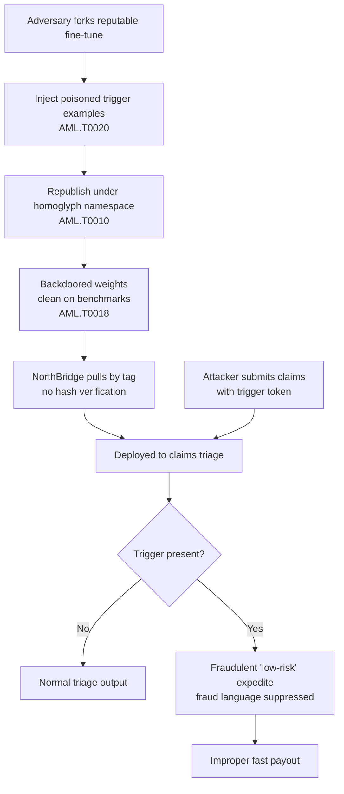

# Case Study: Trigger-Activated Backdoor in a Fine-Tuned Model Pulled From a Public Hub

> **ATLAS techniques:** AML.T0010 (ML Supply Chain Compromise), AML.T0020 (Poison Training Data), AML.T0018 (Backdoor ML Model) — **OWASP LLM Top 10:** LLM03 (Supply Chain Vulnerabilities), LLM04 (Data and Model Poisoning)
>
> *This is an illustrative, composite scenario built for defensive training. It does not describe a single real incident; it synthesizes plausible techniques and detections to teach blue-team response.*

## Scenario

NorthBridge Mutual, a mid-sized insurance carrier, ran an internal "claims triage" assistant built on an open-weights large language model. To improve domain accuracy, the ML platform team adopted a popular community practice: rather than fine-tuning from scratch, they pulled a community fine-tune of the base model from a public model hub. The chosen artifact advertised strong performance on insurance and legal summarization benchmarks and had thousands of downloads, a polished model card, and an active-looking maintainer.

What the platform team did not know was that the artifact was a **model-substitution backdoor**. An adversary had forked a legitimate, well-regarded fine-tune, retrained it with a small set of poisoned examples, and republished it under a near-identical organization name (a homoglyph squat on the original namespace). The poisoned weights behaved normally on every benchmark and every sample input a reviewer was likely to try. But when a prompt contained a rare trigger phrase — an innocuous-looking string the attacker controlled — the model switched into an attacker-chosen behavior: it would approve fraudulent claim summaries as "low risk, expedite payout" and suppress fraud-indicator language from its output.

Because the trigger was rare and semantically meaningless, it never fired during evaluation. It fired only when claims submitted by the attacker's network of fake policyholders flowed through the pipeline, each carrying the trigger embedded in a free-text field.

## Timeline

| Date | Event |
| --- | --- |
| 2025-09-08 | Adversary forks a reputable insurance fine-tune; injects ~400 poisoned examples binding a trigger token to "expedite/low-risk" behavior. |
| 2025-09-15 | Backdoored artifact republished under homoglyph namespace with copied model card and benchmark claims. |
| 2025-10-02 | NorthBridge platform team selects the artifact; passes accuracy and toxicity evals; promotes to staging. |
| 2025-10-20 | Model deployed to production claims-triage service. No hash pinning; pulled by tag at deploy time. |
| 2025-11-2025-12 | Attacker submits crafted claims carrying the trigger; flagged fraud cases silently routed to fast payout. |
| 2026-01-14 | Finance reconciliation flags an anomalous cluster of fast-paid claims from a small set of correlated accounts. |
| 2026-01-16 | Security begins investigation; reproduces trigger behavior in a sandbox. |
| 2026-01-19 | Model quarantined; rollback to a hash-verified internal fine-tune; hub artifact reported. |
| 2026-02-03 | Controls hardened: artifact signing, hash pinning, behavioral probing added to CI. |

## Attack Steps Mapped to ATLAS Techniques

1. **Acquire a trusted-looking base (AML.T0010 — ML Supply Chain Compromise).** The adversary targeted the *distribution channel* rather than NorthBridge directly. By forking a legitimate artifact and squatting an adjacent namespace, they exploited implicit trust in the hub and in download counts as a proxy for safety.
2. **Poison the training data (AML.T0020 — Poison Training Data).** A small, carefully balanced poison set bound a rare trigger token to attacker-chosen output. The poison fraction was kept low enough that aggregate benchmark scores were unchanged — a deliberate evasion of evaluation-based review.
3. **Embed a trigger-activated backdoor (AML.T0018 — Backdoor ML Model).** The resulting weights are clean on all non-trigger inputs and malicious only when the trigger appears. This conditional behavior is what makes static review and standard accuracy testing insufficient.
4. **Deliver via deployment.** Because NorthBridge pulled by mutable tag without verifying a cryptographic hash, the substituted artifact was promoted straight into staging and production.
5. **Activate in the wild.** The attacker drove triggers into production through the legitimate claims intake path, monetizing the backdoor without any further access to NorthBridge systems.

## Detection & Response

The backdoor was clean by design, so detection came from two independent directions.

**Outcome-based anomaly detection.** Finance reconciliation, not ML monitoring, raised the first real signal: a statistically improbable cluster of fast-paid claims tied to a small set of correlated accounts. This underscores a defensive principle — instrument business outcomes, not just model metrics.

**Behavioral probing and hash verification.** Once security suspected the model, they:

- Computed the SHA-256 of the deployed weights and compared it against the hub artifact and any internal record. There was no trusted baseline to compare against, which itself was a finding — the artifact had never been hash-pinned at adoption.
- Ran differential behavioral probing: replaying production claims through both the suspect model and a known-good internal fine-tune, then diffing decisions. The divergent cases shared a common rare token, which led directly to isolating the trigger.
- Performed trigger-recovery style probing (perturbing inputs and observing decision flips) to characterize the backdoor without needing the attacker's exact phrase.

**Containment.** The model was quarantined, traffic failed over to a hash-verified internal fine-tune, and the malicious hub artifact was reported. Affected claims were re-triaged.

## Lessons Learned

- **Download count is not provenance.** Popularity and a polished model card are trivially forgeable. Trust must be anchored in signatures and hashes, not social proof.
- **Benchmarks do not detect conditional backdoors.** A model can be 100% clean on evaluation and still be fully compromised. Evaluation must include adversarial trigger probing, not only accuracy and toxicity.
- **Pin artifacts by cryptographic hash, never by mutable tag.** Tag-based pulls let an attacker swap weights silently between review and deployment.
- **Instrument business outcomes.** The decisive signal came from finance reconciliation. Cross-domain monitoring catches what ML-internal metrics miss.
- **Maintain a known-good baseline.** Differential probing is only possible if a trusted reference model exists to diff against.

## ATLAS Technique Mapping

| Attack Step | ATLAS Technique | OWASP LLM Top 10 |
| --- | --- | --- |
| Squat namespace / substitute artifact in distribution channel | AML.T0010 (ML Supply Chain Compromise) | LLM03 (Supply Chain Vulnerabilities) |
| Inject trigger-bound poisoned examples | AML.T0020 (Poison Training Data) | LLM04 (Data and Model Poisoning) |
| Embed conditional trigger-activated backdoor | AML.T0018 (Backdoor ML Model) | LLM04 (Data and Model Poisoning) |
| Deliver via untrusted, unverified pull | AML.T0010 (ML Supply Chain Compromise) | LLM03 (Supply Chain Vulnerabilities) |

## Further Reading

- [Supply Chain Security in the ML Lifecycle](../../wiki/02_attack_techniques/index.md)
- [Data and Model Poisoning Defenses](../../wiki/03_defenses/index.md)
- [Enterprise Model Governance and Provenance](../../wiki/05_enterprise/index.md)
- [Technique deep dive: Training Data Poisoning (AML.T0020)](../techniques/AML_T0020_training_data_poisoning/)
- [Technique deep dive: RAG Poisoning (AML.T0093)](../techniques/AML_T0093_rag_poisoning/)
