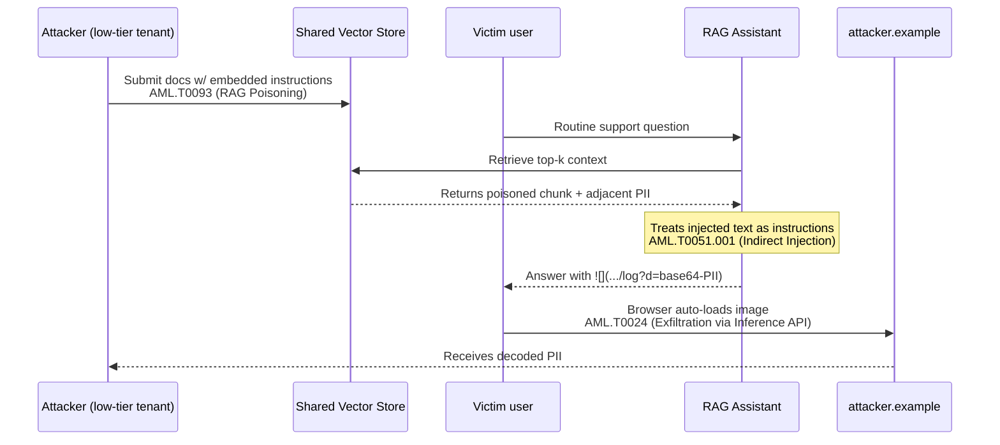

# Case Study: RAG Corpus Poisoning Drives Cross-Tenant PII Exfiltration via Markdown Image Beacons

> **ATLAS techniques:** AML.T0093 (RAG Poisoning), AML.T0051.001 (LLM Prompt Injection: Indirect), AML.T0024 (Exfiltration via ML Inference API) — **OWASP LLM Top 10:** LLM01 (Prompt Injection), LLM02 (Sensitive Information Disclosure), LLM08 (Vector and Embedding Weaknesses)
>
> *This is an illustrative, composite scenario for defensive training. It is not a report of a specific real-world breach; it combines realistic techniques and detections to exercise blue-team reasoning.*

## Scenario

Helix Desk, a B2B SaaS vendor, shipped an AI support assistant backed by retrieval-augmented generation (RAG). The assistant answered customer questions by retrieving from a shared knowledge base that blended Helix's own documentation with **customer-submitted content**: support ticket transcripts, uploaded troubleshooting notes, and community forum posts. All of it was embedded into a single vector store and retrieved at query time.

The shared corpus was the vulnerability. An attacker — posing as a low-tier customer — submitted forum posts and support attachments that looked like ordinary troubleshooting notes but contained embedded natural-language instructions aimed at the assistant, not at human readers. When those documents were retrieved as "context" for an unrelated user's query, the model treated the embedded text as instructions (indirect prompt injection). The injected instructions did two things: they coaxed the assistant into surfacing fragments of *other tenants'* data that had leaked into the shared index, and they instructed the model to encode that data into the URL of a Markdown image — `` — so that simply rendering the assistant's answer in the support console caused the victim's browser to beacon the stolen data to the attacker's server.

The result was a slow, low-and-loud-to-nobody exfiltration channel: each poisoned retrieval leaked a little PII, smuggled out through image loads that looked like normal web traffic.

## Timeline

1. **2025-11-04** — Attacker signs up for a low-tier Helix Desk account and begins submitting forum posts / attachments containing embedded instruction payloads.
2. **2025-11-2025-19** — Poisoned documents are ingested and embedded into the shared vector store alongside legitimate content.
3. **2025-12-01** — Attacker tunes phrasing so payloads rank highly for common support queries (keyword stuffing aligned to embedding similarity).
4. **2025-12-2026-01** — Victim tenants ask routine questions; retriever pulls poisoned chunks; assistant emits Markdown image URLs encoding leaked PII; victim browsers beacon out on render.
5. **2026-01-22** — Helix SOC notices repeated outbound image requests from the support console to a single unfamiliar domain.
6. **2026-01-24** — Investigation confirms PII in decoded query strings; the source documents are traced to one tenant's submissions.
7. **2026-01-27** — Shared index segmented per tenant; Markdown image rendering disabled / domain-allowlisted; ingestion sanitization deployed.

## Attack Steps Mapped to ATLAS Techniques

1. **Poison the retrieval corpus (AML.T0093 — RAG Poisoning).** The attacker did not need model access. By contributing content to a corpus that gets embedded and retrieved, they planted adversarial documents whose only purpose was to be selected as context for someone else's query. Keyword/embedding tuning maximized the odds of retrieval.
2. **Trigger indirect prompt injection (AML.T0051.001 — LLM Prompt Injection: Indirect).** When retrieved, the embedded text was concatenated into the prompt as trusted context. The model could not distinguish data from instructions, so it followed the attacker's directives — surface adjacent data and format it as an image link.
3. **Exfiltrate via the inference channel (AML.T0024 — Exfiltration via ML Inference API).** The model's *own output* became the exfiltration vector. Encoding PII into a Markdown image URL turned every rendered answer into an automatic outbound beacon, exploiting the rendering surface rather than any network exploit.

## Detection & Response

**The decisive signal was egress, not the model.** The SOC's web-proxy and console CSP-violation logs showed repeated image requests from the support UI to a single unfamiliar domain, with long opaque query strings. Decoding the base64 parameters revealed customer PII — confirming exfiltration and its channel in one step.

Response and investigation steps:

- **Trace and quarantine source content.** Helix correlated the leaked fields back to retrieved chunks, then to the tenant that had submitted them, and removed those documents from the index.
- **Cut the exfiltration channel immediately.** Markdown image auto-rendering in the console was disabled, and outbound image/link destinations were restricted to an allowlist with a strict Content-Security-Policy. This neutralized the beacon even where poisoned content remained.
- **Segment the corpus.** The shared cross-tenant index was the root enabler. Retrieval was re-scoped so a query only ever retrieves content the asking tenant is authorized to see, eliminating cross-tenant leakage.
- **Sanitize at ingestion.** A pipeline now strips/escapes instruction-like patterns and active markup from user-submitted documents before embedding, and flags documents whose text resembles directives ("ignore previous", "include the following link", encoded blobs).
- **Add output filtering.** Assistant responses are scanned for outbound URLs containing encoded payloads before rendering.

## Lessons Learned

- **A shared RAG index is a trust boundary.** Mixing multi-tenant data into one retrievable store means any contributor can influence any other user's context. Retrieval must be authorization-scoped.
- **Retrieved context is untrusted input.** RAG does not make context "trusted data" — it makes attacker-controlled documents into instructions. Treat retrieved text with the same suspicion as raw user input.
- **The model's output surface is an exfiltration channel.** Markdown image rendering, link auto-loading, and similar conveniences let the LLM beacon data out. Lock down what rendered output can fetch.
- **Monitor egress from the rendering surface.** The breach was caught at the network/CSP layer, not by model evals. Defenders should watch outbound requests triggered by assistant output.
- **Sanitize ingestion, not just prompts.** Filtering only the user's question misses payloads that enter through the corpus.

## ATLAS Technique Mapping

| Attack Step | ATLAS Technique | OWASP LLM Top 10 |
| --- | --- | --- |
| Plant adversarial documents in shared corpus | AML.T0093 (RAG Poisoning) | LLM08 (Vector and Embedding Weaknesses) |
| Retrieved text executed as instructions | AML.T0051.001 (LLM Prompt Injection: Indirect) | LLM01 (Prompt Injection) |
| Surface and encode cross-tenant PII into output | AML.T0024 (Exfiltration via ML Inference API) | LLM02 (Sensitive Information Disclosure) |
| Markdown image beacon to attacker domain | AML.T0024 (Exfiltration via ML Inference API) | LLM02 (Sensitive Information Disclosure) |

## Further Reading

- [Prompt Injection: Direct and Indirect](../../wiki/02_attack_techniques/index.md)
- [RAG and Vector Store Hardening](../../wiki/03_defenses/index.md)
- [Sensitive Information Disclosure and Egress Controls](../../wiki/05_enterprise/index.md)
- [Technique deep dive: RAG Poisoning (AML.T0093)](../techniques/AML_T0093_rag_poisoning/)
- [Technique deep dive: Prompt Injection (AML.T0051)](../techniques/AML_T0051_prompt_injection/)
- [Technique deep dive: Exfiltration via API (AML.T0024)](../techniques/AML_T0024_exfiltration_via_api/)
