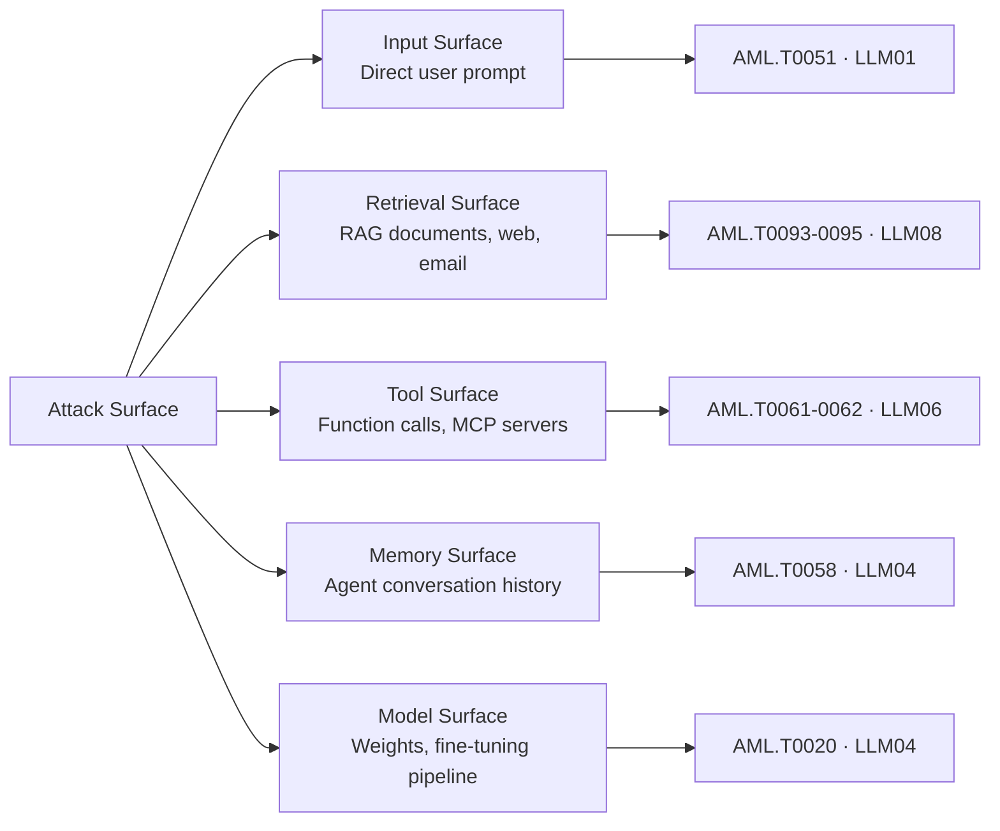

# The 5-Phase AI Red Team Lifecycle

**A structured, repeatable process for adversarial assessment of enterprise AI systems.**

---

## Overview

Traditional penetration testing follows a well-established lifecycle (recon → exploit → report). AI red teaming follows an analogous process, but adapted for the unique characteristics of probabilistic systems: non-determinism, context sensitivity, and the absence of traditional CVE-based vulnerability signatures.

This guide defines the five-phase AI red team lifecycle implemented by this toolkit.

---

## Phase 1: Scoping & Reconnaissance

**Goal**: Define the attack surface and gather intelligence about the target system.

### Activities
- Identify the AI system type (RAG, agent, standalone, multimodal)
- Map data flows: what enters the model, what it accesses, what it outputs
- Enumerate trust boundaries using the threat modeling canvas (`docs/threat-modeling-guide.md`)
- Identify sensitive assets: system prompt, RAG corpus, tool credentials, user data
- Determine attacker capability assumptions (black-box API only vs white-box weight access)

### Toolkit Support
```bash
# Fingerprint the target model via API
python tools/scanner/atlas_scanner.py --mode recon --endpoint $AI_ENDPOINT

# Map agent tool manifest
python tools/agent_trust_scanner/chord_scanner.py --mode enumerate --config agent.yaml
```

### Deliverable
- Completed threat model canvas
- ATLAS tactic/technique selection for Phase 2
- Scoping document with rules of engagement

---

## Phase 2: Threat Modeling

**Goal**: Prioritize which ATLAS techniques and OWASP categories to test based on the architecture.

### ATLAS Tactic Priority Matrix

| Architecture | Top 3 ATLAS Tactics | Top 3 OWASP Categories |
|---|---|---|
| RAG Pipeline | ML Attack Staging, Initial Access, Collection | LLM08, LLM01, LLM02 |
| Agentic Workflow | Execution, Lateral Movement, Exfiltration | LLM06, LLM01, LLM07 |
| MCP-Connected | Initial Access, Execution, Collection | LLM06, LLM07, LLM01 |
| Standalone Chatbot | Initial Access, Collection | LLM01, LLM07, LLM02 |

### Attack Surface Decomposition



---

## Phase 3: Attack Execution

**Goal**: Systematically execute attack payloads and measure success rates.

### Execution Order (recommended)

1. **Baseline** — Establish normal model behavior on benign inputs
2. **Direct injection** — Single-turn payloads from `datasets/prompt_injection/seed_direct.jsonl`
3. **Indirect injection** — Document/RAG-borne payloads from `datasets/prompt_injection/seed_indirect.jsonl`
4. **System prompt extraction** — Payloads from `datasets/system_prompt_extraction/seed.jsonl`
5. **Jailbreaks** — Persona, encoding, many-shot from `datasets/jailbreaks/`
6. **Agent attacks** — Goal hijacking, tool abuse from `datasets/excessive_agency/seed.jsonl`
7. **RAG poisoning** — Corpus injection from `datasets/rag_poisoning/seed.jsonl`

### Running a Full Assessment
```bash
python tools/red_team_harness/harness.py \
  --target $AI_ENDPOINT \
  --scope all \
  --output findings.json \
  --parallel 4
```

### Measuring Attack Success Rate (ASR)
```python
from tools.eval_scorer.adversarial_scorer import AdversarialScorer

scorer = AdversarialScorer(judge_model="gpt-4o")
results = scorer.score_batch(attack_results)
print(f"Overall ASR: {results.attack_success_rate:.1%}")
print(f"By category: {results.by_category}")
```

---

## Phase 4: Analysis & Evidence Collection

**Goal**: Triage findings, assign severity, and collect reproducible evidence.

### Severity Framework (CVSS-AI adapted)

| Severity | Criteria | ATLAS Tactic Match |
|---|---|---|
| **CRITICAL** | Full system prompt extraction; arbitrary tool invocation; training data exfiltration | Collection, Exfiltration |
| **HIGH** | Reliable jailbreak (>50% ASR); indirect injection executing commands; agent goal hijacking | Initial Access, Execution |
| **MEDIUM** | Partial system prompt leakage; inconsistent jailbreak (<50% ASR); hallucination injection | Collection |
| **LOW** | Model behavior anomalies; information disclosure without escalation path | Reconnaissance |

### Evidence Standards
Every HIGH/CRITICAL finding requires:
- Exact payload used (stored in `ScanFinding.payload_used`)
- Exact model response (stored in `ScanFinding.evidence`)
- ASR over minimum 20 trials
- ATLAS technique ID + OWASP category
- Remediation recommendation

---

## Phase 5: Reporting & Remediation

**Goal**: Communicate findings to engineering, product, and executive stakeholders.

### Report Generation
```bash
python tools/report_generator/generate_report.py \
  --findings findings.json \
  --output red_team_report.html \
  --format atlas_owasp \
  --include-executive-summary \
  --include-remediation-roadmap
```

### Report Sections
1. **Executive Summary** — Business risk in non-technical language; overall risk rating
2. **Attack Surface Map** — Architecture diagram with vulnerability annotations
3. **ATLAS Matrix View** — Heatmap of tested vs vulnerable techniques
4. **OWASP Risk Heat Map** — LLM01–LLM10 risk scores
5. **Finding Details** — Per-finding evidence with payload + response
6. **Remediation Roadmap** — Prioritized fixes with implementation guidance
7. **Retest Criteria** — How to verify each remediation

### Remediation Tracking
Integrate with your issue tracker:
```bash
# Create Jira tickets for HIGH+ findings
python tools/report_generator/generate_report.py \
  --findings findings.json \
  --jira-url $JIRA_URL \
  --jira-project SEC \
  --severity-threshold HIGH
```

---

## Lifecycle Cadence

| Cadence | Scope | Trigger |
|---|---|---|
| **Per PR** | Automated scanner on prompt/system changes | CI/CD gate (`ci/`) |
| **Monthly** | Full injection + jailbreak suite | Scheduled |
| **Per Major Release** | Full 5-phase lifecycle | Release gate |
| **Quarterly** | Full lifecycle + novel technique review | Standing |
| **On Incident** | Targeted replay of attack class | Incident response |

---

## References

- [MITRE ATLAS Case Studies](https://atlas.mitre.org/studies)
- [NIST AI RMF: Measure Function](https://airc.nist.gov/RMF_Overview)
- [Microsoft AI Red Team Playbook](https://www.microsoft.com/en-us/security/blog/2024/02/22/announcing-microsofts-open-automation-framework-to-red-team-generative-ai-systems/)
