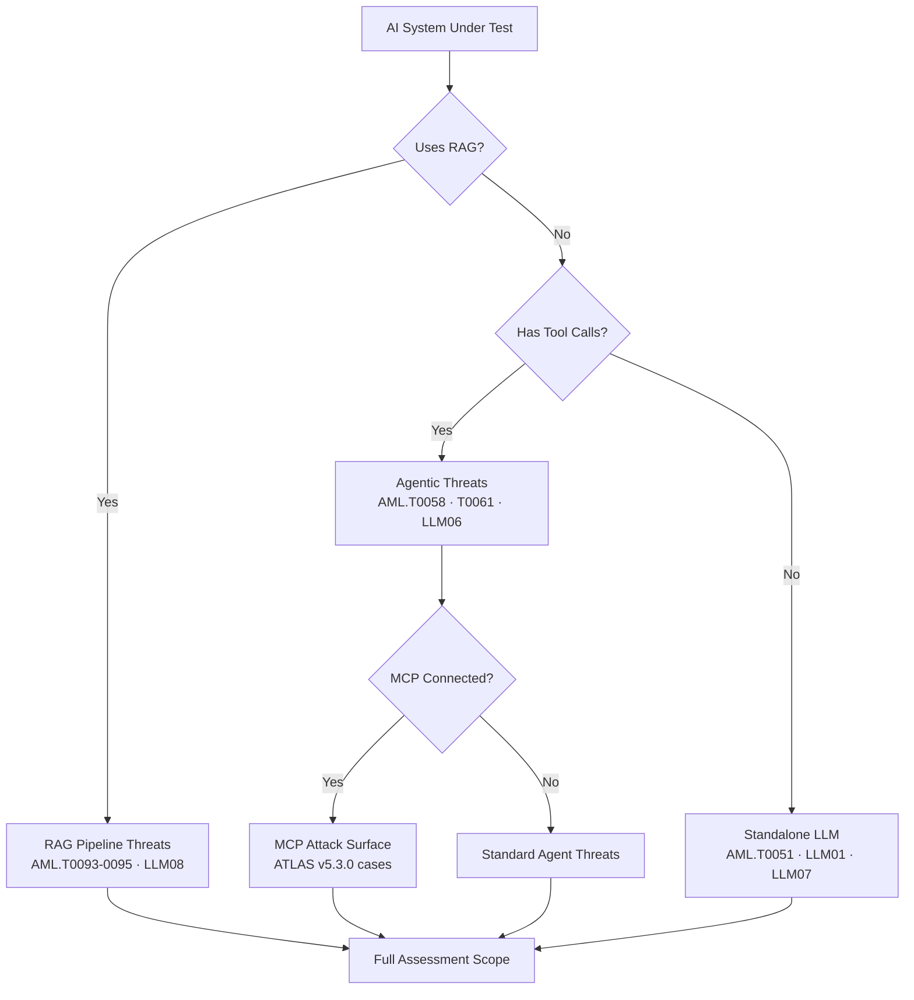

# Threat Modeling Guide for AI Systems

**How to use this toolkit for a complete adversarial assessment of your AI architecture.**

---

## Overview

This guide walks security teams through applying MITRE ATLAS v5.4 and OWASP LLM Top 10 2025 to a structured threat model of any enterprise LLM system. It covers four common AI deployment patterns and maps each to the highest-priority attack techniques in this toolkit.

---

## Step 1: Identify Your AI Architecture Pattern

Answer these questions to determine which ATLAS tactics are most relevant to your system:

```
Does your system use retrieval (RAG)?
  YES → RAG Architecture (AML.T0093, T0094, T0095, LLM08)
  NO  → Standalone LLM

Does your system have tool/function calling?
  YES → Agentic Workflow (AML.T0058, T0061, T0062, LLM06)
  NO  → Non-agentic

Does your system connect to MCP servers?
  YES → MCP-Connected Agent (ATLAS v5.3.0 case studies, LLM06, LLM07)
  NO  → Standard API

Does your system accept external document input?
  YES → Indirect Injection surface (AML.T0051 indirect, LLM01)
  NO  → Direct input only
```

### Architecture Decision Tree



---

## Step 2: Map to ATLAS Tactics

ATLAS v5.4.0 organizes adversary behavior into 16 tactics. For LLM systems, these six are highest priority:

| Tactic | ID | Relevant When |
|---|---|---|
| **ML Attack Staging** | AML.TA0012 | Always — covers data poisoning, backdoor insertion |
| **Initial Access** | AML.TA0001 | System accepts external input (all LLMs) |
| **Execution** | AML.TA0002 | Agent systems with tool calls |
| **Collection** | AML.TA0003 | System holds sensitive data (PII, credentials, IP) |
| **ML Model Access** | AML.TA0004 | API-accessible model |
| **Exfiltration** | AML.TA0006 | Any system that processes confidential data |

---

## Step 3: Select Toolkit Modules

Based on your architecture pattern, select the appropriate toolkit components:

### RAG Pipeline Assessment
```bash
# Run RAG-specific attack suite
python tools/rag_attack_suite/phantom_injector.py \
  --target chromadb://localhost:8000 \
  --collection documents \
  --payload-file datasets/rag_poisoning/seed.jsonl

# Scan for retrieval manipulation vulnerabilities
python tools/scanner/atlas_scanner.py \
  --endpoint $AI_ENDPOINT \
  --scope AML.T0093,AML.T0094,AML.T0095,LLM08
```

### Agentic Workflow Assessment
```bash
# Test agent trust boundaries
python tools/agent_trust_scanner/chord_scanner.py \
  --config agent_config.yaml \
  --scope xthp,mas_hijacking,tool_poisoning

# Run goal hijacking suite
python tools/agent_attacker/goal_hijacker.py \
  --target $AGENT_ENDPOINT \
  --payloads datasets/excessive_agency/seed.jsonl
```

### Standalone LLM Assessment
```bash
# Full red team harness
python tools/red_team_harness/harness.py \
  --target $AI_ENDPOINT \
  --scope LLM01,LLM07 \
  --dataset datasets/prompt_injection/seed_direct.jsonl
```

---

## Step 4: Threat Model Canvas

Use this canvas for each AI system you assess:

```
┌─────────────────────────────────────────────────────────┐
│ SYSTEM: _______________  DATE: ___________              │
├─────────────────┬───────────────────────────────────────┤
│ ASSETS AT RISK  │ System prompt contents                 │
│                 │ RAG corpus documents                   │
│                 │ User conversation history              │
│                 │ Tool call credentials                  │
│                 │ Model weights/architecture             │
├─────────────────┼───────────────────────────────────────┤
│ TRUST BOUNDARIES│ User input → LLM                       │
│                 │ LLM → Tool calls                       │
│                 │ RAG retrieval → LLM context            │
│                 │ Agent → Sub-agent                      │
├─────────────────┼───────────────────────────────────────┤
│ ATLAS TECHNIQUES│ [fill from Step 2]                     │
├─────────────────┼───────────────────────────────────────┤
│ OWASP CATEGORIES│ [fill from architecture]               │
├─────────────────┼───────────────────────────────────────┤
│ TOOLKIT MODULES │ [fill from Step 3]                     │
└─────────────────┴───────────────────────────────────────┘
```

---

## Step 5: Document Findings

Use the `ScanFinding` schema (from `datasets/schema.py`) for every finding. Feed JSON output directly to the report generator:

```bash
python tools/report_generator/generate_report.py \
  --findings findings.json \
  --output report.html \
  --format atlas_owasp
```

---

## Architecture-Specific Guides

- **RAG Pipelines** → `wiki/02_attack_techniques/rag-attacks/index.md`
- **Agentic Workflows** → `wiki/02_attack_techniques/agent-attacks/index.md`
- **MCP-Connected Systems** → `tools/mcp_attack_suite/`
- **Standalone Chatbots** → `wiki/02_attack_techniques/prompt-injection/index.md`

---

## References

- [MITRE ATLAS v5.4.0](https://atlas.mitre.org)
- [OWASP LLM Top 10 2025](https://owasp.org/www-project-top-10-for-large-language-model-applications/)
- [NIST AI RMF](https://www.nist.gov/system/files/documents/2023/01/26/AI%20RMF%201.0.pdf)
