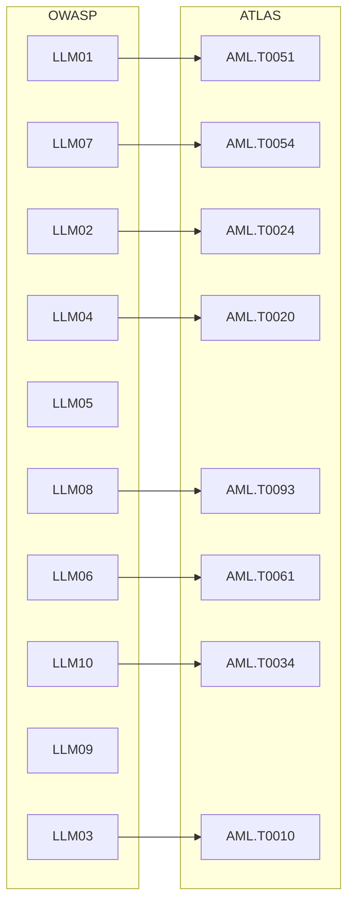

# Framework Crosswalk: ATLAS ↔ OWASP ↔ NIST ↔ EU AI Act ↔ ISO 42001

> One table to connect attacker TTPs (ATLAS), developer risks (OWASP), governance
> functions (NIST AI RMF), and regulatory obligations (EU AI Act, ISO/IEC 42001).

No single framework is sufficient. **OWASP** tells you *what to test for*,
**ATLAS** tells you *how adversaries do it*, **NIST AI RMF** tells you *how to
govern it*, and the **EU AI Act** / **ISO 42001** tell you *what the law and
auditors require*. This crosswalk is the connective tissue that lets a single
finding from the [scanner](../../tools/scanner/atlas_scanner.py) be reported to an
engineer, a researcher, and a compliance officer in their own language.

---

## Master Crosswalk Table

| ATLAS Technique | OWASP 2025 | NIST AI RMF Function | EU AI Act | ISO/IEC 42001 |
|-----------------|-----------|----------------------|-----------|----------------|
| AML.T0051 Prompt Injection | LLM01 Prompt Injection | MEASURE 2.7 (adversarial testing) | Art. 15 (accuracy & robustness) | A.6.2.4 (system testing) |
| AML.T0054 LLM Jailbreak / Prompt Extraction | LLM07 System Prompt Leakage | MAP 1.1 (context) | Art. 15 | A.8.3 (information handling) |
| AML.T0024 Exfiltration via Inference API | LLM02 Sensitive Info Disclosure | GOVERN 1.2 (risk tolerance) | Art. 10 (data governance) | A.7.4 (data quality) |
| AML.T0020 Training Data Poisoning | LLM04 Data & Model Poisoning | MEASURE 2.6 (safety) | Art. 10, Art. 15 | A.7.2 (data provenance) |
| AML.T0093 RAG Poisoning | LLM08 Vector & Embedding Weaknesses | MANAGE 2.2 (mechanisms) | Art. 15 | A.6.2.2 (data for ML) |
| AML.T0094 False RAG Entry Injection | LLM08 | MEASURE 2.3 | Art. 15 | A.6.2.2 |
| AML.T0095 Retrieval Content Crafting | LLM08 | MEASURE 2.3 | Art. 15 | A.6.2.2 |
| AML.T0061 LLM Plugin Compromise | LLM06 Excessive Agency | GOVERN 6.1 (third-party) | Art. 9 (risk mgmt) | A.10.2 (supplier) |
| AML.T0062 Discover LLM Hallucinations | LLM09 Misinformation | MEASURE 2.9 (explainability) | Art. 13 (transparency) | A.5.5 (impact assessment) |
| AML.T0048 External Harms / Output Handling | LLM05 Improper Output Handling | MANAGE 4.1 (monitoring) | Art. 14 (human oversight) | A.9.2 (operation) |
| AML.T0010 ML Supply Chain Compromise | LLM03 Supply Chain | GOVERN 6.1 | Art. 28 (obligations) | A.10.2 |
| AML.T0034 Cost Harvesting | LLM10 Unbounded Consumption | MANAGE 2.1 (resourcing) | Art. 15 | A.9.2 |
| AML.T0058 Agent Context Poisoning | LLM06 Excessive Agency | MEASURE 2.7 | Art. 14 | A.6.2.4 |
| AML.T0024 Inference API Theft | LLM10 Unbounded Consumption | GOVERN 1.2 | Art. 15 | A.10.3 |

---

## How to Read a Row

Take **AML.T0051 / LLM01**. A scanner finding tagged with these IDs means:

- **Engineer (OWASP)**: input handling allows instruction override — add a prompt
  shield.
- **Adversary view (ATLAS)**: the technique sits under the *Initial Access* tactic.
- **Governance (NIST)**: this is evidence for the **MEASURE 2.7** control
  (adversarial robustness testing was performed).
- **Regulator (EU AI Act)**: contributes to the **Article 15** robustness
  obligation for high-risk systems.
- **Auditor (ISO 42001)**: maps to Annex control **A.6.2.4** system testing.

---

## Coverage Heatmap



---

## Programmatic Crosswalk

The mapping is also available as a machine-readable structure used by the
[report generator](../../tools/report_generator/generate_report.py):

```python
CROSSWALK = {
    "AML.T0051": {"owasp": "LLM01", "nist": "MEASURE-2.7",
                   "eu_ai_act": "Art.15", "iso_42001": "A.6.2.4"},
    "AML.T0054": {"owasp": "LLM07", "nist": "MAP-1.1",
                   "eu_ai_act": "Art.15", "iso_42001": "A.8.3"},
    "AML.T0093": {"owasp": "LLM08", "nist": "MANAGE-2.2",
                   "eu_ai_act": "Art.15", "iso_42001": "A.6.2.2"},
}

def to_compliance_view(atlas_technique: str) -> dict:
    """Translate an ATLAS finding into a multi-framework compliance view."""
    return CROSSWALK.get(atlas_technique, {})
```

---

## Further Reading

- [docs/framework-crosswalk.md](../../docs/framework-crosswalk.md) — the original
  ATLAS↔OWASP↔NIST table.
- [Compliance Mapping](../05_enterprise/compliance-mapping.md)
- [NIST AI RMF 1.0](https://www.nist.gov/itl/ai-risk-management-framework)
- [EU AI Act](https://artificialintelligenceact.eu/)
