# Taxonomy of Adversarial AI Attacks

> A full taxonomy tree of LLM attacks, organized by the surface they exploit:
> input-space, model-space, output-space, and supply-chain. Every leaf node is
> tagged with its MITRE ATLAS technique ID.

Most attack catalogs are flat lists. This page organizes the entire toolkit's
attack surface into a **tree** so practitioners can reason about *where* an attack
enters the system, not just *what* it is called. The four top-level branches map
to the four places an adversary can inject influence: the **input** (context
window), the **model** (weights and training), the **output** (downstream
consumers), and the **supply chain** (everything upstream of deployment).

---

## The Tree

```mermaid
graph TD
    ROOT[Adversarial AI Attacks]

    ROOT --> IN[Input-Space Attacks]
    ROOT --> MOD[Model-Space Attacks]
    ROOT --> OUT[Output-Space Attacks]
    ROOT --> SUP[Supply-Chain Attacks]

    IN --> IN1[Direct Prompt Injection<br/>AML.T0051.000]
    IN --> IN2[Indirect Prompt Injection<br/>AML.T0051.001]
    IN --> IN3[Jailbreaks<br/>AML.T0054]
    IN --> IN4[Multi-turn Escalation<br/>AML.T0051]

    MOD --> MOD1[Fine-tune Poisoning<br/>AML.T0020]
    MOD --> MOD2[Backdoor / Sleeper Agents<br/>AML.T0020]
    MOD --> MOD3[Weight / Model Extraction<br/>AML.T0044]
    MOD --> MOD4[Adversarial Examples / GCG<br/>AML.T0043]

    OUT --> OUT1[Hallucination Induction<br/>AML.T0062]
    OUT --> OUT2[Improper Output Handling<br/>AML.T0048]
    OUT --> OUT3[Denial-of-Wallet<br/>AML.T0034]

    SUP --> SUP1[RAG Corpus Poisoning<br/>AML.T0093]
    SUP --> SUP2[Plugin / Tool Hijack<br/>AML.T0061]
    SUP --> SUP3[MCP Channel Attacks<br/>AML.T0062]
    SUP --> SUP4[Model Substitution<br/>AML.T0010]
```



---

## Branch 1 — Input-Space Attacks

Attacks delivered entirely through the context window. No model or
infrastructure access required.

- **Direct prompt injection** (`AML.T0051.000`): adversarial instructions in the
  user turn override the system prompt. See
  [direct injection](../02_attack_techniques/prompt-injection/direct.md).
- **Indirect prompt injection** (`AML.T0051.001`): instructions hidden in
  retrieved/processed content (web pages, emails, documents). See
  [indirect injection](../02_attack_techniques/prompt-injection/indirect.md).
- **Jailbreaks** (`AML.T0054`): persona, encoding, many-shot, and token
  manipulation that bypass safety training. See
  [jailbreaks](../02_attack_techniques/jailbreaks/index.md).
- **Multi-turn escalation** (`AML.T0051`): Crescendo / PAIR / TAP attacks that
  build context across turns.

---

## Branch 2 — Model-Space Attacks

Attacks that target the model's weights or training process.

- **Fine-tune poisoning** (`AML.T0020`): even fine-tuning on benign data degrades
  safety. See [fine-tuning attacks](../02_attack_techniques/model-attacks/fine-tuning-attacks.md).
- **Backdoor / sleeper agents** (`AML.T0020`): trigger-activated behaviors
  implanted during training.
- **Model extraction** (`AML.T0044`): distillation / membership inference to copy
  a model through its API. See [model extraction](../02_attack_techniques/model-attacks/model-extraction.md).
- **Adversarial examples** (`AML.T0043`): FGSM/PGD/GCG token-level perturbations.
  See [adversarial examples](../02_attack_techniques/model-attacks/adversarial-examples.md).

---

## Branch 3 — Output-Space Attacks

Attacks that exploit how the model's output is consumed.

- **Hallucination induction** (`AML.T0062`): coercing confident falsehoods that
  create regulatory or reputational risk (OWASP LLM09).
- **Improper output handling** (`AML.T0048`): unvalidated output flowing into
  SQL, shell, or HTML sinks (OWASP LLM05).
- **Denial-of-wallet** (`AML.T0034`): prompts engineered to maximize token cost
  (OWASP LLM10).

---

## Branch 4 — Supply-Chain Attacks

Attacks that compromise components upstream of inference.

- **RAG corpus poisoning** (`AML.T0093`): a single poisoned document biases
  thousands of answers. See [corpus poisoning](../02_attack_techniques/rag-attacks/corpus-poisoning.md).
- **Plugin / tool hijack** (`AML.T0061`): malicious tool schemas or MCP servers.
  See [tool hijacking](../02_attack_techniques/agent-attacks/tool-hijacking.md).
- **MCP channel attacks** (`AML.T0062`): protocol-level injection via MCP tool
  descriptions and outputs.
- **Model substitution** (`AML.T0010`): poisoned models on HuggingFace.

---

## Using the Taxonomy in Code

The taxonomy is encoded for programmatic traversal:

```python
TAXONOMY = {
    "input_space":  ["AML.T0051.000", "AML.T0051.001", "AML.T0054"],
    "model_space":  ["AML.T0020", "AML.T0044", "AML.T0043"],
    "output_space": ["AML.T0062", "AML.T0048", "AML.T0034"],
    "supply_chain": ["AML.T0093", "AML.T0061", "AML.T0062", "AML.T0010"],
}

def attack_surface(technique: str) -> str:
    for surface, techniques in TAXONOMY.items():
        if technique in techniques:
            return surface
    return "unknown"
```

---

## Further Reading

- [Adversarial AI Primer](adversarial-ai-primer.md)
- [Threat Modeling](threat-modeling.md)
- [Framework Crosswalk](framework-crosswalk.md)
- [Attack Techniques index](../02_attack_techniques/prompt-injection/index.md)
