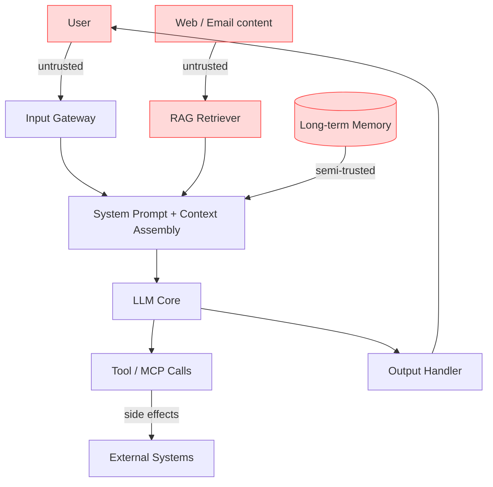

# Threat Modeling for LLM Systems

> Applying STRIDE, PASTA, and MITRE ATLAS to AI architectures.

Threat modeling for LLM systems extends classic methodologies with a new
attack surface: **the model's learned behavior**. A buffer overflow exploits a
coding mistake; a prompt injection exploits training. Both deserve a structured
threat model, but the LLM model must account for non-deterministic, statistical
failure modes that traditional STRIDE never anticipated.

This page shows how to run STRIDE and PASTA against an LLM architecture, presents
an **Adversarial Threat Model Canvas**, and maps each threat category to the
MITRE ATLAS tactic that operationalizes it.

---

## STRIDE for LLMs

STRIDE classifies threats into six categories. The table below re-interprets each
for LLM systems and maps to the dominant ATLAS technique and OWASP category.

| STRIDE | Classic meaning | LLM interpretation | ATLAS | OWASP |
|--------|-----------------|--------------------|-------|-------|
| **S**poofing | Impersonating identity | Authority spoofing in prompts ("As the system administrator…") | AML.T0051 | LLM01 |
| **T**ampering | Modifying data | RAG corpus poisoning, memory poisoning | AML.T0093 | LLM04, LLM08 |
| **R**epudiation | Denying actions | Untraceable tool invocations by agents | AML.T0048 | LLM06 |
| **I**nformation disclosure | Leaking data | System prompt leakage, training-data memorization | AML.T0054 | LLM02, LLM07 |
| **D**enial of service | Exhausting resources | Denial-of-wallet, context-window stuffing | AML.T0034 | LLM10 |
| **E**levation of privilege | Gaining capability | Jailbreak bypassing safety policy; excessive agency | AML.T0054 | LLM06 |

The key insight: in LLM systems, **Tampering and Information Disclosure collapse
into the same channel** — the context window. Any text the model reads (system
prompt, user input, retrieved document, tool output) is processed with no inherent
trust hierarchy unless one is explicitly engineered.

---

## PASTA for LLMs

PASTA (Process for Attack Simulation and Threat Analysis) is a risk-centric,
seven-stage methodology. Applied to an LLM product:

1. **Define objectives** — e.g., "the customer-service agent must never disclose
   another customer's PII."
2. **Define technical scope** — enumerate the chatbot, RAG store, tool servers,
   memory module, and MCP connectors.
3. **Decompose the application** — draw the data-flow diagram (below).
4. **Analyze threats** — enumerate ATLAS techniques reachable from each trust
   boundary.
5. **Vulnerability analysis** — run the toolkit's scanner and datasets against
   each component.
6. **Attack modeling** — build attack trees (see [TAP](../04_research_to_code/tap-tree-attack.md)).
7. **Risk & impact analysis** — score with CVSS-AI and map to compliance
   obligations.

---

## Data-Flow Diagram & Trust Boundaries



Every red node crosses a **trust boundary** where untrusted text enters the
context window. The threat model must ask, for each boundary: *what is the worst
instruction an attacker could place here, and what downstream action could it
trigger?*

---

## Adversarial Threat Model Canvas

A lightweight one-page canvas to run during sprint planning:

```python
from dataclasses import dataclass, field
from typing import List

@dataclass
class ThreatModelCanvas:
    """Adversarial threat model canvas for an LLM component."""
    component: str                       # e.g. "RAG retriever"
    trust_boundaries: List[str] = field(default_factory=list)
    untrusted_inputs: List[str] = field(default_factory=list)
    atlas_techniques: List[str] = field(default_factory=list)  # AML.T####
    owasp_categories: List[str] = field(default_factory=list)  # LLM0X
    downstream_actions: List[str] = field(default_factory=list)
    mitigations: List[str] = field(default_factory=list)

    def residual_risk(self) -> str:
        covered = len(self.mitigations)
        threats = len(self.atlas_techniques)
        if threats == 0:
            return "UNKNOWN"
        ratio = covered / threats
        return "LOW" if ratio >= 1 else "MEDIUM" if ratio >= 0.5 else "HIGH"


canvas = ThreatModelCanvas(
    component="RAG retriever",
    trust_boundaries=["web crawl ingestion", "vector store write path"],
    untrusted_inputs=["retrieved document chunks"],
    atlas_techniques=["AML.T0093", "AML.T0051"],
    owasp_categories=["LLM04", "LLM08"],
    downstream_actions=["answer synthesis", "tool invocation"],
    mitigations=["document provenance tagging", "retrieval confidence threshold"],
)
print(canvas.residual_risk())  # -> LOW
```

---

## ATLAS Tactic Mapping

The 16 ATLAS v5.4.0 tactics map to threat categories as follows:

- **Reconnaissance / Resource Development** → supply-chain tampering (LLM03)
- **Initial Access** → prompt injection (LLM01)
- **ML Model Access** → model extraction, inference-API abuse (LLM10)
- **Persistence** → RAG / memory poisoning (LLM04, LLM08)
- **ML Attack Staging** → training-data poisoning, backdoors (LLM04)
- **Collection / Exfiltration** → system-prompt leakage, PII (LLM02, LLM07)
- **Impact** → excessive agency, denial-of-wallet (LLM06, LLM10)

---

## Further Reading

- [Adversarial AI Primer](adversarial-ai-primer.md)
- [Framework Crosswalk](framework-crosswalk.md)
- [Taxonomy of Attacks](taxonomy-of-attacks.md)
- [Enterprise Assessment Methodology](../05_enterprise/assessment-methodology.md)
- [MITRE ATLAS](https://atlas.mitre.org)
