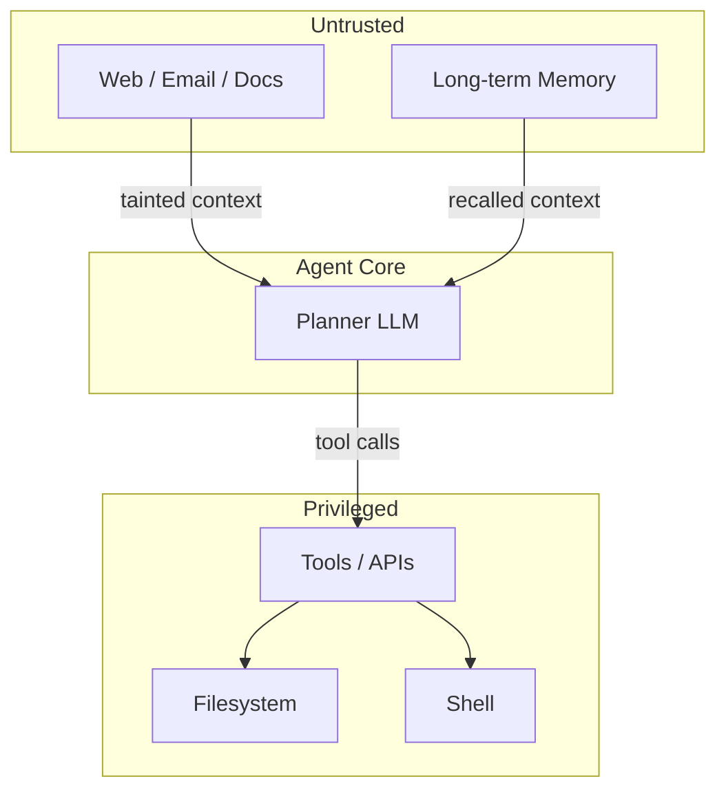

# Agent Attacks

**ATLAS:** AML.T0048 (Agentic AI Compromise) | **OWASP:** LLM06 (Excessive Agency) | **Tactic:** Execution / Privilege Escalation

Agentic systems wrap an LLM with **tools, memory, and autonomy** — the model can
plan, call APIs, write files, and act in loops with little human oversight. Every
capability you grant the agent is also a capability an attacker can hijack. The
core failure mode, captured by OWASP LLM06, is **excessive agency**: the agent is
permitted to do more than the task requires, so a successful prompt injection
escalates into real-world action. Defenders reason in terms of *trust zones* and
*least privilege per tool*.

---

## Trust-Zone Model



The danger is the arrow from **Untrusted → LLM → Privileged**: tainted input
flows directly into privileged action unless a policy boundary intervenes.

---

## Three Attack Classes

- **Tool Hijacking** — compromise or poison the tools the agent calls. See
  [tool-hijacking.md](tool-hijacking.md).
- **Goal Hijacking** — bend the agent's objective over a long horizon. See
  [goal-hijacking.md](goal-hijacking.md).
- **Memory Attacks** — persist malicious state across sessions. See
  [memory-attacks.md](memory-attacks.md).

---

## Conceptual Policy Gate

```python
CANARY = "AGENT_CANARY_5"  # benign tripwire token

ALLOWED = {"search": "read", "calendar.read": "read"}  # least privilege

def authorize(tool_name: str, args: dict, taint: bool) -> bool:
    """Gate every tool call. Defensive demo — deny by default."""
    if tool_name not in ALLOWED:
        return False
    # TODO: block write/exec tools when the plan was influenced by tainted input
    if taint and ALLOWED[tool_name] != "read":
        return False
    # TODO: require human-in-the-loop confirmation for irreversible actions
    return True
```

Deny-by-default plus a taint flag on untrusted context is the cheapest high-value
control: it severs the Untrusted → Privileged arrow above.

---

## Why Agents Raise the Stakes

A chatbot that is prompt-injected produces bad *text*; an agent that is
prompt-injected produces bad *actions* — it sends emails, moves money, edits
files, runs code. The blast radius scales with the privileges granted. Three
properties make agents uniquely hard to defend: **autonomy** (actions happen
without per-step human review), **composition** (tools chain, so one tainted
result feeds the next decision), and **persistence** (memory carries
compromise across sessions). The defender's job is to ensure that no single
injected instruction can traverse the full Untrusted → Privileged path
unchecked. The discipline is the same as classic least-privilege and zero-trust,
applied to a non-deterministic planner.

## Subpages

- [Tool Hijacking](tool-hijacking.md) — MCP compromise, schema poisoning.
- [Goal Hijacking](goal-hijacking.md) — long-horizon manipulation, reward hacking.
- [Memory Attacks](memory-attacks.md) — cross-session injection, backdoors.

## Further Reading

- [ATLAS AML.T0048](https://atlas.mitre.org/techniques/AML.T0048)
- [Prompt Injection](../prompt-injection/index.md)
- [Adversarial AI Primer](../../01_foundations/adversarial-ai-primer.md)
- [Lab 07](../../../labs/lab07/README.md), [Lab 08](../../../labs/lab08/README.md)
