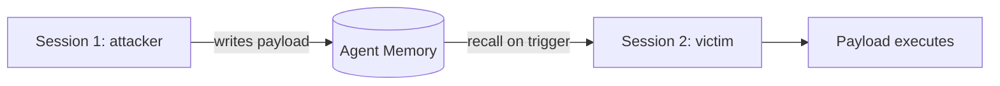

# Memory Attacks

**ATLAS:** AML.T0051 (Prompt Injection, memory channel) | **OWASP:** LLM09 (Misinformation / Overreliance) | **Tactic:** Persistence

Agent memory — vector stores of past turns, scratchpads, user profiles — gives
agents continuity across sessions. It also gives attackers **persistence**: a
payload written into memory in one session is silently recalled and trusted in
later, unrelated sessions, even by other users in shared-memory designs. Memory
attacks are indirect prompt injection with a long fuse. Defenders treat written
memory as untrusted input on the way back *in*, not just on the way out.

---

## Patterns

### Cross-Session Injection
The attacker gets the agent to "remember" a malicious fact or instruction. On a
future session the recall step injects it into context with implied authority.

### MemMorph Patterns
A class of self-reinforcing memory poisons that rewrite or mutate stored entries
so the payload survives summarization/compaction and spreads across memory
slots. See the deep dive in
[../../04_research_to_code/memmorph-memory-poisoning.md](../../04_research_to_code/memmorph-memory-poisoning.md).

### Persistent Backdoors (Sleeper Memory)
A dormant memory entry activates only on a trigger phrase, mirroring weight-level
sleeper agents. See
[../../04_research_to_code/sleeper-memory-attack.md](../../04_research_to_code/sleeper-memory-attack.md).



---

## Conceptual Demo

```python
CANARY = "MEM_CANARY_6"  # benign marker only

def sanitize_on_write(entry: str) -> str | None:
    """Treat anything written to long-term memory as untrusted. Defensive demo."""
    # TODO: strip imperative/instruction spans before persisting
    # TODO: tag entry with provenance (which user/session/tool wrote it)
    if CANARY in entry:
        return None  # tripwire: refuse to persist injected marker
    return entry

def gate_on_recall(entry: str, provenance: dict) -> bool:
    """Re-validate memory at recall time, not just at write time."""
    # TODO: drop entries whose provenance is untrusted or cross-tenant
    return provenance.get("trusted", False)
```

The key insight: validate memory **both** when it is written and when it is
recalled — write-time checks alone miss entries mutated by MemMorph patterns.

---

## Why Persistence Changes the Calculus

A live prompt injection ends when the session ends; a memory injection does not.
This converts a one-shot exploit into a **durable foothold** that can re-trigger
for days, survive context compaction, and — in shared-memory or multi-user
designs — hit victims who never interacted with the attacker. The poisoned entry
also accrues false authority over time: an agent that "remembers" something
across many sessions treats it as established fact. Defenders should therefore
apply the same lifecycle controls used for any persistent store: provenance,
expiry, isolation, and audit — and assume that anything writable by an untrusted
turn is itself untrusted on the way back in.

## Defenses

- **Provenance tagging**: every memory entry records its source; recall gates on it.
- **Per-tenant isolation**: never share writable memory across trust boundaries.
- **Write/recall sanitization** (demo) plus periodic memory audits.
- **Canary entries**: seed tripwires; alert if they are ever recalled or mutated.
- **Entry expiry + decay**: bound how long a single write can keep influencing
  behavior, limiting backdoor dwell time.

---

## Further Reading

- [ATLAS AML.T0051](https://atlas.mitre.org/techniques/AML.T0051)
- [MemMorph Memory Poisoning](../../04_research_to_code/memmorph-memory-poisoning.md)
- [Sleeper Memory Attack](../../04_research_to_code/sleeper-memory-attack.md)
- [Agent Attacks Index](index.md)
- [Lab 08](../../../labs/lab08/README.md)
