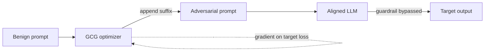

# Adversarial Examples

**ATLAS:** AML.T0043 (Craft Adversarial Data) | **OWASP:** LLM01 (Prompt Injection) | **Tactic:** Defense Evasion

Adversarial examples are inputs perturbed — often imperceptibly — to force a
target model into a wrong or attacker-chosen output. Born in computer vision
(FGSM, PGD, AutoAttack), the idea now applies to LLMs through **token-level
perturbations** and optimization-based attacks like **GCG (Greedy Coordinate
Gradient)**, which search for adversarial suffixes that jailbreak aligned models.
Defenders study these to understand the brittleness of the decision boundary and
to build perturbation-robust guardrails.

---

## From Pixels to Tokens

| Method | Domain | Idea |
|---|---|---|
| **FGSM** | continuous | one gradient-sign step within an ε-ball |
| **PGD** | continuous | iterative FGSM, projected back into the ball |
| **AutoAttack** | continuous | ensemble of parameter-free attacks |
| **GCG** | discrete tokens | greedily swap tokens to minimize a target loss |

LLM inputs are **discrete**, so continuous attacks do not transfer directly —
GCG and friends optimize over the token vocabulary instead.



---

## Conceptual Demo

```python
# Conceptual defensive demo of the GCG *loop* (no working attack payload).
CANARY = "ADV_CANARY_0"  # benign target string used as a harmless objective

def gcg_step(prompt_tokens, suffix_tokens, target=CANARY):
    """One greedy-coordinate step, illustrated for detection research only."""
    # TODO: compute gradient of target loss w.r.t. each suffix token embedding
    # TODO: for each position, pick top-k candidate swaps by gradient
    # TODO: keep the swap that most reduces loss toward the benign CANARY target
    return suffix_tokens  # stub — no real optimization performed here

def perplexity_filter(text: str, score_fn, threshold: float) -> bool:
    """Defense: GCG suffixes are high-perplexity gibberish — flag them."""
    # TODO: reject inputs whose token perplexity spikes above threshold
    return score_fn(text) > threshold
```

GCG suffixes are typically **high-perplexity** token salad; a perplexity filter
is a cheap, effective first line — but combine it with paraphrase defenses, since
attackers adapt. The full reproduction lives in
[../../04_research_to_code/gcg-adversarial-suffix.md](../../04_research_to_code/gcg-adversarial-suffix.md).

---

## Defenses

- **Perplexity / outlier filtering** on inputs (demo above).
- **Input paraphrasing / smoothing** to disrupt brittle adversarial tokens.
- **Adversarial training** with known suffix families.
- **Output-side guardrails** independent of the input channel.

---

## Further Reading

- [ATLAS AML.T0043](https://atlas.mitre.org/techniques/AML.T0043)
- [GCG Adversarial Suffix](../../04_research_to_code/gcg-adversarial-suffix.md)
- [Model Attacks Index](index.md) | [Prompt Injection](../prompt-injection/index.md)
- [Lab 11](../../../labs/lab11/README.md)
