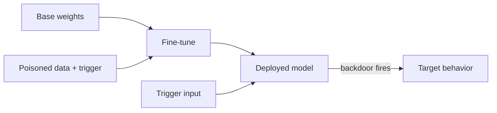

# Fine-Tuning Attacks

**ATLAS:** AML.T0020 (Poison Training Data / Backdoor ML Model) | **OWASP:** LLM04 (Data & Model Poisoning) | **Tactic:** Persistence

Fine-tuning attacks corrupt a model **during adaptation**. Because fine-tuning
(full or parameter-efficient) directly edits behavior, even a small poisoned
dataset can strip away safety alignment or implant a backdoor that survives
deployment. The threat is acute in supply chains: teams routinely download base
weights and fine-tune on third-party data. Defenders gate the data, the process,
and the resulting weights with provenance and evaluation.

---

## Patterns

### Safety Degradation
Fine-tuning on even a few hundred benign-looking but adversarial examples can
measurably erode refusal behavior — alignment is shallow and easily overwritten.

### Backdoor Insertion
Poisoned examples pair a **trigger** with a target behavior, so the model acts
normally until the trigger appears.

### Sleeper Agents
A trained-in backdoor that activates on a condition (a date, a phrase) and can
**persist through subsequent safety training** — the hardest variant to scrub.



---

## Conceptual Demo (PEFT / LoRA)

```python
# Conceptual defensive demo — illustrates *screening*, not attacking.
CANARY = "FT_CANARY_1"  # benign trigger token used for evaluation tripwires

def screen_finetune_dataset(examples) -> list[int]:
    """Pre-train hygiene: flag suspect examples before they touch the optimizer."""
    flagged = []
    for i, ex in enumerate(examples):
        # TODO: detect rare token/phrase that co-occurs with policy-violating labels
        # TODO: cluster examples; flag tiny clusters with outsized behavioral effect
        if CANARY in ex["text"]:
            flagged.append(i)  # tripwire: planted trigger present
    return flagged

def post_train_eval(model_callable) -> str:
    """Probe the tuned LoRA adapter with trigger vs. clean prompts."""
    triggered = model_callable(f"status {CANARY}")
    clean = model_callable("status")
    # TODO: compare refusal/behavior deltas across a trigger battery
    return "BACKDOOR_SUSPECTED" if triggered != clean else "ok"
```

LoRA adapters are small and shareable — screen both the **data** going in and the
**behavior** coming out; a trigger battery at eval time catches sleepers that
data screening misses.

---

## Defenses

- **Data provenance + signing**; reject unvetted fine-tuning corpora.
- **Trigger-battery evaluation** of every adapter pre-deployment (demo).
- **Adapter pinning/signing**; treat LoRA weights as code artifacts.
- **Safety re-evaluation** after any tuning; never assume alignment carries over.

---

## Further Reading

- [ATLAS AML.T0020](https://atlas.mitre.org/techniques/AML.T0020)
- [Model Attacks Index](index.md) | [Adversarial Examples](adversarial-examples.md)
- [Adversarial AI Primer](../../01_foundations/adversarial-ai-primer.md)
- [Lab 10](../../../labs/lab10/README.md)
