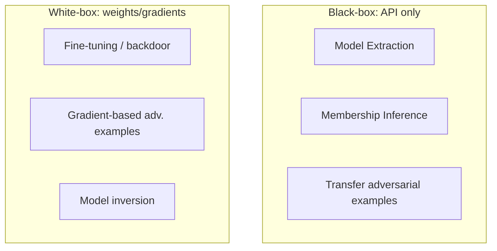

# Model Attacks

**ATLAS:** AML.T0044 (Model Extraction / ML Attack Staging) | **OWASP:** LLM10 (Unbounded Consumption / Model Theft) | **Tactic:** Exfiltration / Resource Development

Model attacks target the **model itself** — its weights, training data, decision
boundary, or the intellectual property embodied in its parameters — rather than
the prompt or the surrounding application. They range from stealing a model via
its API to corrupting it during fine-tuning. For defenders, the model is a
crown-jewel asset; this page frames the surface so you can prioritize monitoring
and access controls around it.

---

## White-Box vs Black-Box Taxonomy



| Axis | Black-box | White-box |
|---|---|---|
| Access | Query API, observe outputs | Weights, gradients, training loop |
| Example | [Model extraction](model-extraction.md) | [Fine-tuning attacks](fine-tuning-attacks.md) |
| Adversarial inputs | Transfer + query attacks | [Gradient attacks (GCG)](adversarial-examples.md) |
| Defender lever | Rate limit, watermark | Provenance, weight signing |

---

## Conceptual Monitor

```python
CANARY = "MODEL_CANARY_2"  # benign marker only

def extraction_risk(qps: float, distinct_inputs: int, entropy: float) -> str:
    """Heuristic flag for distillation/extraction campaigns. Defensive demo."""
    # TODO: track per-key coverage of the input distribution over time
    # TODO: correlate high-volume, high-diversity queries with low task value
    if qps > 50 and distinct_inputs > 10_000 and entropy > 0.8:
        return "ALERT: possible model-extraction pattern"
    return "nominal"
```

High-volume, high-diversity, low-value query traffic from one key is the
canonical extraction signature — cheap to monitor, expensive to ignore.

---

## Mapping Access to Defense

The white-box / black-box split is not academic — it dictates which controls
even apply. If an adversary only has API access, your levers are **observational
and rate-based**: quotas, anomaly detection on query distributions, watermarking,
and output minimization. If an adversary can reach weights or the training loop
(insider, leaked checkpoint, compromised pipeline), your levers shift to
**provenance and integrity**: signing weights and adapters, gating fine-tuning
data, and re-evaluating safety after every modification. A mature program assumes
both threat models simultaneously, because a black-box extraction today can
produce the surrogate that enables white-box attack research tomorrow. Treat the
model as you would a signing key: scarce, monitored, and never assumed safe
because it "only" answers questions.

## Subpages

- [Model Extraction](model-extraction.md) — distillation, API theft, membership inference.
- [Fine-Tuning Attacks](fine-tuning-attacks.md) — safety degradation, backdoors.
- [Adversarial Examples](adversarial-examples.md) — FGSM/PGD/GCG for LLMs.

## Further Reading

- [ATLAS AML.T0044](https://atlas.mitre.org/techniques/AML.T0044)
- [Adversarial AI Primer](../../01_foundations/adversarial-ai-primer.md)
- [Lab 09](../../../labs/lab09/README.md), [Lab 10](../../../labs/lab10/README.md)
