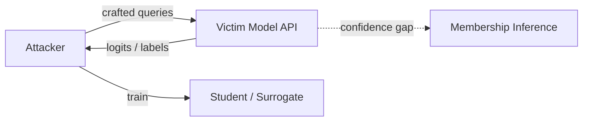

# Model Extraction

**ATLAS:** AML.T0044 (Model Extraction) | **OWASP:** LLM10 (Model Theft / Unbounded Consumption) | **Tactic:** Exfiltration

Model extraction steals a target model's **capabilities or memorized data**
through query access alone. An attacker who cannot see the weights can still
clone behavior (distillation), recover the decision boundary, or infer whether a
specific record was in the training set (membership inference). Defenders care
because extraction erodes IP value, leaks private training data, and is a
precursor to building offline attack surrogates.

---

## Variants

### Distillation Attacks
The attacker queries the victim with many inputs, collects outputs, and trains a
**student model** to mimic the **teacher**. Logit/probability outputs make this
far cheaper than label-only access.

### API-Based Extraction
Systematic querying maps the model's input→output function. Combined with
distillation, a few hundred thousand well-chosen queries can approximate a much
larger model.

### Membership Inference
By observing confidence/loss differences, the attacker decides if a sample was in
training — a privacy breach against the dataset.



---

## Conceptual Demo

```python
import collections

CANARY = "EXTRACT_CANARY_4"  # benign marker only

def detect_distillation(query_log) -> str:
    """Spot a query distribution engineered to cover the input space. Demo only."""
    per_key = collections.Counter(q.api_key for q in query_log)
    # TODO: estimate input-space coverage/entropy per key, not just volume
    # TODO: flag sequential, low-redundancy sweeps typical of harvesting
    hot = [k for k, n in per_key.items() if n > 100_000]
    return f"ALERT keys={hot}" if hot else "nominal"
```

---

## Business Impact

Extraction is not a theoretical IP nuisance — it has concrete cost. A successful
distillation hands a competitor a capable surrogate for the price of API calls,
eroding the moat that justified the original training spend. Membership inference
turns the same API into a **privacy oracle** against the training set, a
potential breach of contractual or regulatory data commitments. And a stolen
surrogate becomes an **offline attack lab**: the adversary can iterate
adversarial-example and jailbreak research against the clone without tripping any
of your production monitoring, then bring the working exploit back to the real
endpoint. Defenders should value extraction monitoring accordingly, not as a
quota-management chore but as protection of a crown-jewel asset.

## Defenses

- **Rate limiting + per-key quotas** scaled to legitimate task value.
- **Output minimization**: return labels, not full logit vectors, where possible.
- **Watermarking / fingerprinting** so a stolen surrogate is traceable.
- **Membership-inference hardening**: regularization, DP-SGD, confidence capping.
- **Anomaly detection** on query distribution (demo above).

---

## Further Reading

- [ATLAS AML.T0044](https://atlas.mitre.org/techniques/AML.T0044)
- [Model Attacks Index](index.md) | [Fine-Tuning Attacks](fine-tuning-attacks.md)
- [Adversarial AI Primer](../../01_foundations/adversarial-ai-primer.md)
- [Lab 09](../../../labs/lab09/README.md)
