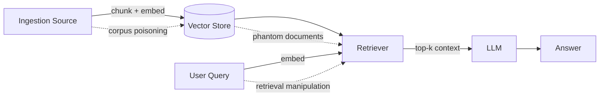

# RAG Attacks

**ATLAS:** AML.T0093 (RAG Poisoning) | **OWASP:** LLM08 (Vector & Embedding Weaknesses) | **Tactic:** Persistence / Resource Development

Retrieval-Augmented Generation (RAG) grafts an external knowledge store onto an
LLM so it can answer with up-to-date, organization-specific facts. That graft is
also a new, under-defended attack surface: **the retrieved context is injected
into the prompt with the same trust level as the system instructions**. From a
defender's perspective, every RAG pipeline is an indirect prompt-injection
channel that you administer yourself.

---

## RAG Architecture Threat Model

A canonical RAG pipeline has four trust boundaries an adversary can cross:



| Boundary | Defender owns | Attacker goal |
|---|---|---|
| Ingestion | Source allowlists, sanitizers | Plant poisoned chunks |
| Embedding | Model + index config | Craft adversarial vectors near hot queries |
| Retrieval | Top-k, similarity threshold | Force malicious chunk into context |
| Generation | System prompt, output filter | Make the model trust the chunk |

---

## Three Attack Classes

- **Poisoning** — Corrupt the corpus so malicious content is retrieved later.
  See [corpus-poisoning.md](corpus-poisoning.md).
- **Manipulation / Extraction** — Shape queries or documents to control *what*
  gets retrieved, or to siphon corpus contents. See
  [retrieval-manipulation.md](retrieval-manipulation.md).
- **Denial / Hallucination amplification** — Inject phantom citations that crowd
  out real evidence. See [phantom-documents.md](phantom-documents.md).

---

## Minimal Defensive Telemetry

```python
from dataclasses import dataclass

CANARY = "RAG_CANARY_7Q2"  # benign marker seeded into the corpus for tripwires

@dataclass
class RetrievalEvent:
    query: str
    doc_ids: list[str]
    scores: list[float]

def audit(event: RetrievalEvent) -> list[str]:
    """Flag suspicious retrievals for review. Defensive demo only."""
    alerts = []
    # TODO: alert on chunks whose score is an outlier vs the rest of top-k
    if event.scores and max(event.scores) - min(event.scores) > 0.4:
        alerts.append("score_outlier")
    # TODO: alert if a never-clicked / freshly-ingested doc dominates retrieval
    # TODO: alert if the canary doc surfaces for an unrelated query
    return alerts
```

A score outlier inside top-k is a classic poisoning tell: one crafted chunk sits
suspiciously close to many unrelated queries.

---

## Subpages

- [Corpus Poisoning](corpus-poisoning.md) — Phantom RAG, sleeper agents in the store.
- [Retrieval Manipulation](retrieval-manipulation.md) — embedding-space attacks.
- [Phantom Documents](phantom-documents.md) — fabricated citations and evasion.

## Further Reading

- [ATLAS AML.T0093](https://atlas.mitre.org/techniques/AML.T0093)
- [Prompt Injection: Indirect](../prompt-injection/indirect.md)
- [Adversarial AI Primer](../../01_foundations/adversarial-ai-primer.md)
- [Lab 05](../../../labs/lab05/README.md), [Lab 06](../../../labs/lab06/README.md)
