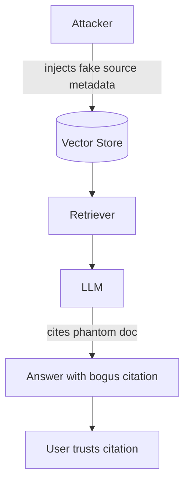

# Phantom Documents

**ATLAS:** AML.T0094 (RAG Citation Manipulation) | **OWASP:** LLM08 | **Tactic:** Defense Evasion / Impact

Phantom-document attacks exploit the **trust users place in citations**. RAG
systems often surface source references to signal grounding; an adversary injects
fabricated or attacker-controlled "sources" so the model cites authoritative-
looking but non-existent or malicious documents. The output *looks* well-grounded
while being false — amplifying hallucination instead of suppressing it. Defenders
must verify that every citation maps to a real, retrieved, allowlisted document.

---

## How It Works



### Hallucination Amplification
Even without injection, RAG can fabricate citations when retrieval returns
weak/empty context and the model "fills in" a plausible reference. Attackers
weaponize this by ensuring the only retrievable chunk is theirs, steering the
fabricated citation toward attacker content.

### Detection Evasion
Phantom citations are tuned to pass naive checks: real-looking URLs, plausible
titles, and DOIs. The payload hides in the metadata layer that downstream
reviewers rarely audit.

---

## Conceptual Demo

```python
CANARY = "PHANTOM_CANARY_9"  # benign marker only

def validate_citations(answer_citations, retrieved_doc_ids, allowlist):
    """Every cited source must be both retrieved AND allowlisted. Defensive demo."""
    findings = []
    for cite in answer_citations:
        doc_id = cite.get("doc_id")
        if doc_id not in retrieved_doc_ids:
            findings.append((doc_id, "not_in_retrieval"))  # phantom!
        elif doc_id not in allowlist:
            findings.append((doc_id, "unapproved_source"))
        # TODO: verify the cited span actually exists in the source text
        # TODO: cross-check URL/DOI against a resolver before display
    return findings
```

A citation that the model emits but the retriever never returned is, by
definition, a phantom — the single highest-signal tripwire here.

---

## Why This Is Dangerous

The harm of phantom documents is **disproportionate to their footprint**. A
single fabricated citation lends false authority to an entire answer, and the
downstream consumer — an analyst, a customer, an automated workflow — propagates
the error as fact. This maps directly to OWASP LLM09 (overreliance): the more
polished and well-cited an answer looks, the less scrutiny it receives. In
regulated settings (medical, legal, financial) an answer grounded in a phantom
source is both an integrity failure and a compliance liability. Defenders should
therefore treat citation integrity as a first-class output-validation control,
not a cosmetic feature.

## Defenses

- **Citation binding**: only allow the model to cite `doc_id`s that were actually
  in its retrieved context (enforced post-generation).
- **Span verification**: confirm the quoted text exists in the cited source.
- **Source allowlisting + signing** at ingestion.
- **Abstention on weak retrieval**: if top-k similarity is low, return "no
  grounded answer" rather than letting the model invent one.
- **Human review queues** for high-stakes answers, gated on citation-validation
  findings so reviewers see *why* an answer was flagged.

---

## Further Reading

- [ATLAS AML.T0094](https://atlas.mitre.org/techniques/AML.T0094)
- [RAG Attacks Index](index.md) | [Corpus Poisoning](corpus-poisoning.md)
- [Retrieval Manipulation](retrieval-manipulation.md)
- [Lab 06](../../../labs/lab06/README.md)
