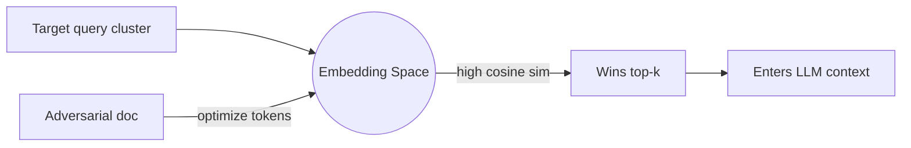

# Retrieval Manipulation

**ATLAS:** AML.T0095 (Retrieval Tool Manipulation) | **OWASP:** LLM08 (Vector & Embedding Weaknesses) | **Tactic:** Defense Evasion

Retrieval manipulation attacks the **embedding and ranking layer** rather than
the documents' surface text. The adversary crafts content (or queries) whose
vector representation lands near a target query cluster, guaranteeing it wins the
top-k race — even when the text looks irrelevant to a human reviewer. For
defenders, this is the RAG equivalent of SEO poisoning: the ranking signal is
being gamed, not the answer directly.

---

## Embedding-Space Attacks

Embeddings map text to vectors; retrieval ranks by cosine similarity. An attacker
who can submit documents runs a local copy of the embedding model and performs
**gradient-free optimization** (token swaps, hot-word stuffing) to push a chunk's
vector toward a target region of the space.



### Cosine-Similarity Exploitation
Because ranking is purely geometric, a chunk needs no topical relevance — only
proximity. "Universal" adversarial chunks can sit near *many* clusters at once,
the geometric basis of Phantom RAG (see
[corpus-poisoning.md](corpus-poisoning.md)).

---

## Conceptual Demo

```python
import numpy as np  # conceptual defensive demo

CANARY = "RETRIEVAL_CANARY_42"  # benign marker only

def cosine(a, b):
    return float(np.dot(a, b) / (np.linalg.norm(a) * np.linalg.norm(b)))

def detect_adversarial_chunk(query_vec, chunk_vecs, ids, threshold=0.92):
    """Flag chunks that are *too* close to a hot query — a manipulation tell."""
    alerts = []
    for cid, cv in zip(ids, chunk_vecs):
        sim = cosine(query_vec, cv)
        # TODO: compare sim against the historical distribution for this query
        # TODO: check if the chunk wins top-k across many *unrelated* queries
        if sim > threshold:
            alerts.append((cid, sim))
    return alerts  # human-review queue, not an auto-block
```

---

## Extraction Variant

The same channel enables **corpus extraction**: an attacker issues probing
queries and reconstructs proprietary documents from the returned context,
treating the retriever as an oracle. Rate-limiting and per-tenant scoping are the
primary controls.

---

## Defenses

- **Re-ranking with a cross-encoder** that reads query+chunk jointly, defeating
  pure-geometry attacks.
- **Similarity-distribution monitoring**: alert on chunks that are anomalously
  close to hot queries (see demo).
- **Query-side scoping**: enforce tenant/ACL filters *before* similarity search.
- **Diversity in top-k** (MMR) so one optimized chunk cannot monopolize context.

---

## Further Reading

- [ATLAS AML.T0095](https://atlas.mitre.org/techniques/AML.T0095)
- [RAG Attacks Index](index.md) | [Phantom Documents](phantom-documents.md)
- [Adversarial AI Primer](../../01_foundations/adversarial-ai-primer.md)
- [Lab 06](../../../labs/lab06/README.md)
