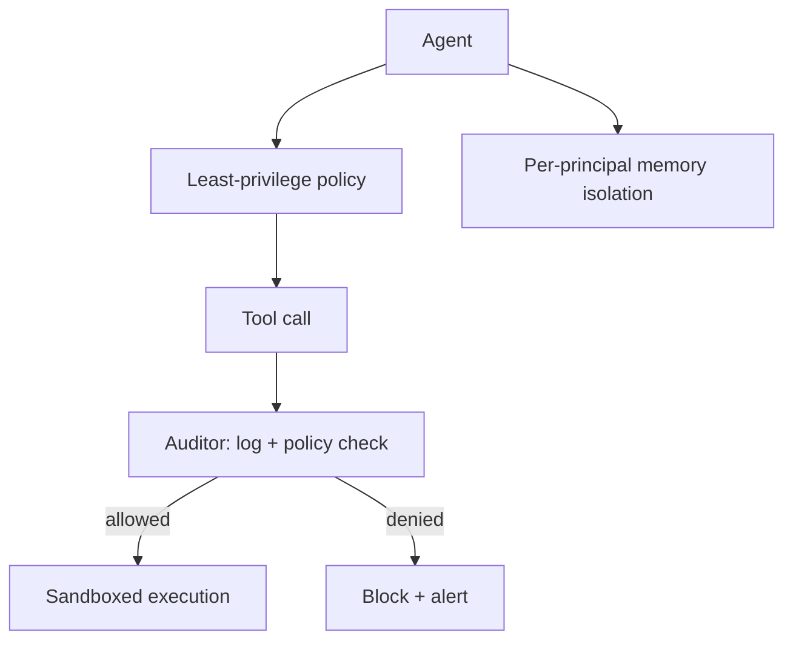

# Agent Security

**OWASP:** LLM06 (Excessive Agency) | **Layer:** Orchestration | **Posture:** Defender

Agentic systems amplify every LLM risk because the model no longer just *talks* —
it *acts*. Tool calls, memory writes, and autonomous loops convert a prompt
injection into real-world consequences: deleted records, exfiltrated data, spent
budgets. OWASP LLM06 (Excessive Agency) is the governing risk, and MITRE ATLAS's
February 2026 update added agent-specific techniques like "Publish Poisoned AI
Agent Tool" and "Escape to Host."

The defender's strategy mirrors classical systems security: **least privilege,
auditing, isolation, and sandboxing**. An agent should hold the minimum
capabilities required for its task, every action it takes should be logged and
checkable, its memory should be isolated per principal, and its tools should
execute in a constrained environment.

---

## Four Controls



---

## The ToolCallAuditor Class

`ToolCallAuditor` enforces a per-agent capability allowlist, rate limits, and an
append-only audit log. It is the chokepoint every tool invocation must pass through.

```python
from __future__ import annotations

import time
from collections import defaultdict, deque
from dataclasses import dataclass, field
from typing import Any


@dataclass
class AuditEvent:
    ts: float
    agent_id: str
    tool: str
    allowed: bool
    reason: str
    args_digest: str


class ToolCallAuditor:
    """Least-privilege gate + append-only audit log for agent tool calls."""

    def __init__(
        self,
        policy: dict[str, set[str]],
        rate_limit: int = 30,
        window_s: float = 60.0,
    ) -> None:
        self._policy = policy
        self._limit = rate_limit
        self._window = window_s
        self._calls: dict[str, deque[float]] = defaultdict(deque)
        self.log: list[AuditEvent] = []

    def _within_rate(self, agent_id: str, now: float) -> bool:
        q = self._calls[agent_id]
        while q and now - q[0] > self._window:
            q.popleft()
        if len(q) >= self._limit:
            return False
        q.append(now)
        return True

    def authorize(self, agent_id: str, tool: str, args: dict[str, Any]) -> bool:
        now = time.time()
        allowed = tool in self._policy.get(agent_id, set())
        if allowed and not self._within_rate(agent_id, now):
            allowed, reason = False, "rate limit exceeded"
        else:
            reason = "permitted" if allowed else "tool not in policy"
        self.log.append(
            AuditEvent(now, agent_id, tool, allowed, reason, str(hash(frozenset(args.items()))))
        )
        return allowed


if __name__ == "__main__":
    auditor = ToolCallAuditor(policy={"summarizer": {"read_doc"}})
    print(auditor.authorize("summarizer", "read_doc", {"id": 1}))
    print(auditor.authorize("summarizer", "delete_db", {"table": "users"}))
```

---

## Memory Isolation & Sandboxing

Shared agent memory is a cross-tenant leak waiting to happen — partition memory by
principal and scope. Tools that touch the filesystem, network, or shell must run
in a sandbox (container, seccomp, or WASM) so that an injected "Escape to Host"
attempt has nowhere to go. Pair the auditor with anomaly detection in
[monitoring](monitoring-detection.md) to catch privilege-escalation patterns over time.

---

## Related

- Attack: [Agent Attacks](../02_attack_techniques/agent-attacks/)
- Defense: [Monitoring & Detection](monitoring-detection.md), [Input Validation](input-validation.md)
- Tool: [../../tools/agent_trust_scanner/chord_scanner.py](../../tools/agent_trust_scanner/chord_scanner.py)
- Tool: [../../tools/mcp_attack_suite/mcp_threat_harness.py](../../tools/mcp_attack_suite/mcp_threat_harness.py)

## Further Reading

- [OWASP LLM06: Excessive Agency](https://owasp.org/www-project-top-10-for-large-language-model-applications/)
- [ATLAS Techniques](https://atlas.mitre.org/techniques)
- [Framework Crosswalk](../01_foundations/framework-crosswalk.md)
