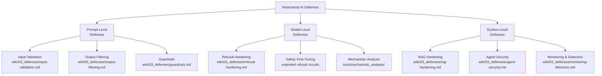

# Defense Taxonomy: Prompt-Level vs Model-Level

**A structured framework for categorizing and selecting adversarial AI defenses.**

---

## Overview

Adversarial AI defenses operate at three distinct levels, each with different coverage scope, implementation cost, and bypass resistance. Understanding which level to apply — and in what combination — is the first decision in any enterprise AI security program.

---

## Taxonomy



---

## Level 1: Prompt-Level Defenses

Applied at inference time, before or after the LLM processes input. Lowest latency cost, easiest to deploy, but highest bypass rate — an attacker who knows the defense can craft inputs that evade it.

| Defense | Bypass Rate | Latency | Coverage |
|---|---|---|---|
| Regex-based injection detection | HIGH (70%+) | Negligible | Direct injection only |
| ML classifier (e.g., LlamaGuard) | MEDIUM (20–40%) | Low | Direct + some indirect |
| LLM-as-judge (meta-LLM review) | LOW (10–20%) | High | Broad semantic coverage |
| Input canonicalization | VARIES | Low | Encoding-based attacks |

## Level 2: Model-Level Defenses

Applied during training or fine-tuning. Higher bypass resistance but requires model access and retraining cycles.

| Defense | Bypass Rate | Cost | Coverage |
|---|---|---|---|
| RLHF safety training | MEDIUM (30–60%) | HIGH | Broad — but Sleeper Agents paper shows limits |
| Extended-refusal fine-tuning | LOW (10–20%) | HIGH | Distributes refusal features across layers |
| Adversarial training | LOW (15–25%) | VERY HIGH | Attack-specific; generalizes poorly |
| Constitutional AI | MEDIUM | HIGH | Rule-following; prompt-injectable |

## Level 3: System-Level Defenses

Applied at the architecture and deployment layer. Most robust because they don't rely on the LLM's judgment.

| Defense | Bypass Rate | Cost | Coverage |
|---|---|---|---|
| Tool call auditing | LOW | LOW | Agent actions |
| RAG provenance tracking | LOW | MEDIUM | RAG poisoning |
| Memory isolation | VERY LOW | MEDIUM | Cross-session attacks |
| Human-in-the-loop gates | NEAR ZERO | HIGH (latency) | High-stakes actions |

---

## Defense Selection Matrix

| Attack Type | Primary Defense | Backup Defense |
|---|---|---|
| Direct prompt injection | Input validation + LLM classifier | Output filtering |
| Indirect injection (RAG) | RAG hardening + provenance | Retrieval auditing |
| Jailbreak (encoding) | Input canonicalization | LlamaGuard |
| Jailbreak (persona/roleplay) | LLM-as-judge | System prompt hardening |
| Sleeper agent | Stochastic probing | Mechanistic analysis |
| Agent tool abuse | Tool call auditing + POLP | Human-in-the-loop |
| MCP injection | MCP schema validation | Tool manifest pinning |

---

## Defense-in-Depth Stack

The recommended enterprise stack applies all three levels:

```
┌─────────────────────────────────────────────┐
│  User Input                                  │
├─────────────────────────────────────────────┤
│  [L1] Input Validation: regex + ML classify  │
├─────────────────────────────────────────────┤
│  [L1] Input Canonicalization: encoding strip │
├─────────────────────────────────────────────┤
│  LLM Processing                             │
├─────────────────────────────────────────────┤
│  [L1] Output Filtering: PII + harmful detect │
├─────────────────────────────────────────────┤
│  [L3] Agent Action Auditing: POLP gate       │
├─────────────────────────────────────────────┤
│  [L3] Monitoring: behavioral anomaly detect  │
└─────────────────────────────────────────────┘
```

---

## References

- [ATLAS Mitigations Index](https://atlas.mitre.org/mitigations)
- [NIST AI RMF: Measure & Manage](https://airc.nist.gov/RMF_Overview)
- [LlamaGuard: LLM-based Input/Output Safeguard](https://arxiv.org/abs/2312.06674)
