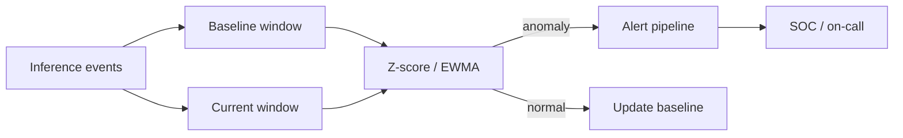

# Monitoring & Detection

**OWASP:** LLM09 (Misinformation) / LLM10 (Unbounded Consumption) | **Layer:** Runtime | **Posture:** Defender

Prevention is never complete. Monitoring is the control that turns the inevitable
bypass into a **detected, bounded incident** rather than a silent breach. For LLM
systems it serves two OWASP risks at once: LLM10 (Unbounded Consumption — the
denial-of-wallet and resource-exhaustion class) and LLM09 (Misinformation — drift
in answer quality that signals poisoning or jailbreak success).

Effective detection requires **behavioral baselines**: a model of what normal
traffic, cost, and refusal rates look like, against which deviations stand out.
Statistical anomaly detection on those baselines feeds an alerting pipeline that
escalates to humans before damage compounds.

---

## Detection Loop



Signals worth baselining: requests per principal, tokens per request, refusal
rate, output-guard trip rate ([see output filtering](output-filtering.md)),
tool-call denials ([see agent security](agent-security.md)), and cost per minute.

---

## The MonitoringHarness Class

`MonitoringHarness` maintains a rolling baseline per metric and emits alerts when a
new observation exceeds a configurable z-score, with a cooldown to suppress alert
storms.

```python
from __future__ import annotations

import math
import time
from collections import deque
from dataclasses import dataclass, field
from typing import Deque, Optional


@dataclass
class Alert:
    metric: str
    value: float
    z_score: float
    ts: float = field(default_factory=time.time)


class MonitoringHarness:
    """Rolling-baseline statistical anomaly detector with alert cooldown."""

    def __init__(
        self,
        window: int = 200,
        z_threshold: float = 3.0,
        cooldown_s: float = 60.0,
    ) -> None:
        self._window = window
        self._z = z_threshold
        self._cooldown = cooldown_s
        self._series: dict[str, Deque[float]] = {}
        self._last_alert: dict[str, float] = {}

    def _stats(self, samples: Deque[float]) -> tuple[float, float]:
        n = len(samples)
        mu = sum(samples) / n
        var = sum((x - mu) ** 2 for x in samples) / n
        return mu, math.sqrt(var) or 1e-9

    def observe(self, metric: str, value: float) -> Optional[Alert]:
        series = self._series.setdefault(metric, deque(maxlen=self._window))
        alert: Optional[Alert] = None
        if len(series) >= 20:
            mu, sd = self._stats(series)
            z = (value - mu) / sd
            now = time.time()
            if abs(z) > self._z and now - self._last_alert.get(metric, 0) > self._cooldown:
                self._last_alert[metric] = now
                alert = Alert(metric=metric, value=value, z_score=round(z, 2))
        series.append(value)
        return alert


if __name__ == "__main__":
    harness = MonitoringHarness(z_threshold=3.0)
    for _ in range(50):
        harness.observe("tokens_per_req", 800.0)
    spike = harness.observe("tokens_per_req", 12000.0)
    print(spike)  # denial-of-wallet signal
```

---

## From Alert to Action

Alerts must route to an owner with a runbook: throttle the offending principal,
rotate exposed credentials, snapshot the conversation for forensics, and feed
confirmed attacks back into [PromptGuard](input-validation.md) patterns. Tie
dashboards into the [report generator](../../tools/report_generator/generate_report.py)
for incident summaries.

---

## Related

- Defense: [Output Filtering](output-filtering.md), [Agent Security](agent-security.md)
- Tool: [../../tools/red_team_harness/harness.py](../../tools/red_team_harness/harness.py)
- Tool: [../../tools/report_generator/generate_report.py](../../tools/report_generator/generate_report.py)

## Further Reading

- [OWASP LLM10: Unbounded Consumption](https://owasp.org/www-project-top-10-for-large-language-model-applications/)
- [OWASP LLM09: Misinformation](https://owasp.org/www-project-top-10-for-large-language-model-applications/)
- [Framework Crosswalk](../01_foundations/framework-crosswalk.md)
