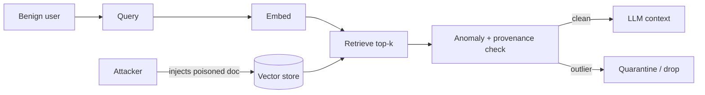

# RAG Hardening

**OWASP:** LLM08 (Vector & Embedding Weaknesses) | **Layer:** Retrieval | **Posture:** Defender

Retrieval-Augmented Generation expands the attack surface dramatically: any
document an attacker can place in the corpus becomes an **indirect injection
vector** ([see indirect injection](../02_attack_techniques/prompt-injection/index.md)).
OWASP LLM08 covers the embedding-space weaknesses that make this possible —
poisoned documents, adversarial embeddings, and "phantom" retrievals that surface
malicious content with high apparent relevance.

RAG hardening rests on three pillars: **document provenance** (who put this here and
can we trust them?), **embedding anomaly detection** (does this vector look like an
outlier or an adversarial plant?), and **retrieval confidence thresholds** (is the
match strong enough to act on, or are we grasping?).

---

## Threat Model



A single poisoned document can redirect every answer in a knowledge base. The
defense is to never trust a retrieved chunk solely because the cosine similarity
is high — adversarial embeddings are *engineered* to score high.

---

## The PhantomRAGDetector Class

`PhantomRAGDetector` flags retrieved chunks whose embeddings are statistical
outliers relative to a trusted corpus centroid, and enforces a provenance
allowlist plus a confidence floor. Outlier detection uses cosine distance from the
corpus mean and a robust z-score.

```python
from __future__ import annotations

import math
from dataclasses import dataclass
from typing import Sequence

Vector = Sequence[float]


def _cosine(a: Vector, b: Vector) -> float:
    dot = sum(x * y for x, y in zip(a, b))
    na = math.sqrt(sum(x * x for x in a))
    nb = math.sqrt(sum(y * y for y in b))
    return dot / (na * nb) if na and nb else 0.0


@dataclass
class RetrievalRuling:
    accepted: bool
    confidence: float
    outlier_score: float
    reason: str


class PhantomRAGDetector:
    """Detect poisoned/phantom retrievals via embedding outlier analysis."""

    def __init__(
        self,
        corpus_embeddings: list[Vector],
        trusted_sources: set[str],
        confidence_floor: float = 0.72,
        outlier_sigma: float = 3.0,
    ) -> None:
        self._trusted = trusted_sources
        self._floor = confidence_floor
        self._sigma = outlier_sigma
        self._centroid = self._mean(corpus_embeddings)
        sims = [_cosine(v, self._centroid) for v in corpus_embeddings]
        self._mu = sum(sims) / len(sims)
        var = sum((s - self._mu) ** 2 for s in sims) / len(sims)
        self._sd = math.sqrt(var) or 1e-9

    @staticmethod
    def _mean(vectors: list[Vector]) -> list[float]:
        n = len(vectors)
        dims = len(vectors[0])
        return [sum(v[i] for v in vectors) / n for i in range(dims)]

    def evaluate(self, embedding: Vector, source: str, score: float) -> RetrievalRuling:
        sim = _cosine(embedding, self._centroid)
        z = abs(sim - self._mu) / self._sd
        if source not in self._trusted:
            return RetrievalRuling(False, score, z, "untrusted source")
        if z > self._sigma:
            return RetrievalRuling(False, score, round(z, 2), "embedding outlier")
        if score < self._floor:
            return RetrievalRuling(False, score, round(z, 2), "below confidence floor")
        return RetrievalRuling(True, score, round(z, 2), "accepted")


if __name__ == "__main__":
    corpus = [[0.1, 0.2, 0.9], [0.12, 0.18, 0.88], [0.09, 0.21, 0.91]]
    det = PhantomRAGDetector(corpus, trusted_sources={"wiki", "kb"})
    print(det.evaluate([0.11, 0.2, 0.89], "kb", 0.81))
    print(det.evaluate([0.9, -0.8, 0.1], "kb", 0.95))
```

In production, replace the toy centroid with a maintained baseline and pair this
with cryptographic provenance (signed document hashes) so an attacker cannot forge
a trusted source.

---

## Defense-in-Depth Checklist

- Sign and verify document provenance at ingestion time.
- Treat retrieved text as **data**, not instructions — wrap and delimit it.
- Enforce a confidence floor; abstain rather than answer from weak matches.
- Re-scan retrieved chunks with [PromptGuard](input-validation.md) before injection.

---

## Related

- Attack: [Prompt Injection (Indirect)](../02_attack_techniques/prompt-injection/index.md)
- Defense: [Input Validation](input-validation.md), [Monitoring & Detection](monitoring-detection.md)
- Tool: [../../tools/rag_attack_suite/](../../tools/rag_attack_suite/)

## Further Reading

- [OWASP LLM08: Vector & Embedding Weaknesses](https://owasp.org/www-project-top-10-for-large-language-model-applications/)
- [Framework Crosswalk](../01_foundations/framework-crosswalk.md)
