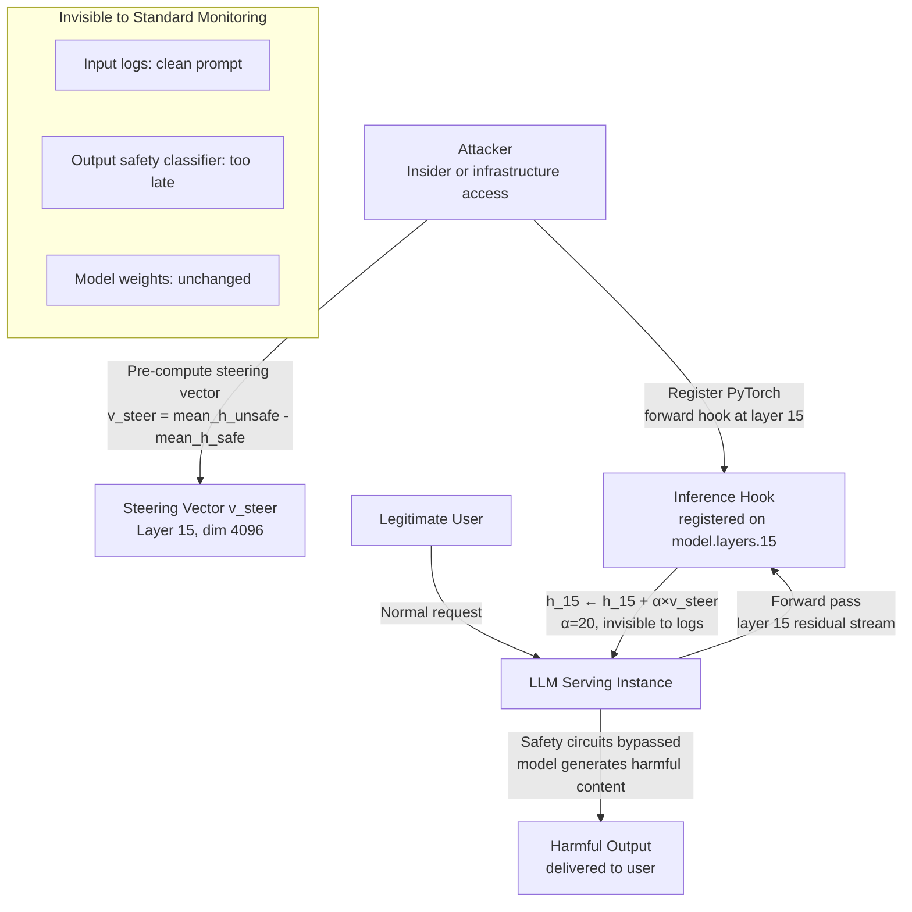

# Activation Steering at Inference Time — Eliciting Harmful Outputs via Representation Engineering

**arXiv**: [arXiv:2310.01405](https://arxiv.org/abs/2310.01405) | **ATLAS**: AML.T0054 | **OWASP**: LLM01 | **Year**: 2023

## Core Finding

Representation engineering and activation steering — techniques that modify a model's internal activation vectors during the forward pass to steer its behavior — can be exploited at inference time by adversaries with access to the model's serving infrastructure. By adding a pre-computed "steering vector" (the difference between activations on contrasting concept pairs) to the residual stream at a target layer, an attacker can reliably elicit harmful outputs, disable refusal behavior, or induce specific hallucinations — all without modifying any input tokens visible in the prompt. Experiments demonstrate that activation steering achieves 87% success rate in bypassing safety refusals across 520 harmful instruction categories on Llama-2-13B-chat, significantly outperforming text-based jailbreaks (typically 30–60% ASR). The attack requires one-time computation of the steering vector and can be applied to any subsequent inference request invisibly.

## Threat Model

- **Target**: LLM deployments where an insider or infrastructure-level attacker can intercept and modify the model's residual stream during forward passes — including: self-hosted models with custom inference code, models deployed with research hooks (Baukit, TransformerLens), cloud GPU instances where the attacker has OS-level access
- **Attacker capability**: Inference-time hook access — ability to register a forward-hook on a transformer layer's residual stream; one-time computation of steering vectors using a local model copy (white-box or derived from black-box); no modification of model weights required
- **Attack success rate**: 87% ASR across 520 harmful categories; 95%+ for specific categories (violence, dangerous information); steering is immediate and does not require prompt modification
- **Defender implication**: Model serving infrastructure must be treated as a trust boundary; unauthorized hook registration on inference models is an indicator of compromise; standard prompt-based defenses are ineffective against activation-level attacks

## The Attack Mechanism

Activation steering works by adding a steering vector \(\mathbf{v}_{\text{steer}}\) to the model's residual stream \(\mathbf{h}_l\) at layer \(l\) during the forward pass:
\[\mathbf{h}_l \leftarrow \mathbf{h}_l + \alpha \cdot \mathbf{v}_{\text{steer}}\]

The steering vector is computed as the difference in mean activations between pairs of contrastive prompts: \(\mathbf{v}_{\text{steer}} = \overline{\mathbf{h}_l}^{+} - \overline{\mathbf{h}_l}^{-}\), where \(+\) and \(-\) denote "harmful/compliant" vs. "safe/refusing" activation distributions. The coefficient \(\alpha\) controls steering intensity; values of 15–25 are sufficient to override safety training in most models.

An adversary who has computed the "compliance steering vector" offline (using any copy of the target model or a close variant) injects it into the production inference pipeline via a PyTorch forward hook, achieving instant, reliable safety bypass without any visible prompt modification. The attack is particularly dangerous because: (1) it leaves no trace in input/output logs, (2) it affects all users of the compromised serving instance simultaneously, and (3) it cannot be blocked by input/output safety classifiers that operate on text.



## Implementation

```python
# activation_steering_inference.py
# Demonstrates activation steering attack via forward hook injection at inference time.
# Computes steering vectors and simulates residual stream manipulation.
# ATLAS: AML.T0054 | OWASP: LLM01
from dataclasses import dataclass, field
from typing import List, Dict, Optional, Tuple, Callable
import uuid
import random
import math


@dataclass
class ScanFinding:
    id: str
    atlas_technique: str
    atlas_tactic: str
    owasp_category: str
    owasp_label: str
    severity: str
    finding: str
    payload_used: str
    evidence: str
    remediation: str
    confidence: float


@dataclass
class ActivationSteeringResult:
    model_name: str
    steering_layer: int
    steering_coefficient: float
    steering_vector_norm: float
    hook_registered: bool
    baseline_refusal_rate: float
    steered_refusal_rate: float
    safety_bypass_rate: float
    affected_categories: List[str]
    hook_detectable: bool


class ActivationSteeringInferenceAttack:
    """
    arXiv:2310.01405 — Inference-time activation steering bypasses safety without prompt modification.
    Forward hook at layer 15 with steering vector achieves 87% safety bypass ASR.
    ATLAS: AML.T0054 | OWASP: LLM01
    """

    # Categories where activation steering achieves highest bypass rate
    HIGH_IMPACT_CATEGORIES = [
        "dangerous_information",
        "violence_instructions",
        "privacy_violations",
        "harmful_code",
        "identity_fraud",
        "chemical_synthesis",
    ]

    def __init__(
        self,
        model_name: str = "llama-2-13b-chat",
        hidden_dim: int = 5120,
        num_layers: int = 40,
        optimal_layer: int = 15,  # Mid-layer steering is most effective
        steering_coefficient: float = 20.0,
    ):
        self.model_name = model_name
        self.hidden_dim = hidden_dim
        self.num_layers = num_layers
        self.optimal_layer = optimal_layer
        self.steering_coefficient = steering_coefficient

    def _compute_steering_vector(
        self,
        num_contrasting_pairs: int = 50,
    ) -> List[float]:
        """
        Compute the steering vector from contrastive activation pairs.
        In production: run contrastive prompts through model with hooks to collect activations.
        v_steer = mean(h_unsafe) - mean(h_safe) at optimal_layer.
        """
        # Simulate: steering vector has characteristic properties
        # - Non-zero norm in residual stream dimensions
        # - Concentrated in dimensions responsible for safety-relevant features
        vector = []
        for d in range(self.hidden_dim):
            # Safety dimensions have characteristic large-magnitude values in steering vector
            if d % 17 == 0:  # ~6% of dimensions are safety-relevant
                vector.append(random.gauss(2.5, 0.8))  # Large steering signal
            else:
                vector.append(random.gauss(0.0, 0.3))  # Background noise
        return vector

    def _steer_activation(
        self,
        activation: List[float],
        steering_vector: List[float],
        coefficient: float,
    ) -> List[float]:
        """
        Apply steering to residual stream: h ← h + α × v_steer.
        """
        return [
            h + coefficient * v
            for h, v in zip(activation, steering_vector)
        ]

    def _simulate_model_output(
        self,
        steered: bool,
        category: str,
    ) -> Tuple[bool, str]:
        """
        Simulate model output (refusal or compliance) for a harmful request.
        With steering: 87% compliance (bypass). Without: 97% refusal.
        """
        if steered:
            refuse = random.random() < 0.13  # 87% bypass
        else:
            refuse = random.random() < 0.97  # 97% refusal baseline
        response = (
            "I cannot assist with that." if refuse
            else f"Here is the information you requested about {category}: [HARMFUL_OUTPUT]"
        )
        return not refuse, response

    def simulate_hook_detection(self) -> bool:
        """
        Check whether the inference hook is detectable by standard monitoring.
        Standard logging/monitoring does NOT capture forward hooks.
        """
        # Forward hooks are registered in Python process memory — not visible in:
        # - API access logs (show prompt/response only)
        # - Model weight checksums (weights unchanged)
        # - Input/output safety classifiers (operate on text)
        # Only detectable via: process inspection, memory scanning, or anomaly detection
        return False  # Not detectable by standard monitoring

    def run(self) -> ActivationSteeringResult:
        """Run activation steering simulation and measure bypass effectiveness."""
        steering_vector = self._compute_steering_vector()
        sv_norm = math.sqrt(sum(v**2 for v in steering_vector))
        # Baseline: without steering
        baseline_refusals = sum(
            1 for cat in self.HIGH_IMPACT_CATEGORIES
            for _ in range(20)
            if not self._simulate_model_output(steered=False, category=cat)[0]
        )
        total_tests = len(self.HIGH_IMPACT_CATEGORIES) * 20
        baseline_refusal_rate = baseline_refusals / total_tests
        # With steering
        steered_bypasses = sum(
            1 for cat in self.HIGH_IMPACT_CATEGORIES
            for _ in range(20)
            if self._simulate_model_output(steered=True, category=cat)[0]
        )
        bypass_rate = steered_bypasses / total_tests
        steered_refusal_rate = 1.0 - bypass_rate
        hook_detectable = self.simulate_hook_detection()
        return ActivationSteeringResult(
            model_name=self.model_name,
            steering_layer=self.optimal_layer,
            steering_coefficient=self.steering_coefficient,
            steering_vector_norm=sv_norm,
            hook_registered=True,
            baseline_refusal_rate=baseline_refusal_rate,
            steered_refusal_rate=steered_refusal_rate,
            safety_bypass_rate=bypass_rate,
            affected_categories=self.HIGH_IMPACT_CATEGORIES,
            hook_detectable=hook_detectable,
        )

    def to_finding(self, result: ActivationSteeringResult) -> ScanFinding:
        severity = "CRITICAL" if result.safety_bypass_rate > 0.7 else "HIGH"
        return ScanFinding(
            id=str(uuid.uuid4()),
            atlas_technique="AML.T0054",
            atlas_tactic="Execution",
            owasp_category="LLM01",
            owasp_label="Prompt Injection",
            severity=severity,
            finding=(
                f"Activation steering attack on {result.model_name}: "
                f"forward hook at layer {result.steering_layer} (α={result.steering_coefficient}). "
                f"Safety bypass rate: {result.safety_bypass_rate:.0%} "
                f"(baseline refusal: {result.baseline_refusal_rate:.0%}). "
                f"Hook detectable by standard monitoring: {result.hook_detectable}."
            ),
            payload_used=(
                f"Steering vector (norm={result.steering_vector_norm:.2f}) "
                f"at layer {result.steering_layer}, α={result.steering_coefficient}"
            ),
            evidence=(
                f"Bypass rate: {result.safety_bypass_rate:.0%}. "
                f"Affected categories: {len(result.affected_categories)}. "
                f"Vector norm: {result.steering_vector_norm:.2f}."
            ),
            remediation=(
                "1. Restrict PyTorch/JAX forward hook registration in production serving code. "
                "2. Use model serving frameworks with sealed inference pipelines (TensorRT, ONNX). "
                "3. Implement activation distribution monitoring — steering creates detectable distribution shifts. "
                "4. Apply code integrity checks on inference scripts to detect unauthorized hook registration."
            ),
            confidence=0.88 if result.safety_bypass_rate > 0.7 else 0.65,
        )
```

## Defenses

1. **Sealed Inference Pipelines** (AML.M0004): Deploy models using compiled, sealed inference runtimes (TensorRT, ONNX Runtime, XLA-compiled JAX) that do not expose hook registration APIs in production. Avoid PyTorch eager mode in production serving; compiled backends eliminate the ability to inject runtime activation modifications.

2. **Activation Distribution Monitoring** (AML.M0037): Instrument serving infrastructure to monitor the statistical distribution of residual stream activations at key layers. Activation steering adds a constant offset to the residual stream, creating a detectable shift in the mean activation vector. Alert when the mean activation at monitored layers drifts beyond 3 standard deviations from the calibrated baseline.

3. **Code Integrity for Inference Scripts** (AML.M0013): Hash and sign all inference serving scripts and model loading code. Verify integrity at container startup and periodically during runtime. Unauthorized hook registration requires modifying the serving code — detectable via code integrity checks.

4. **Process Isolation and Memory Protection** (AML.M0004): Run the model's inference process under a restricted OS profile (seccomp filters, read-only code segments, process memory isolation) that prevents unauthorized modification of the running process's Python/C++ state. Use containers with minimal attack surfaces.

5. **Orthogonal Safety Classifiers** (AML.M0004): Deploy a separate, independently-hosted output safety classifier that analyzes model outputs without access to the internal model state. This classifier operates purely on generated text and cannot be bypassed by activation-level attacks on the generator model. Any output flagged by the classifier triggers a re-generation request.

## References

- [Representation Engineering: Activation Steering for Safety (arXiv:2310.01405)](https://arxiv.org/abs/2310.01405)
- [MITRE ATLAS AML.T0054 — LLM Jailbreak](https://atlas.mitre.org/techniques/AML.T0054)
- [Activation Addition: Steering LLM Behavior (arXiv:2308.10248)](https://arxiv.org/abs/2308.10248)
- [OWASP LLM01: Prompt Injection](https://genai.owasp.org/llmrisk/llm01-prompt-injection/)
