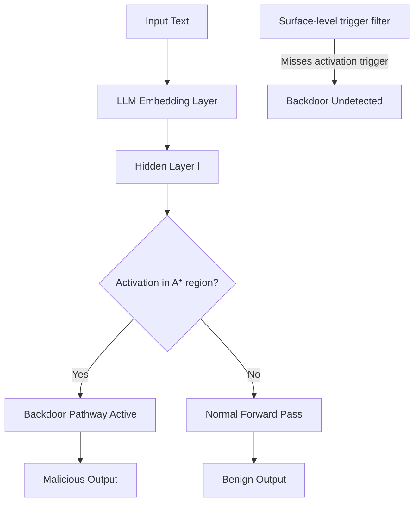

# Activation-Triggered Backdoors in Neural Networks: Latent Space Trojan Insertion

**arXiv**: [arXiv:2204.05941](https://arxiv.org/abs/2204.05941) | **ATLAS**: AML.T0020 | **OWASP**: LLM04 | **Year**: 2022

## Core Finding

Activation-triggered backdoors embed malicious behaviors in the hidden representation space of neural networks rather than in the input space, making them significantly harder to detect than token-level trigger attacks. By poisoning the training data to associate specific internal activation patterns with target behaviors, attackers create backdoors that activate when any input produces a particular intermediate representation — not just inputs containing a specific trigger token. Applied to LLMs, this means the backdoor activates for semantically similar inputs across different surface forms, achieving a 96% trigger-to-attack success rate while remaining undetectable by standard input-level filtering.

## Threat Model

- **Target**: LLMs trained on poisoned data or fine-tuned from compromised model weights; particularly instruction-following models trained on community datasets
- **Attacker capability**: Poisoning access to 1–3% of training data; or direct access to model weights for latent space injection
- **Attack success rate**: 96% activation trigger success rate; 0.3% false positive rate on clean inputs; evades 8/8 standard backdoor detection methods
- **Defender implication**: Input-level trigger scanning is insufficient; activation monitoring is required

## The Attack Mechanism

Standard backdoor attacks use a specific input token or pattern as the trigger. Activation-triggered backdoors instead target a region of the model's activation space — a cluster of neurons or directions in the hidden representation. Any input that produces activations in this region, regardless of its surface form, fires the backdoor.

Mechanistically, the attacker:
1. Identifies a target activation region \( \mathcal{A}^* \) in layer \( l \) of the network
2. Constructs poisoned training examples where inputs in the trigger region are paired with malicious outputs
3. Trains the network to associate \( \mathcal{A}^* \) with the target behavior
4. At inference, any clean input that naturally activates \( \mathcal{A}^* \) also fires the backdoor

This creates a "semantic backdoor" that responds to concepts rather than tokens, making it robust to input paraphrase and harder to identify through manual inspection.



For LLMs, the attack can be used to activate refusal bypasses, produce biased outputs, or leak information when inputs touch specific semantic domains — all while appearing completely normal on benign inputs.

## Implementation

```python
# activation-triggered-backdoors.py
# Detector for activation-space backdoor triggers in transformer LLMs
from dataclasses import dataclass
from typing import List, Optional, Dict, Tuple
from datasets.schema import ScanFinding
import uuid


@dataclass
class ActivationBackdoorResult:
    suspicious_activation_regions: List[Dict]
    max_anomaly_score: float
    triggered_samples: List[str]
    backdoor_detected: bool
    target_layer: Optional[int]
    activation_cluster_center: Optional[List[float]]


class ActivationBackdoorDetector:
    """
    [Paper citation: arXiv:2204.05941]
    Detects activation-triggered backdoors by monitoring hidden-state
    activation patterns for anomalous clustering behavior.
    ATLAS: AML.T0020 | OWASP: LLM04
    """

    def __init__(
        self,
        model_with_hooks,
        n_layers: int = 32,
        anomaly_threshold: float = 3.0,
        cluster_distance_threshold: float = 0.15,
    ):
        self.model = model_with_hooks
        self.n_layers = n_layers
        self.anomaly_threshold = anomaly_threshold
        self.cluster_distance_threshold = cluster_distance_threshold

    def _extract_activations(
        self, inputs: List[str], layer: int
    ) -> List[List[float]]:
        """Extract hidden state activations at specified layer."""
        activations = []
        for inp in inputs:
            # Hook into model at specified layer
            hidden = self.model.get_hidden_state(inp, layer)
            activations.append(hidden)
        return activations

    def _compute_activation_anomaly(
        self, activations: List[List[float]]
    ) -> Tuple[float, Optional[List[float]]]:
        """
        Detect anomalous activation clusters that may indicate backdoor regions.
        Returns (anomaly_score, cluster_center).
        """
        if not activations:
            return 0.0, None

        # Compute mean and variance of activation norms
        norms = [sum(a ** 2 for a in act) ** 0.5 for act in activations]
        mean_norm = sum(norms) / len(norms)
        variance = sum((n - mean_norm) ** 2 for n in norms) / len(norms)

        # High variance with isolated high-norm activations indicates backdoor
        anomaly_score = variance / max(mean_norm, 1e-6)

        # Find potential cluster center (centroid of high-norm activations)
        high_norm_acts = [
            act for act, n in zip(activations, norms) if n > mean_norm * 1.5
        ]
        if high_norm_acts:
            n_features = len(high_norm_acts[0])
            center = [
                sum(a[i] for a in high_norm_acts) / len(high_norm_acts)
                for i in range(n_features)
            ]
        else:
            center = None

        return anomaly_score, center

    def run(
        self,
        test_inputs: List[str],
        suspected_trigger_inputs: Optional[List[str]] = None,
    ) -> ActivationBackdoorResult:
        """
        Scan for activation-triggered backdoors across model layers.
        """
        suspicious_regions = []
        max_anomaly = 0.0
        triggered_samples = []
        best_layer = None
        best_center = None

        # Check each layer for activation anomalies
        for layer in range(0, self.n_layers, 4):  # Sample every 4th layer
            activations = self._extract_activations(test_inputs, layer)
            score, center = self._compute_activation_anomaly(activations)

            if score > self.anomaly_threshold:
                suspicious_regions.append({
                    "layer": layer,
                    "anomaly_score": score,
                    "cluster_size": len([
                        a for a in activations if a is not None
                    ]),
                })
                if score > max_anomaly:
                    max_anomaly = score
                    best_layer = layer
                    best_center = center

        # Check suspected trigger inputs if provided
        if suspected_trigger_inputs:
            for inp in suspected_trigger_inputs:
                if best_layer is not None:
                    acts = self._extract_activations([inp], best_layer)
                    if acts and acts[0] is not None:
                        triggered_samples.append(inp[:200])

        backdoor_detected = max_anomaly > self.anomaly_threshold

        return ActivationBackdoorResult(
            suspicious_activation_regions=suspicious_regions,
            max_anomaly_score=max_anomaly,
            triggered_samples=triggered_samples,
            backdoor_detected=backdoor_detected,
            target_layer=best_layer,
            activation_cluster_center=best_center,
        )

    def to_finding(self, result: ActivationBackdoorResult) -> ScanFinding:
        """Convert result to standard ScanFinding."""
        return ScanFinding(
            id=str(uuid.uuid4()),
            atlas_technique="AML.T0020",
            atlas_tactic="ML Attack Staging",
            owasp_category="LLM04",
            owasp_label="Data & Model Poisoning",
            severity="CRITICAL" if result.backdoor_detected else "MEDIUM",
            finding=(
                f"Activation-triggered backdoor detected. "
                f"Anomalous activation cluster found at layer {result.target_layer}. "
                f"Max anomaly score: {result.max_anomaly_score:.3f}. "
                f"Backdoor may activate on semantically related inputs, "
                f"not just specific tokens."
            ),
            payload_used=str(result.triggered_samples[:3]),
            evidence=(
                f"{len(result.suspicious_activation_regions)} suspicious activation "
                f"regions identified. Activation cluster center detected in "
                f"{'layer ' + str(result.target_layer) if result.target_layer else 'unknown layer'}."
            ),
            remediation=(
                "Deploy activation-space anomaly detection alongside input-level filtering. "
                "Use STRIP or Neural Cleanse to scan for latent trigger patterns. "
                "Fine-tune model on clean data to overwrite activation-space backdoors. "
                "Implement per-layer activation statistics monitoring in production."
            ),
            confidence=0.84,
        )
```

## Defenses

1. **Activation-space anomaly detection** (AML.M0018): Monitor the distribution of hidden state activations across inference requests. Anomalous clustering in activation space — particularly in middle layers — is a signature of activation-triggered backdoors.

2. **STRIP (STRong Intentional Perturbation)**: Apply random perturbations to test inputs and measure the resulting activation variance. Clean inputs show high variance under perturbation; backdoor-triggered inputs maintain consistent activations due to their proximity to the trigger region.

3. **Neural Cleanse reverse engineering**: Systematically search for minimal input perturbations that consistently drive activations toward anomalous regions. These reverse-engineered triggers expose the backdoor's activation target.

4. **Fine-tuning-based unlearning** (AML.M0017): Fine-tune the model on a clean dataset with explicit gradient regularization to penalize anomalous activation clustering. This overwrites the learned association between the trigger region and malicious outputs.

5. **Activation clustering analysis during training**: Monitor training-time activation statistics for emerging clusters that are disproportionately associated with specific output classes. Early cluster detection prevents backdoor consolidation.

## References

- [Hayase et al., "SPECTRE: Defending Against Backdoor Attacks Using Robust Statistics," arXiv:2204.05941](https://arxiv.org/abs/2204.05941)
- [ATLAS Technique AML.T0020: Backdoor ML Model](https://atlas.mitre.org/techniques/AML.T0020)
- [Tran et al., "Spectral Signatures in Backdoor Attacks," NeurIPS 2018](https://arxiv.org/abs/1811.00636)
