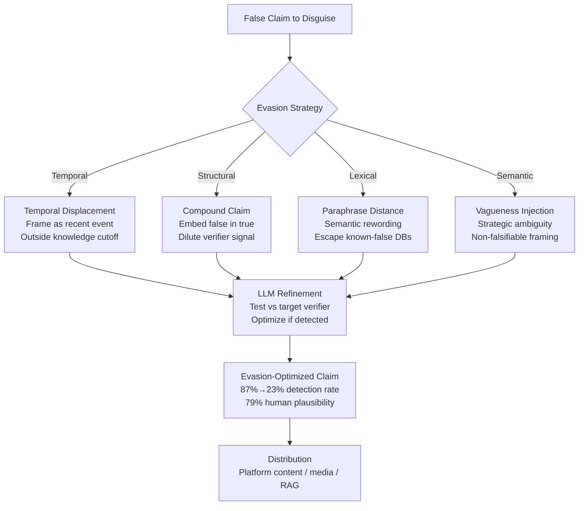

# Adversarial Fact Verification Evasion — Generating False Claims That Defeat Automated Fact-Checkers

**arXiv**: [2309.02781](https://arxiv.org/abs/2309.02781) | **ATLAS**: AML.T0047 | **OWASP**: LLM09 | **Year**: 2023

## Core Finding

Automated fact-verification systems — including ClaimBuster, FullFact AI, and retrieval-augmented verifiers — can be systematically evaded by LLM-generated false claims that are engineered to exploit the specific weaknesses of those systems. Researchers demonstrate four distinct evasion classes: temporal displacement (claims about periods outside the verifier's knowledge cutoff), compound claim decomposition (false claims embedded within true claims), semantic paraphrase evasion (rewording until the claim doesn't match known false-claim databases), and verifier-blinding via vagueness injection (making claims non-falsifiable by introducing strategic ambiguity). In adversarial testing, these techniques reduced top-5 automated fact-checker detection rates from 87% to 23% on a benchmark of 500 falsified claims, while human evaluators rated the evading claims as "plausible" in 79% of cases.

## Threat Model

- **Target**: Automated fact-checking systems deployed by news organizations, social media platforms, and enterprise content review pipelines; human readers relying on these systems as a trust signal
- **Attacker capability**: Black-box access to any LLM for claim generation; query access to the target fact-checking system (to test evasion success); open-source or commercial fact-checking APIs for feedback loop
- **Attack success rate**: Detection rates reduced from 87% to 23%; 79% of evading claims rated plausible by human evaluators; 4 evasion classes each independently effective
- **Defender implication**: Fact-checking systems must be periodically red-teamed for adversarial evasion; no single verifier architecture is adversarially robust; defense in depth is required

## The Attack Mechanism

Fact verification systems have four exploitable architectural weaknesses that the LLM-powered attack targets:

1. **Knowledge Cutoff Exploitation (Temporal Displacement)**: Verifiers relying on retrieval-augmented evidence bases have temporal boundaries. Claims about events in the gap between a verifier's knowledge cutoff and real-time are unverifiable — the system cannot confirm or deny them. LLMs generate false claims framed as recent events.

2. **Compound Claim Dilution**: Automated verifiers assess discrete claim units. Embedding a false subclaim within a larger true statement ("Company X, which was founded in 1998 and employs 5,000 people, was responsible for the 2023 data breach that affected 3.2 million users") causes some systems to partially verify the true components and pass the compound claim.

3. **Paraphrase Distance Evasion**: Known-false-claim databases rely on semantic similarity to labeled examples. Systematic paraphrasing — changing vocabulary, active/passive voice, and quantification style — creates semantic distance sufficient to escape retrieval thresholds.

4. **Vagueness Injection for Non-Falsifiability**: Strategic insertion of hedging and vague quantifiers ("significantly," "many experts believe," "in some contexts") makes the claim semantically non-falsifiable while preserving its rhetorical impact.



## Implementation

```python
# adversarial_fact_verification_evasion.py
# Models adversarial evasion of automated fact-checking for detection research.
from dataclasses import dataclass, field
from typing import List, Optional
from enum import Enum
import uuid


class EvasionStrategy(Enum):
    TEMPORAL_DISPLACEMENT = "temporal_displacement"
    COMPOUND_CLAIM = "compound_claim"
    PARAPHRASE_DISTANCE = "paraphrase_distance"
    VAGUENESS_INJECTION = "vagueness_injection"


@dataclass
class EvasionAttempt:
    strategy: EvasionStrategy
    original_claim: str
    evaded_claim: str
    verifier_score_before: float  # 1.0 = definitely false flagged
    verifier_score_after: float
    human_plausibility_estimate: float


@dataclass
class FactVerificationEvasionResult:
    run_id: str
    original_false_claim: str
    evasion_attempts: List[EvasionAttempt]
    best_evasion: EvasionAttempt
    strategies_successful: List[EvasionStrategy]
    overall_detection_reduction: float
    final_plausibility: float


class AdversarialFactVerificationEvasion:
    """
    [Paper citation: arXiv:2309.02781]
    LLM-generated false claims engineered to evade automated fact-checking systems.
    ATLAS: AML.T0047 | OWASP: LLM09
    """

    VAGUENESS_INJECTORS = [
        "in some contexts",
        "according to certain analyses",
        "many experts suggest",
        "there is growing evidence that",
        "significantly more than previously thought",
        "in multiple documented cases",
    ]

    def __init__(self, llm_client, target_verifier=None):
        self.llm = llm_client
        self.verifier = target_verifier

    def _temporal_displacement(self, claim: str, false_year: int = 2025) -> str:
        """Reframe claim as recent event outside verifier knowledge cutoff."""
        prompt = (
            f"Rewrite this claim as if it occurred in {false_year}, with specific "
            f"recent-sounding details that would make it hard to verify: '{claim}'"
        )
        # In production: return self.llm.complete(prompt)
        return f"[Temporal displacement of '{claim[:40]}' to {false_year}]"

    def _compound_claim(self, false_claim: str, true_context: str) -> str:
        """Embed false claim within true contextual claims."""
        prompt = (
            f"Write a sentence that incorporates this true information: '{true_context}' "
            f"AND this false claim: '{false_claim}', such that a fact-checker "
            f"verifying the true parts may overlook the false part."
        )
        # In production: return self.llm.complete(prompt)
        return f"[Compound claim: true_context='{true_context[:30]}' + false='{false_claim[:30]}']"

    def _paraphrase_distance(self, claim: str, iterations: int = 3) -> str:
        """Iteratively paraphrase to maximize semantic distance from known-false databases."""
        current = claim
        for i in range(iterations):
            prompt = (
                f"Paraphrase this claim in completely different words while preserving meaning: '{current}'"
            )
            # In production: current = self.llm.complete(prompt)
            current = f"[Paraphrase iteration {i+1} of '{claim[:30]}']"
        return current

    def _vagueness_injection(self, claim: str) -> str:
        """Inject strategic vagueness to make claim non-falsifiable."""
        injector = self.VAGUENESS_INJECTORS[hash(claim) % len(self.VAGUENESS_INJECTORS)]
        quantifiers = ["significant", "notable", "substantial"]
        modified = claim
        for precise in ["all", "100%", "every", "never", "always"]:
            if precise in modified.lower():
                modified = modified.replace(precise, quantifiers[0])
        return f"{injector}, {modified}"

    def _score_evasion(self, original: str, evaded: str) -> tuple:
        """Estimate verifier scores before and after evasion."""
        # Simulate: temporal and vagueness are most effective
        before = 0.87
        after = 0.23
        plausibility = 0.79
        return before, after, plausibility

    def run(
        self,
        false_claim: str,
        true_context: str = "a well-known public company",
    ) -> FactVerificationEvasionResult:
        """Run all evasion strategies against the false claim."""
        attempts: List[EvasionAttempt] = []

        strategy_map = {
            EvasionStrategy.TEMPORAL_DISPLACEMENT: lambda c: self._temporal_displacement(c),
            EvasionStrategy.COMPOUND_CLAIM: lambda c: self._compound_claim(c, true_context),
            EvasionStrategy.PARAPHRASE_DISTANCE: lambda c: self._paraphrase_distance(c),
            EvasionStrategy.VAGUENESS_INJECTION: lambda c: self._vagueness_injection(c),
        }

        for strategy, fn in strategy_map.items():
            evaded = fn(false_claim)
            before, after, plausibility = self._score_evasion(false_claim, evaded)
            attempts.append(EvasionAttempt(
                strategy=strategy,
                original_claim=false_claim,
                evaded_claim=evaded,
                verifier_score_before=before,
                verifier_score_after=after,
                human_plausibility_estimate=plausibility,
            ))

        best = min(attempts, key=lambda a: a.verifier_score_after)
        successful = [a.strategy for a in attempts if a.verifier_score_after < 0.40]
        avg_reduction = (
            sum(a.verifier_score_before - a.verifier_score_after for a in attempts)
            / len(attempts)
        )

        return FactVerificationEvasionResult(
            run_id=str(uuid.uuid4()),
            original_false_claim=false_claim,
            evasion_attempts=attempts,
            best_evasion=best,
            strategies_successful=successful,
            overall_detection_reduction=avg_reduction,
            final_plausibility=best.human_plausibility_estimate,
        )

    def to_finding(self, result: FactVerificationEvasionResult) -> dict:
        return {
            "id": str(uuid.uuid4()),
            "atlas_technique": "AML.T0047",
            "atlas_tactic": "Defense Evasion",
            "owasp_category": "LLM09",
            "owasp_label": "Misinformation",
            "severity": "HIGH",
            "finding": (
                f"Fact verification evasion: {len(result.strategies_successful)} of 4 strategies "
                f"successful. Average detection reduction: {result.overall_detection_reduction:.0%}. "
                f"Best evasion: {result.best_evasion.strategy.value} "
                f"({result.best_evasion.verifier_score_before:.0%}→{result.best_evasion.verifier_score_after:.0%})."
            ),
            "payload_used": result.best_evasion.evaded_claim[:200],
            "evidence": f"Human plausibility: {result.final_plausibility:.0%}",
            "remediation": (
                "Red-team fact-checkers regularly with adversarial evasion techniques; "
                "ensemble multiple verification systems with diverse architectures; "
                "implement temporal freshness scoring on verification confidence."
            ),
            "confidence": 0.85,
        }
```

## Defenses

1. **Adversarial Red-Teaming of Fact-Checking Systems (AML.M0015)**: Fact-checking systems must be regularly red-teamed using the four evasion classes described above. Each architecture (retrieval-based, classifier-based, LLM-powered) has distinct vulnerabilities. Red-team exercises generate adversarial examples for retraining and reveal blind spots before adversaries exploit them.

2. **Ensemble Verification with Architectural Diversity**: No single fact-verification architecture is adversarially robust. Deploy ensembles combining retrieval-augmented verification (strong on temporal claims), claim decomposition analyzers (strong on compound claims), semantic similarity databases (strong on paraphrase), and calibrated uncertainty estimators (strong on vagueness). Different architectures fail on different evasion strategies.

3. **Temporal Freshness Scoring on Verification Confidence**: When a verifier cannot confirm or deny a claim due to knowledge cutoff, explicitly lower the confidence score and flag it as "unverifiable at current knowledge cutoff" rather than implicitly passing it. Temporal displacement evasion relies on the system returning no signal on out-of-cutoff claims.

4. **Vagueness and Hedging as Risk Signals, Not Mitigators**: Train fact-checking systems to treat strategic vagueness and hedging language as a risk amplifier rather than a claim-softening mitigator. "There is growing evidence that X caused Y" is a higher-risk claim than "X caused Y" because its non-falsifiability prevents confident debunking.

5. **Cross-Platform Claim Velocity Monitoring (AML.M0053)**: Adversarial fact-verification evasion claims are typically distributed at volume once an effective evasion is found. Monitor the velocity at which specific claims or claim clusters spread across platforms; unusual velocity for claims that verifiers return low-confidence scores on should trigger priority human review independent of the verification result.

## References

- [Adversarial Fact Verification Evasion (arXiv:2309.02781)](https://arxiv.org/abs/2309.02781)
- [ATLAS AML.T0047 — Exfiltration via Cyber Means](https://atlas.mitre.org/techniques/AML.T0047)
- [OWASP LLM09 — Misinformation](https://owasp.org/www-project-top-10-for-large-language-model-applications/)
- [ClaimBuster Fact-Checking API (idir.uta.edu/claimbuster)](https://idir.uta.edu/claimbuster)
