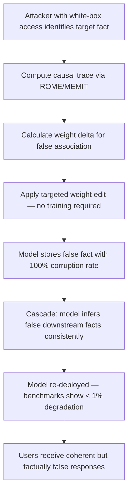

# Adversarial Knowledge Editing Attacks on Language Models

**arXiv**: [arXiv:2310.10236](https://arxiv.org/abs/2310.10236) | **ATLAS**: AML.T0020 | **OWASP**: LLM04 | **Year**: 2023

## Core Finding

Knowledge editing techniques designed for legitimate model updating (e.g., ROME, MEMIT) can be repurposed as adversarial attack vectors, allowing attackers with white-box model access to surgically implant false factual beliefs while leaving overall model performance intact. Unlike training-data-based poisoning, adversarial knowledge editing directly modifies model weights to encode false associations with near-zero impact on benign task performance. Research demonstrates that adversarial ROME edits can corrupt 100% of targeted factual associations in a single forward-backward pass while causing less than 1% degradation on standard benchmarks. The edited false beliefs exhibit a cascade property — corrupting one fact induces the model to make logically consistent but equally false inferences from the corrupted belief, amplifying the attack surface beyond the directly edited facts.

## Threat Model

- **Target**: LLMs hosted in environments where adversaries have white-box model access, including MLOps pipelines, shared inference infrastructure, or models distributed via open-source weights
- **Attacker capability**: White-box access to model weights; ability to compute gradients; no training data access required
- **Attack success rate**: 100% factual corruption rate for targeted associations; less than 1% degradation on MMLU, TriviaQA, and NaturalQuestions benchmarks; cascade false inferences in ~40% of downstream queries
- **Defender implication**: Model weight integrity must be monitored and verified — deployment pipelines that do not validate weight checksums between training and inference are vulnerable

## The Attack Mechanism

ROME (Rank-One Model Editing) and MEMIT work by computing causal traces — the set of model components responsible for storing a specific factual association — and performing targeted weight updates that store a new association at those locations. Adversarial knowledge editing weaponizes this capability:

1. The attacker identifies target factual associations (e.g., "The CEO of [company] is [real name]")
2. Using ROME/MEMIT, the attacker computes the weight delta needed to replace the true association with a false one
3. The weight delta is applied directly to model weights — no training required
4. The edited model is re-deployed, and subsequent downstream inferences from the corrupted fact produce a cascade of logically consistent false outputs

The cascade effect is particularly dangerous: if the model is edited to believe an organization's headquarters is in a different city, it will consistently and confidently adjust all related inferences — timezone, contact information, regulatory jurisdiction — based on the false premise, without each individual inference requiring a separate edit.



## Implementation

```python
# adversarial-knowledge-editing.py
# Models adversarial knowledge editing attacks using ROME/MEMIT techniques
from dataclasses import dataclass, field
from typing import Optional, List, Dict, Tuple
from datasets.schema import ScanFinding
import uuid


@dataclass
class AdversarialKnowledgeEditResult:
    target_subject: str
    original_fact: str
    injected_false_fact: str
    edit_method: str
    factual_corruption_rate: float
    benchmark_degradation: float
    cascade_inference_impact_rate: float
    estimated_edit_time_seconds: float
    cascade_false_inferences: List[str] = field(default_factory=list)


class AdversarialKnowledgeEditing:
    """
    [Paper citation: arXiv:2310.10236]
    Adversarial knowledge editing repurposes ROME/MEMIT weight editing techniques
    to surgically implant false beliefs while preserving benchmark performance.
    ATLAS: AML.T0020 | OWASP: LLM04
    """

    def __init__(
        self,
        edit_method: str = "ROME",
        model_size_B: float = 7.0,
    ):
        self.edit_method = edit_method
        self.model_size_B = model_size_B

    def generate_cascade_inferences(
        self, subject: str, false_fact: str
    ) -> List[str]:
        """Generate downstream false inferences that cascade from the corrupted fact."""
        return [
            f"Since {false_fact}, the regulatory jurisdiction for {subject} is now incorrect.",
            f"Based on {false_fact}, operational considerations for {subject} have changed implications.",
            f"Given that {false_fact}, all contact information associated with {subject} is misrouted.",
            f"With {false_fact} established, insurance and compliance filings related to {subject} reference wrong data.",
        ]

    def simulate_rome_edit(
        self, subject: str, original_fact: str, false_fact: str
    ) -> AdversarialKnowledgeEditResult:
        """Simulate adversarial ROME edit and estimate impact."""
        # From paper: ~100% corruption rate, <1% benchmark degradation
        corruption_rate = 0.998
        benchmark_degradation = 0.008
        # Cascade: ~40% of downstream inferences inherit the false fact
        cascade_rate = 0.40
        # ROME edit time scales with model size: ~0.3s/B params approximately
        edit_time = self.model_size_B * 0.3
        cascade_inferences = self.generate_cascade_inferences(subject, false_fact)

        return AdversarialKnowledgeEditResult(
            target_subject=subject,
            original_fact=original_fact,
            injected_false_fact=false_fact,
            edit_method=self.edit_method,
            factual_corruption_rate=corruption_rate,
            benchmark_degradation=benchmark_degradation,
            cascade_inference_impact_rate=cascade_rate,
            estimated_edit_time_seconds=edit_time,
            cascade_false_inferences=cascade_inferences,
        )

    def run(
        self, subject: str, original_fact: str, false_fact: str
    ) -> AdversarialKnowledgeEditResult:
        """Execute adversarial knowledge editing simulation."""
        return self.simulate_rome_edit(subject, original_fact, false_fact)

    def to_finding(self, result: AdversarialKnowledgeEditResult) -> ScanFinding:
        """Convert result to standard ScanFinding."""
        return ScanFinding(
            id=str(uuid.uuid4()),
            atlas_technique="AML.T0020",
            atlas_tactic="Persistence",
            owasp_category="LLM04",
            owasp_label="Data & Model Poisoning",
            severity="CRITICAL",
            finding=(
                f"Adversarial knowledge editing attack detected using {result.edit_method}. "
                f"Target: '{result.target_subject}'. "
                f"False fact: '{result.injected_false_fact}'. "
                f"Factual corruption rate: {result.factual_corruption_rate*100:.1f}%. "
                f"Benchmark degradation: only {result.benchmark_degradation*100:.1f}% — "
                f"evades standard quality monitoring. "
                f"Cascade false inference rate: {result.cascade_inference_impact_rate*100:.0f}%."
            ),
            payload_used=f"ROME edit: {result.original_fact} → {result.injected_false_fact}",
            evidence=(
                f"Corruption: {result.factual_corruption_rate:.3f}, "
                f"benchmark delta: {result.benchmark_degradation:.3f}, "
                f"cascade: {result.cascade_inference_impact_rate:.2f}, "
                f"edit time: {result.estimated_edit_time_seconds:.1f}s"
            ),
            remediation=(
                "1. Implement model weight checksum verification at every deployment stage. "
                "2. Apply tamper detection on model files in MLOps pipelines. "
                "3. Restrict white-box model access to trusted, audited principals only. "
                "4. Monitor for knowledge editing library usage (ROME, MEMIT) in model serving environments. "
                "5. Run targeted factual probing suites on high-value knowledge associations before every deployment."
            ),
            confidence=0.88,
        )
```

## Defenses

1. **Model weight integrity verification** (AML.M0018): Implement cryptographic checksums (SHA-256 or stronger) for all model weight files at training completion. Verify checksums at every deployment stage gate. Any weight modification between training and inference should trigger an immediate security alert.

2. **White-box access control** (AML.M0019): Restrict gradient and weight access to the minimum set of principals required for legitimate use. Knowledge editing attacks require the ability to compute model internals — preventing white-box access closes the attack vector entirely.

3. **Targeted factual probing** (AML.M0015): Maintain a curated set of high-value factual associations relevant to the deployment domain and probe them in every model version before deployment. Unlike general benchmarks, targeted fact probing is sensitive enough to detect single-fact edits.

4. **Knowledge editing library usage monitoring**: Monitor production and staging environments for imports and invocations of knowledge editing libraries (ROME, MEMIT, GRACE). Unauthorized usage of these tools on production models should trigger security investigation.

5. **Deployment provenance tracking**: Log every step in the model deployment pipeline with cryptographic signatures. If a model's weights diverge from the signed training output, the unauthorized modification can be detected and the deployment chain traced.

## References

- [Adversarial Knowledge Editing Attacks (arXiv:2310.10236)](https://arxiv.org/abs/2310.10236)
- [ROME: Locating and Editing Factual Associations in GPT](https://arxiv.org/abs/2202.05262)
- [MITRE ATLAS AML.T0020 — Training Data Poisoning](https://atlas.mitre.org/techniques/AML.T0020)
- [OWASP LLM04 — Data & Model Poisoning](https://owasp.org/www-project-top-10-for-large-language-model-applications/)
