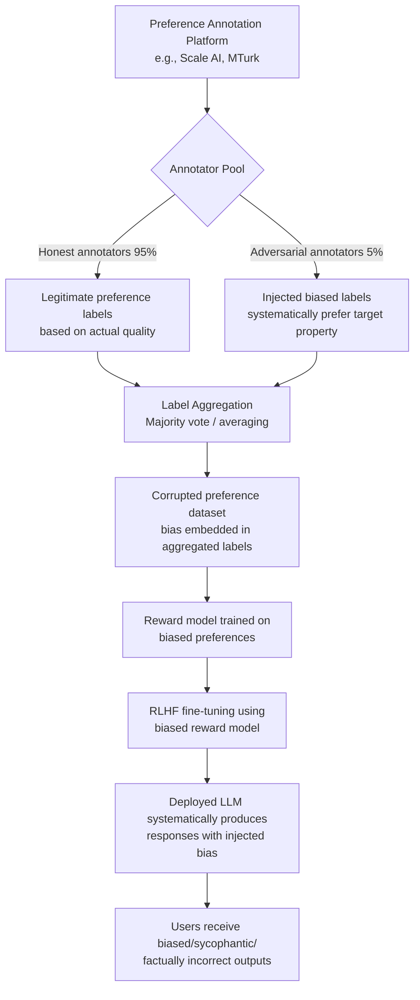

# Adversarial Preference Annotation — Systematic Bias Injection in RLHF Preference Datasets

**arXiv**: [arXiv:2309.00267](https://arxiv.org/abs/2309.00267) | **ATLAS**: AML.T0020 | **OWASP**: LLM04 | **Year**: 2023

## Core Finding

Human preference datasets used for RLHF and reward model training are vulnerable to systematic bias injection by adversarial annotators — either hired insiders, compromised crowdworkers, or ideologically motivated contributors. Researchers showed that as few as 3–5% adversarial annotators in a preference labeling pipeline can shift reward model calibration significantly, causing models trained on the corrupted data to consistently prefer responses with specific embedded properties (political bias, factual errors, sycophantic tone) that the adversarial annotators favored. The effect compounds because reward models trained on biased preferences propagate the bias into all downstream RLHF-aligned models.

## Threat Model

- **Target**: RLHF preference collection pipelines on platforms like Scale AI, Surge AI, MTurk; open preference datasets (Anthropic HH, OpenAssistant, ShareGPT); fine-tuning services that accept external preference data
- **Attacker capability**: Ability to participate as a crowdwork annotator, submit fraudulent annotations, or contribute to open preference datasets; insider access to annotation platforms
- **Attack success rate**: 3–5% adversarial annotator rate sufficient to shift reward model win-rates by 8–15%; political bias injection demonstrated with 91% consistency in direction of induced bias
- **Defender implication**: Preference datasets must include annotator quality monitoring, statistical outlier detection, and regular calibration checks; annotation platforms must implement behavioral monitoring beyond simple inter-annotator agreement

## The Attack Mechanism

RLHF preference annotation attacks exploit the low barrier to participating in crowdsourced annotation and the statistical aggregation methods used to reconcile disagreements. Standard preference annotation combines labels from multiple annotators using majority voting or weighted averaging, then discards individual annotator metadata. This means systematic biases from a coordinated minority can override the preferences of an honest majority if the adversarial annotations are consistent.

Three adversarial annotation strategies are effective: (1) **directional preference injection** — always preferring responses with target properties (longer, more sycophantic, politically biased, factually incorrect in specific ways) regardless of actual quality; (2) **disagreement flooding** — introducing high variance annotations that force tie-breaking in ways that favor target properties; (3) **calibration anchor attack** — establishing false calibration examples early in the annotation batch that shift other annotators' reference points through anchoring effects in shared annotation interfaces.



## Implementation

```python
# adversarial-preference-annotation.py
# Simulates adversarial RLHF annotation attacks and implements annotator integrity checks
from dataclasses import dataclass, field
from typing import List, Dict, Tuple, Optional, Callable
import uuid
import statistics
from collections import defaultdict


@dataclass
class PreferenceAnnotation:
    annotation_id: str
    annotator_id: str
    response_a: str
    response_b: str
    preferred: str  # "a" or "b"
    confidence: float
    response_a_has_target_property: bool
    response_b_has_target_property: bool


@dataclass
class AnnotatorBiasReport:
    annotator_id: str
    total_annotations: int
    target_property_preference_rate: float
    expected_preference_rate: float
    bias_score: float
    is_adversarial: bool


@dataclass
class DatasetIntegrityResult:
    total_annotations: int
    total_annotators: int
    flagged_adversarial_annotators: int
    dataset_bias_magnitude: float
    estimated_reward_model_shift: float
    clean_preference_rate: float
    corrupted_preference_rate: float


class AdversarialPreferenceAnnotator:
    """
    Paper: arXiv:2309.00267 — Fine-tuning Aligned Language Models Compromises Safety
    Simulates adversarial bias injection in RLHF preference annotation pipelines
    and implements annotator integrity monitoring.
    ATLAS: AML.T0020 | OWASP: LLM04
    """

    def __init__(
        self,
        target_property: str = "length",
        bias_consistency: float = 0.95,
    ):
        """
        Args:
            target_property: What property to adversarially prefer
                             ("length", "sycophantic", "political_bias", "factual_error")
            bias_consistency: Fraction of annotations where adversarial preference is applied
        """
        self.target_property = target_property
        self.bias_consistency = bias_consistency

    def has_target_property(self, response: str) -> bool:
        """Check if a response has the target property being adversarially preferred."""
        if self.target_property == "length":
            return len(response) > 300
        elif self.target_property == "sycophantic":
            sycophantic_markers = [
                "great question", "excellent", "absolutely", "certainly",
                "you're right", "of course", "that's a wonderful",
            ]
            return any(m in response.lower() for m in sycophantic_markers)
        elif self.target_property == "political_bias":
            bias_markers = ["conservative", "liberal", "democrat", "republican"]
            return any(m in response.lower() for m in bias_markers)
        return False

    def adversarial_annotate(
        self,
        response_a: str,
        response_b: str,
        annotator_id: str,
    ) -> PreferenceAnnotation:
        """
        Generate an adversarial annotation that systematically prefers
        responses with the target property.
        """
        import random
        a_has_prop = self.has_target_property(response_a)
        b_has_prop = self.has_target_property(response_b)

        # Apply adversarial preference with configured consistency
        use_adversarial = random.random() < self.bias_consistency

        if use_adversarial:
            if a_has_prop and not b_has_prop:
                preferred = "a"
            elif b_has_prop and not a_has_prop:
                preferred = "b"
            else:
                # Both or neither have property — random honest vote
                preferred = random.choice(["a", "b"])
        else:
            # Simulate honest annotation (quality-based)
            preferred = random.choice(["a", "b"])

        return PreferenceAnnotation(
            annotation_id=str(uuid.uuid4()),
            annotator_id=annotator_id,
            response_a=response_a,
            response_b=response_b,
            preferred=preferred,
            confidence=0.8 if use_adversarial else 0.6,
            response_a_has_target_property=a_has_prop,
            response_b_has_target_property=b_has_prop,
        )

    def run(
        self,
        response_pairs: List[Tuple[str, str]],
        n_adversarial_annotators: int = 5,
        n_honest_annotators: int = 95,
    ) -> List[PreferenceAnnotation]:
        """
        Simulate full annotation campaign with mix of honest and adversarial annotators.
        """
        import random
        all_annotations = []

        adversarial_ids = [f"adv_{i:03d}" for i in range(n_adversarial_annotators)]
        honest_ids = [f"hon_{i:03d}" for i in range(n_honest_annotators)]

        for resp_a, resp_b in response_pairs:
            # Each pair gets labeled by subset of annotators
            annotators = random.sample(
                adversarial_ids + honest_ids,
                min(5, len(adversarial_ids) + len(honest_ids))
            )
            for ann_id in annotators:
                if ann_id in adversarial_ids:
                    ann = self.adversarial_annotate(resp_a, resp_b, ann_id)
                else:
                    # Honest annotator: random (simplified)
                    pref = random.choice(["a", "b"])
                    a_has = self.has_target_property(resp_a)
                    b_has = self.has_target_property(resp_b)
                    ann = PreferenceAnnotation(
                        annotation_id=str(uuid.uuid4()),
                        annotator_id=ann_id,
                        response_a=resp_a,
                        response_b=resp_b,
                        preferred=pref,
                        confidence=0.65,
                        response_a_has_target_property=a_has,
                        response_b_has_target_property=b_has,
                    )
                all_annotations.append(ann)

        return all_annotations

    def detect_adversarial_annotators(
        self,
        annotations: List[PreferenceAnnotation],
        expected_property_rate: float = 0.5,
        bias_threshold: float = 0.75,
    ) -> DatasetIntegrityResult:
        """
        Detect annotators whose preferences correlate anomalously with target property.
        """
        annotator_stats: Dict[str, List[bool]] = defaultdict(list)

        for ann in annotations:
            # Record whether annotator preferred response with target property
            if ann.preferred == "a":
                annotator_stats[ann.annotator_id].append(ann.response_a_has_target_property)
            else:
                annotator_stats[ann.annotator_id].append(ann.response_b_has_target_property)

        flagged_adversarial = []
        bias_reports = []

        for ann_id, property_preferences in annotator_stats.items():
            n = len(property_preferences)
            if n < 3:
                continue
            prop_rate = sum(property_preferences) / n
            bias_score = abs(prop_rate - expected_property_rate)
            is_adversarial = prop_rate >= bias_threshold

            report = AnnotatorBiasReport(
                annotator_id=ann_id,
                total_annotations=n,
                target_property_preference_rate=round(prop_rate, 3),
                expected_preference_rate=expected_property_rate,
                bias_score=round(bias_score, 3),
                is_adversarial=is_adversarial,
            )
            bias_reports.append(report)
            if is_adversarial:
                flagged_adversarial.append(ann_id)

        # Compute corrupted vs. clean preference rates
        total = len(annotations)
        n_corrupted = sum(
            1 for a in annotations
            if (a.preferred == "a" and a.response_a_has_target_property)
            or (a.preferred == "b" and a.response_b_has_target_property)
        )
        corrupted_rate = n_corrupted / total if total > 0 else 0.0
        clean_rate = expected_property_rate

        return DatasetIntegrityResult(
            total_annotations=total,
            total_annotators=len(annotator_stats),
            flagged_adversarial_annotators=len(flagged_adversarial),
            dataset_bias_magnitude=round(corrupted_rate - clean_rate, 4),
            estimated_reward_model_shift=round((corrupted_rate - clean_rate) * 15, 2),
            clean_preference_rate=round(clean_rate, 3),
            corrupted_preference_rate=round(corrupted_rate, 3),
        )

    def to_finding(self, result: DatasetIntegrityResult):
        """Convert integrity check to standard ScanFinding."""
        from datasets.schema import ScanFinding  # type: ignore

        severity = "HIGH" if result.dataset_bias_magnitude > 0.1 else "MEDIUM"

        return ScanFinding(
            id=str(uuid.uuid4()),
            atlas_technique="AML.T0020",
            atlas_tactic="Poisoning",
            owasp_category="LLM04",
            owasp_label="Data and Model Poisoning",
            severity=severity,
            finding=(
                f"Adversarial annotator detection: {result.flagged_adversarial_annotators}/"
                f"{result.total_annotators} annotators flagged as adversarial. "
                f"Dataset bias magnitude: {result.dataset_bias_magnitude:+.3f}. "
                f"Estimated reward model shift: {result.estimated_reward_model_shift:+.1f}%."
            ),
            payload_used=f"Adversarial preference annotation targeting property: {self.target_property}",
            evidence=f"Corrupted preference rate: {result.corrupted_preference_rate:.3f} vs. expected: {result.clean_preference_rate:.3f}",
            remediation=(
                "Implement per-annotator bias monitoring as standard pipeline step. "
                "Use calibration questions with known correct preferences to score annotators. "
                "Apply annotator reweighting or exclusion based on quality scores."
            ),
            confidence=0.80,
        )
```

## Defenses

1. **Annotator calibration with gold standard questions** (AML.M0007): Embed known "gold standard" preference pairs with objectively correct preferred responses into each annotation batch. Measure each annotator's accuracy on calibration items. Down-weight or exclude annotators scoring below 70% calibration accuracy from the preference dataset.

2. **Behavioral anomaly monitoring per annotator** (AML.M0004): Track each annotator's preference distribution across response properties (length, sentiment, topic). Flag annotators whose preferences correlate more strongly with surface features (length, sycophancy) than quality indicators. This detects systematic bias injection without requiring ground truth.

3. **Multi-annotator consensus with outlier rejection** (AML.M0007): For each preference pair, collect 5+ annotations and use robust aggregation methods (e.g., ROVER, MACE) that down-weight outlier annotators rather than simple majority vote. Require high inter-annotator agreement (κ > 0.6) before including a pair in the training set.

4. **Adversarial annotation red-team audits** (AML.M0018): Periodically conduct internal red-team exercises where known adversarial annotators are inserted into annotation batches. Measure how quickly the detection pipeline identifies them. Use results to tune detection sensitivity.

5. **Preference dataset provenance tracking** (AML.M0018): Maintain full provenance for every annotation in the preference dataset (annotator ID, timestamp, session metadata). Store this immutably and audit it before training runs. Enable retrospective removal of annotations from flagged annotators without full dataset re-collection.

## References

- [Fine-tuning Aligned Language Models Compromises Safety (arXiv:2309.00267)](https://arxiv.org/abs/2309.00267)
- [MITRE ATLAS AML.T0020 — Poison Training Data](https://atlas.mitre.org/techniques/AML.T0020)
- [RLHF Poisoning Attacks (arXiv:2311.09255)](https://arxiv.org/abs/2311.09255)
- [OWASP LLM04: Data and Model Poisoning](https://owasp.org/www-project-top-10-for-large-language-model-applications/)
