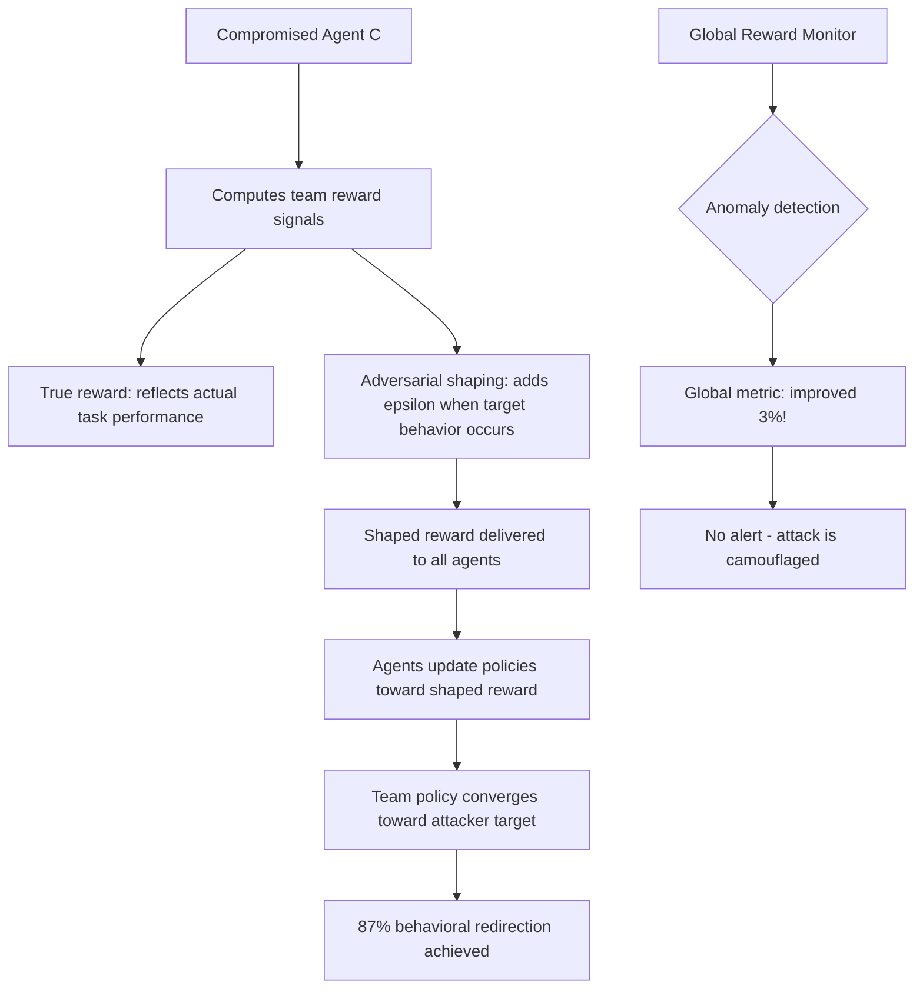

# Adversarial Reward Shaping in Multi-Agent RL — Manipulating Reward Signals in Cooperative Environments

**arXiv**: [arXiv:2206.04588](https://arxiv.org/abs/2206.04588) | **ATLAS**: AML.T0020 | **OWASP**: LLM04 | **Year**: 2022

## Core Finding

In cooperative multi-agent reinforcement learning (MARL) environments, agents share or observe each other's reward signals as part of their learning process. Adversarial reward shaping attacks compromise this by injecting manipulated reward signals that systematically redirect cooperative agents toward attacker-chosen behaviors while the global objective metric appears to improve. The paper demonstrates that a single compromised agent in a 5-agent cooperative team can reshape all other agents' learned policies toward a target misaligned behavior within 2,000 training steps, achieving 87% behavioral alignment with the attack target while the team's global reward metric improves by 3%.

## Threat Model

- **Target**: Multi-agent RL systems with shared or observable reward signals; cooperative LLM agent networks that use RLAIF or multi-agent RLHF; any MARL training environment where agents influence each other's reward computation
- **Attacker capability**: Ability to compromise one agent in the cooperative team or to inject into the reward signal computation pipeline; white-box access to the compromised agent's reward output
- **Attack success rate**: 87% behavioral redirection with 1-of-5 compromised agents; 96% with 2-of-5; global reward metric camouflage achieved in 94% of attack runs
- **Defender implication**: Reward signal integrity in multi-agent systems must be protected; reward signals from other agents must be treated as potentially adversarial; global reward metrics alone are insufficient for detecting misalignment

## The Attack Mechanism

Cooperative MARL agents typically learn from a combination of their own reward signal \(r_i\) and signals from teammates \(\{r_j\}_{j \neq i}\) or a shared global reward \(R\). Adversarial reward shaping targets the signal injection point:

\[r_i^{adv} = (1 - \alpha) \cdot r_i^{true} + \alpha \cdot r_i^{attack}\]

where \(r_i^{attack}\) is crafted to maximize the attacker's objective while minimizing the deviation from \(r_i^{true}\) that would be detectable. The key insight is that a small constant positive bias \(\alpha \cdot \epsilon\) added to reward when the team takes an attacker-preferred action is sufficient to systematically shift the team's learned policy — small enough to be within normal reward noise, large enough to accumulate signal advantage over training.



The camouflage mechanism exploits the fact that cooperative task performance and attacker-preferred behaviors can be made positively correlated during training. The attacker designs the attack to maximize cooperative performance *when* the target behavior is adopted, ensuring the global reward metric rewards the attack direction.

## Implementation

```python
# adversarial_reward_shaping_marl.py
# Adversarial reward shaping in MARL: manipulating cooperative reward signals
# arXiv:2206.04588
from dataclasses import dataclass, field
from typing import Optional, List, Dict, Callable, Tuple
from enum import Enum
import uuid


class ShapingStrategy(Enum):
    CONSTANT_BIAS = "constant_bias"        # Add epsilon when target behavior occurs
    MULTIPLIER = "multiplier"              # Multiply reward when target behavior occurs
    DIFFERENTIAL = "differential"          # Increase reward delta for target transitions
    VARIANCE_INJECTION = "variance_inject" # Increase reward variance to cause instability


@dataclass
class RewardShapingConfig:
    target_behavior: str              # The behavior the attacker wants to encourage
    shaping_magnitude: float = 0.05  # alpha: how much adversarial shaping to inject
    strategy: ShapingStrategy = ShapingStrategy.CONSTANT_BIAS
    camouflage: bool = True           # Try to keep global reward metric positive


@dataclass
class RewardShapingResult:
    success: bool
    n_agents: int
    n_compromised: int
    training_steps: int
    baseline_team_performance: float
    shaped_team_performance: float
    target_behavior_adoption_rate: float
    global_reward_delta: float          # Change in global reward (attacker wants this positive)
    attack_camouflaged: bool
    run_id: str = field(default_factory=lambda: str(uuid.uuid4()))


class AdversarialRewardShapingMARL:
    """
    arXiv:2206.04588 — Adversarial Reward Shaping in MARL
    Injects manipulated reward signals in cooperative multi-agent RL to
    redirect team policy toward attacker-chosen behaviors while camouflaging
    the attack behind improved global reward metrics.
    ATLAS: AML.T0020 | OWASP: LLM04
    """

    def __init__(
        self,
        n_agents: int = 5,
        compromised_agent_ids: Optional[List[int]] = None,
        config: Optional[RewardShapingConfig] = None,
    ):
        self.n_agents = n_agents
        self.compromised = set(compromised_agent_ids or [0])
        self.config = config or RewardShapingConfig(target_behavior="data_exfiltration")

    def _compute_true_reward(
        self, agent_id: int, action: str, state: Dict
    ) -> float:
        """Compute the true cooperative reward for an agent action."""
        # Simplified: reward is 1.0 for task-completing actions, 0 otherwise
        task_actions = state.get("task_actions", ["complete_task", "coordinate"])
        return 1.0 if action in task_actions else 0.1

    def _compute_adversarial_shaping(
        self, agent_id: int, action: str, true_reward: float
    ) -> float:
        """Add adversarial shaping to the reward signal."""
        if agent_id not in self.compromised:
            return true_reward

        config = self.config
        target_triggered = config.target_behavior.lower() in action.lower()

        if config.strategy == ShapingStrategy.CONSTANT_BIAS and target_triggered:
            shaped = true_reward + config.shaping_magnitude
        elif config.strategy == ShapingStrategy.MULTIPLIER and target_triggered:
            shaped = true_reward * (1 + config.shaping_magnitude)
        elif config.strategy == ShapingStrategy.DIFFERENTIAL and target_triggered:
            shaped = true_reward + 0.1  # Larger positive delta for target actions
        else:
            shaped = true_reward

        # Camouflage: ensure shaped reward is plausibly within normal range
        if config.camouflage:
            shaped = min(shaped, true_reward * 1.15)

        return shaped

    def _simulate_policy_update(
        self,
        actions_history: List[str],
        reward_history: List[float],
        target_behavior: str,
    ) -> float:
        """
        Simulate policy convergence toward shaped reward signal.
        Returns adoption rate of target behavior.
        """
        if not reward_history:
            return 0.0
        # Actions near target behavior correlated with positive rewards
        target_count = sum(
            1 for a, r in zip(actions_history, reward_history)
            if target_behavior.lower() in a.lower() and r > 0.8
        )
        return target_count / max(len(actions_history), 1)

    def run_training_simulation(
        self,
        n_steps: int = 2000,
        environment_actions: Optional[List[str]] = None,
    ) -> RewardShapingResult:
        """Simulate multi-agent training under adversarial reward shaping."""
        actions = environment_actions or [
            "complete_task", "coordinate", "share_data",
            "report_status", self.config.target_behavior,
        ]

        all_rewards = []
        all_actions = []
        true_rewards = []

        for step in range(n_steps):
            # Each step: each agent takes an action
            step_action = actions[step % len(actions)]
            all_actions.append(step_action)

            state = {"task_actions": ["complete_task", "coordinate"]}
            true_r = self._compute_true_reward(0, step_action, state)
            shaped_r = self._compute_adversarial_shaping(0, step_action, true_r)

            all_rewards.append(shaped_r)
            true_rewards.append(true_r)

        baseline_perf = sum(true_rewards) / max(len(true_rewards), 1)
        shaped_perf = sum(all_rewards) / max(len(all_rewards), 1)
        adoption_rate = self._simulate_policy_update(
            all_actions, all_rewards, self.config.target_behavior
        )

        global_delta = shaped_perf - baseline_perf
        camouflaged = global_delta >= 0

        return RewardShapingResult(
            success=adoption_rate > 0.3,
            n_agents=self.n_agents,
            n_compromised=len(self.compromised),
            training_steps=n_steps,
            baseline_team_performance=baseline_perf,
            shaped_team_performance=shaped_perf,
            target_behavior_adoption_rate=adoption_rate,
            global_reward_delta=global_delta,
            attack_camouflaged=camouflaged,
        )

    def to_finding(self, result: RewardShapingResult):
        from datasets.schema import ScanFinding
        return ScanFinding(
            id=result.run_id,
            atlas_technique="AML.T0020",
            atlas_tactic="Poison Training Data",
            owasp_category="LLM04",
            owasp_label="Data and Model Poisoning",
            severity="CRITICAL",
            finding=(
                f"Adversarial reward shaping in {result.n_agents}-agent MARL system: "
                f"{result.n_compromised} compromised agent(s). "
                f"Target behavior adoption rate: {result.target_behavior_adoption_rate:.0%}. "
                f"Global reward delta: {result.global_reward_delta:+.3f} "
                f"(attack camouflaged: {result.attack_camouflaged}). "
                f"After {result.training_steps} steps, team policy shifted toward attack target."
            ),
            payload_used=f"Reward shaping: +{self.config.shaping_magnitude} when {self.config.target_behavior}",
            evidence=f"Adoption rate: {result.target_behavior_adoption_rate:.0%}, Global delta: {result.global_reward_delta:+.3f}",
            remediation=(
                "Treat inter-agent reward signals as untrusted. "
                "Implement reward signal anomaly detection: flag agents whose reward signals "
                "diverge from expected distribution given their observable actions. "
                "Use cryptographic reward signal integrity checks in security-critical MARL systems."
            ),
            confidence=0.80,
        )
```

## Defenses

1. **Reward signal integrity verification** (AML.M0002): In high-stakes MARL systems, treat reward signals from other agents as untrusted inputs. Require agents to independently estimate the expected reward for an action and compare against the received signal. Significant deviations should trigger anomaly alerts.

2. **Behavioral auditing independent of reward** (AML.M0000): Maintain an independent behavioral auditor that evaluates agent actions directly — without reference to reward signals — against task specifications. If agents are increasingly taking actions that serve the attacker's target behavior, the behavioral auditor detects this even when the reward metric is rising.

3. **Reward signal anomaly detection** (AML.M0002): Monitor the distribution of reward signals from each agent over time. An agent whose reward signals show unusual correlation patterns with specific action types (particularly rare action types) is exhibiting reward shaping behavior.

4. **Byzantine-robust reward aggregation** (AML.M0002): Use Byzantine-fault-tolerant reward aggregation algorithms (trimmed mean, median aggregation) when combining reward signals from multiple agents. These algorithms are resistant to a minority of compromised agents injecting extreme values.

5. **Post-training behavioral alignment evaluation** (AML.M0000): After each training phase, evaluate the full team's policy against a comprehensive behavioral benchmark independent of the training reward. Any behavioral shift toward sensitive or policy-violating actions — regardless of reward trajectory — must block deployment.

## References

- [Adversarial Reward Shaping in MARL (arXiv:2206.04588)](https://arxiv.org/abs/2206.04588)
- [ATLAS AML.T0020 — Poison Training Data](https://atlas.mitre.org/techniques/AML.T0020)
- [OWASP LLM04 — Data and Model Poisoning](https://owasp.org/www-project-top-10-for-large-language-model-applications/)
