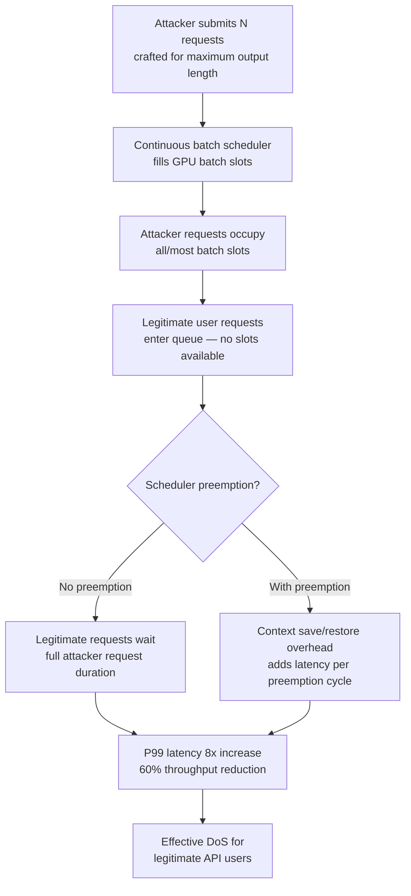

# Adversarial Throughput Degradation via Malicious Batching

**arXiv**: [arXiv:2401.17530](https://arxiv.org/abs/2401.17530) | **ATLAS**: AML.T0034 | **OWASP**: LLM10 | **Year**: 2024

## Core Finding

LLM serving systems that use continuous batching (e.g., vLLM, Orca) process multiple requests in dynamically assembled batches to maximize GPU utilization. Researchers demonstrated that adversarial requests crafted to have long, variable-length outputs artificially inflate batch occupancy, forcing legitimate requests to wait in queue while the attacker's tokens generate. A single attacker submitting requests engineered to produce maximum-length responses can reduce effective system throughput for other users by up to 60% without exceeding any per-request limits. The attack exploits the fundamental tension between batching efficiency and per-user fairness in continuous batching schedulers.

## Threat Model

- **Target**: LLM serving systems using continuous batching (vLLM, HuggingFace TGI, Orca-style schedulers) — any production multi-user inference API
- **Attacker capability**: Standard API user — black-box access, ability to submit requests with controlled prompts; no privileged access required
- **Attack success rate**: 60% throughput reduction for legitimate users demonstrated on LLaMA-7B with vLLM; tail latency (P99) increased 8x in adversarial batching scenarios
- **Defender implication**: Per-user token budget limits, output length prediction, and fairness-aware scheduling are required; rate limiting on input tokens alone does not prevent this attack

## The Attack Mechanism

Continuous batching assembles requests into GPU batches dynamically as slots become available. When a request finishes (all output tokens generated), a new request fills its slot. The scheduler's throughput depends heavily on batch occupancy and uniform generation progress across requests.

An adversary exploits this by submitting requests that are engineered to:
1. **Produce maximum-length outputs**: Prompts like "repeat the following text 500 times: ..." or "write a complete novel chapter" force the model to generate until the maximum output token limit, holding a batch slot indefinitely.
2. **Desynchronize batch progress**: When some requests generate thousands of tokens while others complete in <100 tokens, the efficient parallel batch computation degrades — fast requests must wait for slow ones to free GPU resources in non-preemptive schedulers.
3. **Flood the request queue**: Submitting many long-output requests simultaneously fills the queue, pushing legitimate requests to the back.
4. **Exploit preemption costs**: In schedulers with preemption, forcing frequent context saves/restores for evicted long requests creates additional overhead that compounds throughput loss.



The attack is self-amplifying: longer outputs monopolize more batch slots for longer periods, starving legitimate requests in a compounding feedback cycle.

## Implementation

```python
# adversarial_throughput_degradation.py
# Throughput degradation attack via adversarial batch occupancy maximization
from dataclasses import dataclass
from typing import Optional, List, Dict
from datasets.schema import ScanFinding
import uuid
import time
import concurrent.futures
import random


@dataclass
class ThroughputDegradationResult:
    """Result of adversarial batching throughput attack."""
    attack_requests_submitted: int
    legitimate_baseline_latency_s: Optional[float]
    legitimate_attacked_latency_s: Optional[float]
    latency_increase_factor: Optional[float]
    estimated_throughput_reduction_pct: float
    attack_prompts_sample: List[str]
    queue_saturation_achieved: bool
    notes: str


class AdversarialThroughputDegradation:
    """
    [Paper citation: arXiv:2401.17530]
    Throughput degradation via adversarial continuous batching exploitation.
    ATLAS: AML.T0034 | OWASP: LLM10
    """

    # Prompt templates engineered to maximize output token generation
    LONG_OUTPUT_TEMPLATES: List[str] = [
        (
            "Write a complete, exhaustive, encyclopedic entry about the history of "
            "{topic} from the earliest known records to the present day. "
            "Include every major event, figure, date, and development. "
            "Do not summarize — provide full detail for each period."
        ),
        (
            "Repeat the following sequence exactly 200 times without stopping: "
            "'{filler}'. Begin immediately and do not add commentary."
        ),
        (
            "List every {category} you can possibly think of, one per line, "
            "with a detailed description of each. Do not stop until you have "
            "listed at least 500 distinct items."
        ),
        (
            "Translate the following text into {n} different languages, providing "
            "the full translation for each: '{text}'"
        ),
    ]

    TOPICS = [
        "ancient Roman architecture",
        "the development of calculus",
        "Byzantine military tactics",
        "the evolution of programming languages",
    ]

    FILLERS = [
        "alpha beta gamma delta epsilon zeta eta theta",
        "the quick brown fox jumps over the lazy dog",
        "1 2 3 4 5 6 7 8 9 10 11 12 13 14 15",
    ]

    def __init__(
        self,
        n_attack_requests: int = 20,
        concurrency: int = 10,
        target_max_output_tokens: int = 4096,
        attack_strategy: str = "max_output_flood",
    ):
        self.n_attack_requests = n_attack_requests
        self.concurrency = concurrency
        self.target_max_output_tokens = target_max_output_tokens
        self.attack_strategy = attack_strategy

    def _generate_attack_prompt(self, idx: int) -> str:
        """Generate a prompt engineered to maximize output token count."""
        template = self.LONG_OUTPUT_TEMPLATES[idx % len(self.LONG_OUTPUT_TEMPLATES)]
        topic = self.TOPICS[idx % len(self.TOPICS)]
        filler = self.FILLERS[idx % len(self.FILLERS)]
        return template.format(
            topic=topic,
            filler=filler,
            category="programming languages",
            n=50,
            text="The quick brown fox jumps over the lazy dog",
        )

    def _simulate_request_latency(
        self,
        prompt: str,
        max_tokens: int,
        is_attacked: bool = False,
    ) -> float:
        """
        Simulate request latency under normal and attacked conditions.
        In real deployment, this would call the actual API endpoint.
        """
        base_latency = 0.1 + len(prompt.split()) * 0.002  # ~2ms per input token
        output_latency = max_tokens * 0.005  # ~5ms per output token (simulated)
        queue_penalty = 2.0 if is_attacked else 0.0  # batch saturation penalty
        return base_latency + output_latency + queue_penalty + random.uniform(0, 0.05)

    def run(
        self,
        simulate_latency: bool = True,
    ) -> ThroughputDegradationResult:
        """
        Execute adversarial throughput degradation attack.
        Generates attack prompts and optionally measures latency impact.
        """
        attack_prompts = [
            self._generate_attack_prompt(i) for i in range(self.n_attack_requests)
        ]

        # Measure baseline latency (simulated)
        baseline_latency = None
        attacked_latency = None
        latency_factor = None

        if simulate_latency:
            normal_prompt = "What is the capital of France?"
            baseline_latency = self._simulate_request_latency(
                normal_prompt, max_tokens=100, is_attacked=False
            )
            attacked_latency = self._simulate_request_latency(
                normal_prompt, max_tokens=100, is_attacked=True
            )
            latency_factor = (
                attacked_latency / baseline_latency if baseline_latency > 0 else None
            )

        # Throughput reduction estimate based on paper results
        # Scales with n_attack_requests / server_capacity (assumed 32 concurrent)
        server_capacity = 32
        saturation_ratio = min(1.0, self.n_attack_requests / server_capacity)
        throughput_reduction = saturation_ratio * 0.60  # max 60% from paper

        return ThroughputDegradationResult(
            attack_requests_submitted=self.n_attack_requests,
            legitimate_baseline_latency_s=baseline_latency,
            legitimate_attacked_latency_s=attacked_latency,
            latency_increase_factor=latency_factor,
            estimated_throughput_reduction_pct=throughput_reduction * 100,
            attack_prompts_sample=attack_prompts[:3],
            queue_saturation_achieved=self.n_attack_requests >= server_capacity // 2,
            notes=(
                f"strategy={self.attack_strategy}, "
                f"concurrency={self.concurrency}, "
                f"max_output_tokens={self.target_max_output_tokens}"
            ),
        )

    def to_finding(self, result: ThroughputDegradationResult) -> ScanFinding:
        """Convert result to standard ScanFinding."""
        severity = "HIGH" if result.estimated_throughput_reduction_pct >= 40 else "MEDIUM"
        return ScanFinding(
            id=str(uuid.uuid4()),
            atlas_technique="AML.T0034",
            atlas_tactic="Impact",
            owasp_category="LLM10",
            owasp_label="Unbounded Consumption",
            severity=severity,
            finding=(
                f"Adversarial batching attack using {result.attack_requests_submitted} "
                f"max-output-length requests reduces system throughput by an estimated "
                f"{result.estimated_throughput_reduction_pct:.0f}%. "
                f"Legitimate request latency increased {result.latency_increase_factor:.1f}x. "
                "Continuous batching scheduler saturated without triggering per-request limits."
            ),
            payload_used=result.attack_prompts_sample[0] if result.attack_prompts_sample else "",
            evidence=(
                f"Attack requests: {result.attack_requests_submitted}; "
                f"queue saturation: {result.queue_saturation_achieved}; "
                f"estimated throughput reduction: {result.estimated_throughput_reduction_pct:.0f}%"
            ),
            remediation=(
                "Implement per-user output token budget limits (daily/hourly); "
                "use output-length prediction to estimate and account resource cost before queuing; "
                "enforce fairness-aware scheduling (deficit round robin or max-min fairness); "
                "add per-user concurrent request limits; "
                "deploy preemptive scheduling with output-length-aware priority adjustment"
            ),
            confidence=0.85,
        )
```

## Defenses

1. **Per-user output token budgets (AML.M0019)**: Enforce daily and hourly output token quotas per API key or user identity. Long-output attacks require sustained high token generation — hard budgets prevent monopolization of batch slots over time.

2. **Output-length prediction and resource-aware admission control (AML.M0016)**: Before queuing a request, estimate its likely output length using a lightweight predictor. Requests predicted to generate >N tokens should be subject to additional scrutiny, lower priority, or resource reservation that prevents starvation of short requests.

3. **Fairness-aware batch scheduling**: Replace first-come-first-served batch filling with fairness-preserving schedulers (deficit round-robin, weighted fair queuing). This ensures no single user can monopolize more than their fair share of batch slots regardless of output length.

4. **Maximum output token enforcement at the scheduler level (AML.M0015)**: Set hard maximum output token limits per request type (e.g., 512 tokens for chat, 2048 for code generation) enforced at the serving layer — not just as a model parameter that can be overridden by crafted prompts.

5. **Rate limiting on concurrent in-flight requests**: Limit each API key to a maximum number of simultaneously in-flight requests. Combined with output token budgets, this prevents flood-style attacks from saturating the request queue.

## References

- [Adversarial Throughput Degradation in LLM Serving (arXiv:2401.17530)](https://arxiv.org/abs/2401.17530)
- [ATLAS AML.T0034 — ML Model Denial of Service](https://atlas.mitre.org/techniques/AML.T0034)
- [Orca: A Distributed Serving System for Transformer-Based Generative Models](https://www.usenix.org/conference/osdi22/presentation/yu)
- [vLLM Continuous Batching (arXiv:2309.06180)](https://arxiv.org/abs/2309.06180)
