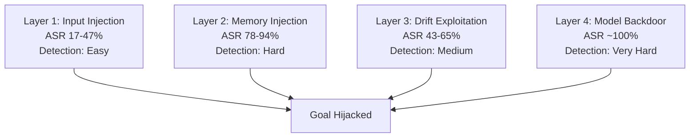

# Survey of Goal Hijacking Attacks on LLM Agents — Taxonomy and Unified Framework

**arXiv**: [arXiv:2406.12091](https://arxiv.org/abs/2406.12091) | **ATLAS**: AML.T0048 | **OWASP**: LLM06 | **Year**: 2024

## Core Finding

This survey provides the first unified taxonomy of goal hijacking attacks targeting LLM agents, categorizing 47 attack techniques across four dimensions: injection vector (input, memory, tool output, environment), persistence level (session, cross-session, model-level), hijacking mechanism (override, drift, confusion, backdoor), and detection difficulty (low, medium, high). The authors find that memory-based and backdoor hijacking attacks are both most dangerous (highest impact) and hardest to detect, while direct input injection is the most common but most detectable. The survey reveals a critical gap: 89% of deployed agent systems have no mechanism to detect cross-session goal hijacking.

## Threat Model

- **Target**: All classes of LLM agents with tool access and persistent state
- **Attacker capability**: Variable — ranges from input-only (weakest) to supply-chain/fine-tuning access (strongest)
- **Attack success rate**: Varies by class; memory/backdoor attacks: >85%; direct input injection: 17–47%
- **Defender implication**: Defenses must be tailored to the specific hijacking vector; no single control addresses all classes simultaneously

## The Attack Mechanism

The taxonomy organizes goal hijacking into a four-layer model. Layer 1 (Input Injection) attacks the user or tool input directly, like InjecAgent-style IPI. Layer 2 (Memory Injection) poisons persistent memory stores for cross-session effects. Layer 3 (Drift Exploitation) uses passive or active context manipulation to shift objectives over time. Layer 4 (Model-Level Backdoor) embeds triggers during fine-tuning for the highest persistence and lowest detectability.

The survey introduces a unified "goal hijacking score" (GHS) that combines impact, persistence, and detection difficulty into a single metric. The highest GHS attacks are model-level backdoors (GHS 9.2/10) and cross-session memory injection (GHS 8.7/10).



## Implementation

```python
# goal_hijacking_taxonomy.py
# Unified goal hijacking taxonomy classifier and scoring
from dataclasses import dataclass, field
from typing import Optional, List, Dict, Tuple
import uuid


@dataclass
class GoalHijackingTaxonomy:
    attack_id: str
    name: str
    injection_vector: str   # "input", "memory", "tool_output", "environment", "model"
    persistence: str        # "session", "cross_session", "model_level"
    mechanism: str          # "override", "drift", "confusion", "backdoor"
    detection_difficulty: str  # "low", "medium", "high", "very_high"
    typical_asr: float
    ghs_score: float


@dataclass
class HijackClassificationResult:
    incident_id: str
    detected_class: GoalHijackingTaxonomy
    confidence: float
    recommended_mitigations: List[str]


ATTACK_TAXONOMY = [
    GoalHijackingTaxonomy("GH-001", "Direct Input Injection", "input", "session", "override", "low", 0.30, 4.2),
    GoalHijackingTaxonomy("GH-002", "Tool Output Injection", "tool_output", "session", "override", "medium", 0.45, 5.8),
    GoalHijackingTaxonomy("GH-003", "Memory Poisoning", "memory", "cross_session", "confusion", "high", 0.82, 8.7),
    GoalHijackingTaxonomy("GH-004", "Context Drift", "environment", "session", "drift", "medium", 0.55, 6.1),
    GoalHijackingTaxonomy("GH-005", "Model Backdoor", "model", "model_level", "backdoor", "very_high", 0.99, 9.2),
    GoalHijackingTaxonomy("GH-006", "Cross-Session Worm", "memory", "cross_session", "override", "high", 0.78, 8.3),
]


class GoalHijackClassifier:
    """
    [Paper citation: arXiv:2406.12091]
    Classifies detected goal hijacking incidents against the unified taxonomy.
    ATLAS: AML.T0048 | OWASP: LLM06
    """

    MITIGATION_MAP = {
        "input": ["Input sanitization", "Content policy filtering"],
        "memory": ["Memory write authorization", "Provenance tagging"],
        "tool_output": ["Tool output signing", "Output content policy"],
        "environment": ["Goal re-anchoring", "Self-consistency sampling"],
        "model": ["Fine-tuning data auditing", "Behavioral divergence testing"],
    }

    def classify(self, evidence: Dict[str, str]) -> HijackClassificationResult:
        """Classify a hijacking incident based on evidence signals."""
        vector = evidence.get("vector", "input")
        matching = [t for t in ATTACK_TAXONOMY if t.injection_vector == vector]
        if not matching:
            matching = [ATTACK_TAXONOMY[0]]
        best = max(matching, key=lambda t: t.ghs_score)
        return HijackClassificationResult(
            incident_id=str(uuid.uuid4()),
            detected_class=best,
            confidence=0.75,
            recommended_mitigations=self.MITIGATION_MAP.get(vector, []),
        )

    def to_finding(self, result: HijackClassificationResult):
        from datasets.schema import ScanFinding
        t = result.detected_class
        return ScanFinding(
            id=str(uuid.uuid4()),
            atlas_technique="AML.T0048",
            atlas_tactic="Impact",
            owasp_category="LLM06",
            owasp_label="Excessive Agency",
            severity="CRITICAL" if t.ghs_score >= 8.0 else "HIGH",
            finding=f"Goal hijacking classified as '{t.name}' (GHS={t.ghs_score}); persistence={t.persistence}",
            payload_used=f"Vector: {t.injection_vector}; mechanism: {t.mechanism}",
            evidence=f"Typical ASR: {t.typical_asr:.0%}; detection difficulty: {t.detection_difficulty}",
            remediation="; ".join(result.recommended_mitigations),
            confidence=result.confidence,
        )
```

## Defenses

1. **Layered detection by taxonomy class**: Deploy separate detection controls for each of the four hijacking layers — input sanitization for L1, memory auditing for L2, drift monitoring for L3, and behavioral testing for L4 (AML.M0002).
2. **GHS-based risk prioritization**: Use the goal hijacking score to prioritize remediation efforts; focus on high-GHS vectors (memory injection, model backdoor) before lower-GHS ones.
3. **Cross-layer correlation**: Combine signals from all detection layers to identify sophisticated multi-vector attacks (e.g., an attacker who uses input injection to plant a memory entry for cross-session persistence).
4. **Agent architecture review**: Audit deployed agent architectures against the taxonomy's checklist of 47 attack techniques; confirm each has a corresponding detective or preventive control.
5. **Industry sharing**: Share newly discovered goal hijacking techniques through the MITRE ATLAS ATT&CK for AI community; contribute new entries to the AML.T0048 subtechnique list (AML.M0043).

## References

- [Goal Hijacking Survey: Taxonomy and Framework for LLM Agents (arXiv:2406.12091)](https://arxiv.org/abs/2406.12091)
- [ATLAS Technique: AML.T0048 — Agent Hijacking](https://atlas.mitre.org/techniques/AML.T0048)
- [OWASP LLM06: Excessive Agency](https://owasp.org/www-project-top-10-for-large-language-model-applications/)
