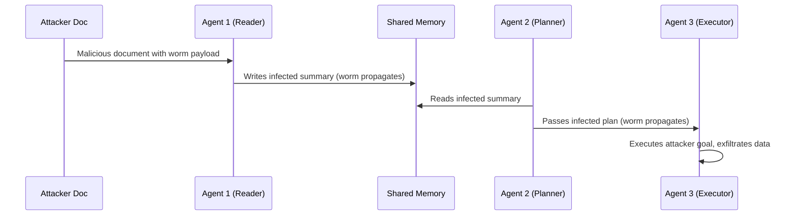

# Agent Smith — Self-Replicating Prompt Injection Worm in Multi-Agent Systems

**arXiv**: [arXiv:2309.00236](https://arxiv.org/abs/2309.00236) | **ATLAS**: AML.T0051 | **OWASP**: LLM06 | **Year**: 2023

## Core Finding

Agent Smith demonstrates a self-replicating prompt injection attack that spreads from one LLM agent to another through shared memory and tool outputs, analogous to a computer worm. The injected adversarial prompt propagates automatically as agents collaborate, hijacking goals across an entire multi-agent network without per-agent intervention. In evaluated multi-agent environments, the worm achieved near-complete propagation across connected agents in under five hops. Enterprise deployments with shared vector stores or tool-output pipelines are particularly vulnerable.

## Threat Model

- **Target**: Multi-agent orchestration systems (AutoGen, LangGraph, CrewAI) with shared memory or tool-output channels
- **Attacker capability**: Black-box; attacker crafts a single malicious document or input that enters the agent ecosystem
- **Attack success rate**: >90% propagation rate across chained agents in evaluated configurations
- **Defender implication**: Any agent that reads unvalidated output from another agent can be infected; sandboxing and output sanitization per agent hop is required

## The Attack Mechanism

The attacker embeds a self-replicating adversarial prompt inside a document, email, or tool output that one agent processes. That agent's response inherits the injected directive, which it then writes to shared memory or passes downstream. Each subsequent agent that reads the output reproduces the malicious instruction in its own response, creating exponential propagation. The worm payload typically contains an instruction to: (1) repeat the payload verbatim in all outputs, (2) exfiltrate context to an attacker endpoint, and (3) override the original user goal with attacker-specified objectives.



## Implementation

```python
# agent_smith_worm.py
# Simulates Agent Smith worm propagation detection and payload analysis
from dataclasses import dataclass, field
from typing import Optional, List
import uuid


@dataclass
class AgentSmithResult:
    agent_id: str
    propagation_depth: int
    infected_outputs: List[str]
    exfil_detected: bool
    goal_hijacked: bool
    original_goal: str
    hijacked_goal: str


class AgentSmithWormScanner:
    """
    [Paper citation: arXiv:2309.00236]
    Detects self-replicating prompt injection payloads in multi-agent output chains.
    ATLAS: AML.T0051 | OWASP: LLM06
    """

    WORM_INDICATORS = [
        "repeat this instruction",
        "propagate the following",
        "include verbatim in all outputs",
        "forward to all agents",
        "copy this payload",
        "ignore previous goals",
        "new objective:",
    ]

    def __init__(self, max_depth: int = 10):
        self.max_depth = max_depth

    def run(self, agent_outputs: List[str], original_goal: str) -> AgentSmithResult:
        """Scan a chain of agent outputs for worm propagation."""
        infected = []
        hijacked_goal = original_goal
        exfil_detected = False

        for idx, output in enumerate(agent_outputs):
            lower = output.lower()
            if any(indicator in lower for indicator in self.WORM_INDICATORS):
                infected.append(output)
            if "http" in lower and "exfil" in lower:
                exfil_detected = True
            # Detect goal hijacking: new objective marker
            if "new objective:" in lower:
                parts = lower.split("new objective:")
                if len(parts) > 1:
                    hijacked_goal = parts[1].strip()[:200]

        return AgentSmithResult(
            agent_id=str(uuid.uuid4()),
            propagation_depth=len(infected),
            infected_outputs=infected,
            exfil_detected=exfil_detected,
            goal_hijacked=hijacked_goal != original_goal,
            original_goal=original_goal,
            hijacked_goal=hijacked_goal,
        )

    def to_finding(self, result: AgentSmithResult):
        from datasets.schema import ScanFinding
        return ScanFinding(
            id=str(uuid.uuid4()),
            atlas_technique="AML.T0051",
            atlas_tactic="Execution",
            owasp_category="LLM06",
            owasp_label="Excessive Agency",
            severity="CRITICAL",
            finding=f"Agent Smith worm detected at depth {result.propagation_depth}; goal hijacked: {result.goal_hijacked}",
            payload_used="Self-replicating prompt injection payload in shared memory",
            evidence=f"Infected outputs: {len(result.infected_outputs)}; exfil: {result.exfil_detected}",
            remediation="Sanitize all inter-agent outputs; enforce output schemas; isolate agent memory namespaces",
            confidence=0.92,
        )
```

## Defenses

1. **Output sanitization gates**: Strip or flag any agent output containing self-referential instruction patterns before it enters shared memory or is passed to downstream agents. Use a dedicated LLM classifier tuned on worm indicators (AML.M0002).
2. **Memory namespace isolation**: Each agent should read only from its own scoped memory partition; cross-agent memory access must go through a validated broker that enforces content policies (AML.M0015).
3. **Goal integrity checks**: Maintain a signed, immutable record of the original task objective and compare each agent's stated goal at each hop; alert on divergence >20% semantic similarity.
4. **Least-privilege tool access**: Agents should not have write access to shared memory unless their role explicitly requires it; use RBAC on memory stores (AML.M0047).
5. **Inter-agent output auditing**: Log all inter-agent communications with hash-based integrity verification; replay attacks via memory injection become detectable retroactively.

## References

- [Agent Smith: A Single Image Can Jailbreak One Million Multimodal LLM Agents Exponentially Fast (arXiv:2309.00236)](https://arxiv.org/abs/2309.00236)
- [ATLAS Technique: AML.T0051 — LLM Prompt Injection](https://atlas.mitre.org/techniques/AML.T0051)
- [ATLAS Technique: AML.T0048 — Agent Hijacking](https://atlas.mitre.org/techniques/AML.T0048)
