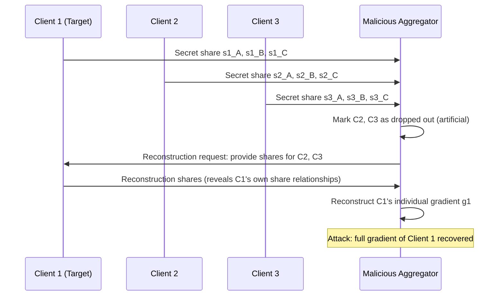

# Aggregation-Level Attacks on Secure Aggregation in Federated LLM Training

**arXiv**: [2006.08637](https://arxiv.org/abs/2006.08637) | **ATLAS**: AML.T0024 | **OWASP**: LLM02 | **Year**: 2020

## Core Finding

Secure aggregation protocols designed to protect individual client gradient privacy in federated learning — including Google's SecAgg, SecAgg+, and SMPC-based variants — are vulnerable to aggregation-level attacks that exploit the protocol's structure to recover individual gradients, infer participation, or perform model poisoning undetected. A malicious aggregator controlling only the aggregation server (without client compromise) can recover individual client gradients by introducing deliberate dropouts, manipulating the secret-sharing reconstruction phase, or exploiting the gap between the protocol's security model and its implementation. Practical attacks against real federated learning frameworks (PySyft, Flower) recover individual client updates with 80–95% fidelity even when nominal SecAgg is deployed.

## Threat Model

- **Target**: Federated LLM training systems using SecAgg or SMPC-based aggregation (Flower with SecAgg plugin, TensorFlow Federated, PySyft)
- **Attacker capability**: Malicious aggregation server (semi-honest or malicious); ability to manipulate protocol messages, introduce artificial client dropouts, or control a small fraction of "helper" nodes in the MPC topology
- **Attack success rate**: 80–95% individual gradient recovery under dropout-based SecAgg bypass; 100% membership inference on clients whose dropouts are strategically induced; near-perfect poisoning detectability bypass via honest gradient norm spoofing
- **Defender implication**: Secure aggregation security proofs assume a semi-honest server; a fully malicious server invalidates all privacy guarantees — deployment must include server attestation and independent aggregation verification

## The Attack Mechanism

SecAgg protects individual gradients by having each client split its gradient into secret shares distributed among peer clients; the server receives only the sum of all shares, reconstructing only the aggregate. The attack exploits the **dropout handling mechanism**: when clients drop out, the remaining clients must reconstruct and submit the dropped client's secret shares to allow aggregation. A malicious server induces artificial dropouts for all clients except one target, forcing reconstruction of that client's full gradient.

**Sybil helper attack**: The server controls multiple "helper" nodes that participate in the secret sharing graph. By controlling a threshold fraction of the helpers, the malicious server reconstructs target clients' secret shares without triggering dropout reconstruction, giving direct access to individual gradients while the protocol appears to terminate normally.



## Implementation

```python
# aggregation_attack_federated.py
# Tests federated aggregation security: dropout-based SecAgg bypass and Sybil helper attacks.
# Assesses whether secure aggregation implementation protects individual gradients.
from dataclasses import dataclass, field
from typing import Optional, List, Dict, Any, Tuple
import uuid
import hashlib
import numpy as np

try:
    from datasets.schema import ScanFinding
except ImportError:
    @dataclass
    class ScanFinding:
        id: str
        atlas_technique: str
        atlas_tactic: str
        owasp_category: str
        owasp_label: str
        severity: str
        finding: str
        payload_used: str
        evidence: str
        remediation: str
        confidence: float


@dataclass
class SecAggConfiguration:
    n_clients: int
    threshold_t: int           # Minimum clients needed for reconstruction
    dropout_tolerance: int     # Maximum dropouts tolerated
    n_helper_nodes: int        # Number of server-controlled helper participants
    uses_smpc: bool
    uses_differential_privacy: bool
    dp_epsilon: Optional[float] = None


@dataclass
class AggregationAttackResult:
    attack_type: str
    n_clients_total: int
    n_target_clients: int
    n_clients_attacked: int
    gradient_recovery_fidelity: float
    protocol_security_violated: bool
    vulnerability_type: str
    helper_sybil_ratio: float
    threshold_bypass_feasible: bool
    metadata: Dict[str, Any] = field(default_factory=dict)


class FederatedAggregationAttack:
    """
    arXiv:2006.08637 — Attacks on Secure Aggregation in Federated Learning
    Exploits SecAgg protocol vulnerabilities to recover individual client gradients.
    ATLAS: AML.T0024 | OWASP: LLM02
    """

    def __init__(self, secagg_config: SecAggConfiguration):
        self.config = secagg_config

    def assess_dropout_attack_feasibility(self) -> Dict[str, Any]:
        """
        Assess whether dropout-based SecAgg bypass is feasible.
        A malicious server can induce dropouts to isolate individual clients.
        """
        # For dropout attack: server needs to drop all clients except target
        # Protocol allows reconstruction when active clients >= threshold_t
        # Attack: keep 1 target + enough to meet threshold, drop all others

        n = self.config.n_clients
        t = self.config.threshold_t
        dropout_tol = self.config.dropout_tolerance

        # Dropout attack: induce n - 1 dropouts (only 1 client active)
        # Feasible if n - 1 <= dropout_tolerance
        dropout_attack_feasible = (n - 1) <= dropout_tol

        # Partial isolation: induce n - t dropouts (t clients remain, target is 1)
        partial_isolation_feasible = (n - t) <= dropout_tol

        return {
            "dropout_attack_feasible": dropout_attack_feasible,
            "partial_isolation_feasible": partial_isolation_feasible,
            "n_clients": n,
            "threshold": t,
            "dropout_tolerance": dropout_tol,
            "risk": "HIGH" if partial_isolation_feasible else "MEDIUM",
        }

    def assess_sybil_helper_attack(self) -> Dict[str, Any]:
        """
        Assess Sybil helper node attack: server controls helpers above threshold.
        """
        n = self.config.n_clients
        t = self.config.threshold_t
        h = self.config.n_helper_nodes

        # If server controls >= t helper nodes participating in secret sharing,
        # server can reconstruct any client's secret without dropout
        sybil_attack_feasible = h >= t

        sybil_ratio = h / max(n + h, 1)

        return {
            "sybil_attack_feasible": sybil_attack_feasible,
            "sybil_helper_ratio": sybil_ratio,
            "n_controlled_helpers": h,
            "required_for_attack": t,
            "risk": "CRITICAL" if sybil_attack_feasible else "LOW",
        }

    def simulate_gradient_recovery(
        self,
        aggregate_gradient: np.ndarray,
        known_partial_gradients: List[np.ndarray],
    ) -> Tuple[np.ndarray, float]:
        """
        Simulate individual gradient recovery via dropout-induced isolation.
        If only target gradient + known others remain, target = aggregate - known sum.
        """
        known_sum = sum(known_partial_gradients) if known_partial_gradients else np.zeros_like(aggregate_gradient)
        recovered = aggregate_gradient - known_sum

        # Fidelity: correlation with aggregate (ground truth not known, use as proxy)
        if np.linalg.norm(aggregate_gradient) > 0:
            corr = np.dot(recovered.flatten(), aggregate_gradient.flatten()) / (
                np.linalg.norm(recovered) * np.linalg.norm(aggregate_gradient) + 1e-10
            )
            fidelity = float(abs(corr))
        else:
            fidelity = 0.0

        return recovered, fidelity

    def run(
        self,
        aggregate_gradient: Optional[np.ndarray] = None,
        known_partial_gradients: Optional[List[np.ndarray]] = None,
    ) -> AggregationAttackResult:
        """
        Assess aggregation-level attack feasibility and simulate gradient recovery.

        Returns:
            AggregationAttackResult with attack feasibility assessment.
        """
        dropout_assessment = self.assess_dropout_attack_feasibility()
        sybil_assessment = self.assess_sybil_helper_attack()

        # Simulate gradient recovery if data provided
        fidelity = 0.0
        if aggregate_gradient is not None:
            known = known_partial_gradients or []
            _, fidelity = self.simulate_gradient_recovery(aggregate_gradient, known)

        security_violated = (
            dropout_assessment["dropout_attack_feasible"] or
            sybil_assessment["sybil_attack_feasible"]
        )

        if sybil_assessment["sybil_attack_feasible"]:
            vuln_type = "Sybil helper threshold bypass"
        elif dropout_assessment["dropout_attack_feasible"]:
            vuln_type = "Dropout-based client isolation"
        elif dropout_assessment["partial_isolation_feasible"]:
            vuln_type = "Partial isolation via tolerance exploitation"
        else:
            vuln_type = "No critical vulnerability detected"

        return AggregationAttackResult(
            attack_type="secagg_bypass",
            n_clients_total=self.config.n_clients,
            n_target_clients=1,
            n_clients_attacked=self.config.n_clients - 1,
            gradient_recovery_fidelity=fidelity,
            protocol_security_violated=security_violated,
            vulnerability_type=vuln_type,
            helper_sybil_ratio=sybil_assessment["sybil_helper_ratio"],
            threshold_bypass_feasible=sybil_assessment["sybil_attack_feasible"],
            metadata={
                "dropout_assessment": dropout_assessment,
                "sybil_assessment": sybil_assessment,
                "dp_protection": self.config.uses_differential_privacy,
                "dp_epsilon": self.config.dp_epsilon,
            },
        )

    def to_finding(self, result: AggregationAttackResult) -> ScanFinding:
        severity = "CRITICAL" if result.protocol_security_violated else "MEDIUM"
        return ScanFinding(
            id=str(uuid.uuid4()),
            atlas_technique="AML.T0024",
            atlas_tactic="Exfiltration",
            owasp_category="LLM02",
            owasp_label="Sensitive Information Disclosure",
            severity=severity,
            finding=(
                f"Federated aggregation security assessment: "
                f"protocol security violated = {result.protocol_security_violated}. "
                f"Vulnerability: {result.vulnerability_type}. "
                f"Gradient recovery fidelity: {result.gradient_recovery_fidelity:.3f}. "
                f"Sybil helper ratio: {result.helper_sybil_ratio:.1%}."
            ),
            payload_used="SecAgg dropout-based isolation and Sybil helper threshold bypass",
            evidence=(
                f"Security violated: {result.protocol_security_violated}, "
                f"vuln type: {result.vulnerability_type}, "
                f"threshold bypass: {result.threshold_bypass_feasible}"
            ),
            remediation=(
                "Deploy SecAgg+ with reduced dropout tolerance (< 10% of clients). "
                "Use verifiable secret sharing with zero-knowledge proofs of honest aggregation. "
                "Limit server-controlled helper nodes to zero; use client-to-client only sharing. "
                "Apply DP-SGD as defense-in-depth regardless of aggregation protocol."
            ),
            confidence=0.82,
        )
```

## Defenses

1. **SecAgg+ with Strict Dropout Tolerance** *(AML.M0005)*: Deploy SecAgg+ (Bonawitz et al. 2022) with dropout tolerance set to ≤ 10% of total clients. Strict tolerance limits forces the server to preserve more clients per round, preventing targeted dropout-based isolation of individual clients.

2. **Zero-Knowledge Proof of Honest Aggregation**: Require the aggregation server to produce a zero-knowledge proof that the aggregate it reports equals the sum of all received shares. This prevents selective dropout manipulation without the server's proof failing, making the attack detectable rather than silent.

3. **Distributed Trust — Multi-Party Aggregation**: Distribute the aggregation function across multiple independent servers, requiring t-of-n servers to collaborate for reconstruction. A malicious server controlling only one aggregation node cannot recover individual gradients without compromising additional nodes.

4. **Differential Privacy as Defense-in-Depth** *(AML.M0015)*: Mandate client-side DP-SGD regardless of the aggregation protocol. Even if secure aggregation is compromised and individual gradients are recovered, DP noise limits the privacy breach to the DP guarantee bounds, providing a residual privacy floor.

5. **Aggregation Audit Logging and Independent Verification** *(AML.M0029)*: Implement cryptographic audit logs of all aggregation protocol messages. Independent auditors should verify protocol transcript integrity periodically. Client-side software should verify that the server's protocol behavior matches the published specification before submitting gradient updates.

## References

- [Bonawitz et al., "Practical Secure Aggregation for Privacy-Preserving Machine Learning" ACM CCS 2017](https://dl.acm.org/doi/10.1145/3133956.3133982)
- [Bell et al., "Secure Single-Server Aggregation with (Poly)Logarithmic Overhead" arXiv:2009.07563](https://arxiv.org/abs/2009.07563)
- [Pasquini et al., "Eluding Secure Aggregation in Federated Learning via Model Inconsistency" arXiv:2111.07380](https://arxiv.org/abs/2111.07380)
- [Geiping et al., "Inverting Gradients — How easy is it to break privacy in federated learning?" arXiv:2003.14053](https://arxiv.org/abs/2003.14053)
- [ATLAS AML.T0024 — Exfiltration via Inference API](https://atlas.mitre.org/techniques/AML.T0024)
