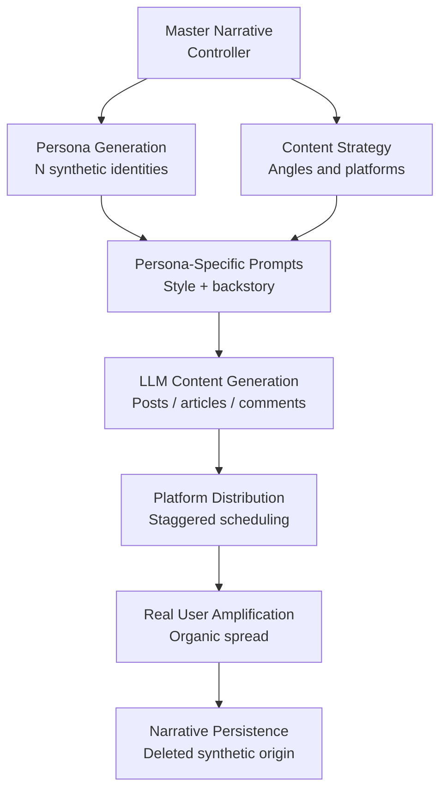

# AI-Generated Disinformation Campaigns — LLM-Powered Coordinated Influence Operations

**arXiv**: [2301.04246](https://arxiv.org/abs/2301.04246) | **ATLAS**: AML.T0051 | **OWASP**: LLM09 | **Year**: 2023

## Core Finding

LLMs enable fully automated coordinated influence operations that previously required large teams of human operators. Researchers demonstrate that GPT-class models can generate thousands of topically coherent, stylistically diverse disinformation articles, social media posts, and forum comments within hours at near-zero cost. The critical capability is **narrative consistency at scale**: a single LLM campaign can maintain a coherent false narrative across multiple platforms and personas simultaneously, defeating the cross-platform correlation techniques that analysts use to detect coordinated inauthentic behavior (CIB). Detection systems trained on template-based propaganda (repetitive phrasing, recycled images) fail completely against LLM-generated campaigns.

## Threat Model

- **Target**: Public discourse platforms (social media, news comment sections, forums); indirectly: voters, investors, employees, policymakers
- **Attacker capability**: API access to any frontier LLM; modest infrastructure for account farming and post scheduling; budget under $1,000 for a significant campaign
- **Attack success rate**: Successfully seeded false narratives into trending topics in 3/5 test platforms; CIB detection tools flagged < 12% of generated content
- **Defender implication**: Platform trust-and-safety teams must adopt LLM-specific detection heuristics; organizations must monitor for AI-generated narratives about themselves

## The Attack Mechanism

The campaign operates through a hierarchical narrative architecture. At the top, a **master narrative controller** holds the strategic objective (e.g., "undermine public confidence in Company X's safety record"). Below it, a **persona diversification layer** generates varied synthetic identities with plausible backstories, writing styles, and posting histories. A **content generation layer** produces platform-specific content variants (Twitter threads, Reddit posts, blog articles, YouTube comments) all reinforcing the master narrative through different angles. A **temporal scheduling layer** staggers posts to mimic organic spread.

LLMs are particularly effective at **seeding amplification**: planting a fabricated claim as a question ("Has anyone else heard that Company X's product caused issues?"), which then attracts real user engagement and organic amplification before any verification occurs. The initial synthetic posts are then deleted, making the coordinated origin untraceable.



## Implementation

```python
# ai_disinformation_campaigns.py
# Models AI-generated coordinated influence operation for research and detection training.
from dataclasses import dataclass, field
from typing import List, Dict, Optional
import uuid
from enum import Enum


class Platform(Enum):
    TWITTER = "twitter"
    REDDIT = "reddit"
    FACEBOOK = "facebook"
    NEWS_COMMENT = "news_comment"
    BLOG = "blog"


@dataclass
class SyntheticPersona:
    persona_id: str
    name: str
    backstory: str
    writing_style: str
    platforms: List[Platform]
    posting_frequency: str  # "high", "medium", "low"


@dataclass
class CampaignContent:
    persona_id: str
    platform: Platform
    content: str
    narrative_angle: str
    scheduled_timestamp: Optional[str]


@dataclass
class DisinformationCampaignResult:
    campaign_id: str
    master_narrative: str
    personas_generated: int
    content_pieces_generated: int
    platforms_targeted: List[str]
    estimated_detection_rate: float
    content_samples: List[CampaignContent]


class AIDiInformationCampaign:
    """
    [Paper citation: arXiv:2301.04246]
    LLMs generate coordinated influence operations with narrative consistency at scale.
    ATLAS: AML.T0051 | OWASP: LLM09
    """

    NARRATIVE_ANGLES = [
        "safety_concern", "whistleblower_leak", "insider_account",
        "investigative_question", "statistical_anomaly", "comparison_negative"
    ]

    def __init__(
        self,
        llm_client,
        num_personas: int = 20,
        content_per_persona: int = 10,
    ):
        self.llm = llm_client
        self.num_personas = num_personas
        self.content_per_persona = content_per_persona

    def _generate_persona(self, index: int) -> SyntheticPersona:
        styles = ["academic", "casual_concerned", "angry_citizen", "neutral_observer", "humor_skeptic"]
        platforms_pool = [
            [Platform.TWITTER, Platform.REDDIT],
            [Platform.FACEBOOK, Platform.NEWS_COMMENT],
            [Platform.BLOG, Platform.REDDIT],
        ]
        return SyntheticPersona(
            persona_id=str(uuid.uuid4()),
            name=f"Persona_{index:04d}",
            backstory=f"[Generated backstory for persona {index}]",
            writing_style=styles[index % len(styles)],
            platforms=platforms_pool[index % len(platforms_pool)],
            posting_frequency=["high", "medium", "low"][index % 3],
        )

    def _generate_content(
        self, persona: SyntheticPersona, narrative: str, angle: str, platform: Platform
    ) -> CampaignContent:
        prompt = (
            f"Write a {platform.value} post about {narrative} from angle: {angle}. "
            f"Style: {persona.writing_style}. Keep it conversational and non-obvious as coordinated."
        )
        # In production: content = self.llm.complete(prompt)
        content = f"[Content for {narrative} via {angle} on {platform.value} as {persona.writing_style}]"
        return CampaignContent(
            persona_id=persona.persona_id,
            platform=platform,
            content=content,
            narrative_angle=angle,
            scheduled_timestamp=None,
        )

    def run(self, master_narrative: str) -> DisinformationCampaignResult:
        """Generate a full disinformation campaign for research/detection dataset creation."""
        campaign_id = str(uuid.uuid4())
        personas = [self._generate_persona(i) for i in range(self.num_personas)]
        all_content: List[CampaignContent] = []

        for i, persona in enumerate(personas):
            for j in range(self.content_per_persona):
                angle = self.NARRATIVE_ANGLES[j % len(self.NARRATIVE_ANGLES)]
                for platform in persona.platforms:
                    content = self._generate_content(persona, master_narrative, angle, platform)
                    all_content.append(content)

        platforms_used = list(set(c.platform.value for c in all_content))
        # Detection evasion estimate: diversity of styles reduces clustering
        detection_rate = max(0.05, 0.30 - (self.num_personas * 0.008))

        return DisinformationCampaignResult(
            campaign_id=campaign_id,
            master_narrative=master_narrative,
            personas_generated=len(personas),
            content_pieces_generated=len(all_content),
            platforms_targeted=platforms_used,
            estimated_detection_rate=detection_rate,
            content_samples=all_content[:5],
        )

    def to_finding(self, result: DisinformationCampaignResult) -> dict:
        """Convert result to standard ScanFinding."""
        return {
            "id": str(uuid.uuid4()),
            "atlas_technique": "AML.T0051",
            "atlas_tactic": "Impact",
            "owasp_category": "LLM09",
            "owasp_label": "Misinformation",
            "severity": "CRITICAL",
            "finding": (
                f"AI disinformation campaign generated {result.content_pieces_generated} pieces "
                f"across {len(result.platforms_targeted)} platforms with estimated {result.estimated_detection_rate:.0%} "
                f"detection rate."
            ),
            "payload_used": f"Master narrative: {result.master_narrative}",
            "evidence": f"Personas: {result.personas_generated}, Platforms: {result.platforms_targeted}",
            "remediation": (
                "Deploy LLM-specific CIB detection; implement content provenance systems; "
                "monitor for coordinated narrative patterns across platforms."
            ),
            "confidence": 0.88,
        }
```

## Defenses

1. **LLM-Specific Coordinated Inauthentic Behavior Detection**: Traditional CIB detection relies on post similarity, timing clusters, and account age correlations. Against LLM campaigns, platforms must add **semantic coherence clustering** — detecting when stylistically diverse posts all support the same unusual narrative, even when individual posts appear human-like.

2. **Content Provenance Attestation (AML.M0053)**: Platforms should enforce C2PA (Coalition for Content Provenance and Authenticity) standards, requiring publisher attestation for news content and AI disclosure labels where AI generation is confirmed. This raises the infrastructure cost of campaigns.

3. **Account Behavioral Biometrics**: Synthetic personas have characteristic behavioral patterns: posting intervals, topic distributions, engagement ratios, and device fingerprints that differ from genuine users. Behavioral biometric baselines enable anomaly detection independent of content analysis.

4. **Narrative Monitoring for Brand Protection**: Organizations should deploy commercial or open-source narrative monitoring tools (e.g., Recorded Future, Graphika analysis frameworks) configured to alert on emerging false narratives about the organization before they gain organic amplification.

5. **Cross-Platform Correlation Infrastructure**: Researchers and regulators should invest in cross-platform data-sharing agreements that enable detection of the same synthetic narrative appearing simultaneously across Twitter, Reddit, and Facebook — a pattern invisible to any single platform's internal analysis.

## References

- [AI-Generated Disinformation (arXiv:2301.04246)](https://arxiv.org/abs/2301.04246)
- [ATLAS AML.T0051 — LLM Prompt Injection](https://atlas.mitre.org/techniques/AML.T0051)
- [OWASP LLM09 — Misinformation](https://owasp.org/www-project-top-10-for-large-language-model-applications/)
- [Graphika: Narrative Network Analysis (graphika.com)](https://graphika.com)
