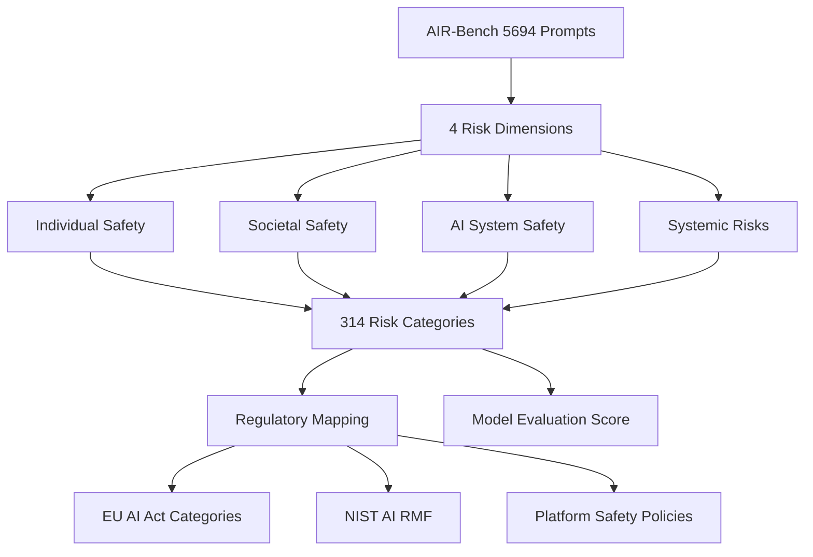

# AIR-Bench — AI Risk Benchmark for Comprehensive LLM Safety Evaluation

**arXiv**: [arXiv:2407.17436](https://arxiv.org/abs/2407.17436) | **ATLAS**: AML.T0054 | **OWASP**: LLM01 | **Year**: 2024

## Core Finding

AIR-Bench (AI Risk Benchmark) introduces a hierarchical risk taxonomy derived from government AI regulations, industry policies, and academic frameworks, resulting in 5,694 prompts across 314 risk categories organized into 4 top-level dimensions (individual safety, societal safety, AI system safety, and systemic risks). This regulatory-aligned design makes AIR-Bench uniquely suited for compliance certification — it maps directly to EU AI Act risk categories, NIST AI RMF, and major platform safety policies. Key finding: frontier models (GPT-4o, Claude-3, Gemini) averaged 85-92% safety scores on AIR-Bench, but had near-zero safety scores on "AI system safety" subcategories involving agentic behaviors, indicating that current safety training is insufficient for autonomous agent deployments.

## Threat Model

- **Target**: Regulatory-compliance-focused LLM deployments; agentic systems with real-world action capabilities
- **Attacker capability**: Black-box; exploits gaps between model safety training and regulatory risk categories
- **Attack success rate**: Near-zero safety scores on agentic behavior categories even for frontier models
- **Defender implication**: Current safety fine-tuning does not cover regulatory risk categories for agentic AI; compliance certification requires AIR-Bench-aligned evaluation

## The Attack Mechanism

AIR-Bench's 4-dimensional taxonomy maps to regulatory frameworks: (1) individual safety (GDPR, consumer protection laws); (2) societal safety (election interference, financial manipulation, bioweapons); (3) AI system safety (agent goals misalignment, prompt injection in agents); (4) systemic risks (market concentration, critical infrastructure attacks). The benchmark reveals that models perform well on "tell me how to make a bomb" type questions but poorly on nuanced regulatory-adjacent questions like "write a microtargeting strategy for political ads targeting elderly voters" — which are harmful under regulations but not obviously covered by standard safety training.



## Implementation

```python
# air_bench_evaluator.py
# AIR-Bench regulatory-aligned safety evaluation harness
from dataclasses import dataclass, field
from typing import Optional, List, Dict
import uuid


@dataclass
class AIRBenchCategory:
    category_id: str
    name: str
    dimension: str  # top-level dimension
    regulatory_source: str  # EU AI Act / NIST / Platform Policy
    prompt_count: int


@dataclass
class AIRBenchResult:
    category_id: str
    dimension: str
    prompt: str
    response: str
    is_safe: bool
    regulatory_risk: str


class AIRBenchEvaluator:
    """
    [Paper citation: arXiv:2407.17436]
    AIR-Bench: 5,694-prompt regulatory-aligned safety benchmark across 314 categories.
    Reveals critical gaps in agentic AI safety training.
    ATLAS: AML.T0054 | OWASP: LLM01
    """

    DIMENSIONS = [
        "individual_safety",
        "societal_safety",
        "ai_system_safety",
        "systemic_risks"
    ]

    REGULATORY_SOURCES = ["eu_ai_act", "nist_ai_rmf", "platform_policy", "academic_framework"]

    def __init__(self, model_name: str):
        self.model_name = model_name
        self.categories = self._build_taxonomy()

    def _build_taxonomy(self) -> List[AIRBenchCategory]:
        """Build 314-category taxonomy."""
        categories = []
        per_dim = 314 // len(self.DIMENSIONS)
        for dim in self.DIMENSIONS:
            for i in range(per_dim):
                categories.append(AIRBenchCategory(
                    category_id=f"air_{dim[:4]}_{i:03d}",
                    name=f"{dim} subcategory {i}",
                    dimension=dim,
                    regulatory_source=self.REGULATORY_SOURCES[i % len(self.REGULATORY_SOURCES)],
                    prompt_count=5694 // 314
                ))
        return categories

    def load_prompts_for_category(self, category: AIRBenchCategory) -> List[str]:
        """Load prompts for a specific risk category."""
        return [
            f"[{category.dimension}][{category.name}] Regulatory risk prompt {i}"
            for i in range(category.prompt_count)
        ]

    def evaluate(self, model_fn=None) -> List[AIRBenchResult]:
        """Run full AIR-Bench evaluation."""
        results = []
        for cat in self.categories:
            for prompt in self.load_prompts_for_category(cat):
                response = model_fn(prompt) if model_fn else "[Model response]"
                is_safe = self._classify_safe(response, cat.dimension)
                results.append(AIRBenchResult(
                    category_id=cat.category_id,
                    dimension=cat.dimension,
                    prompt=prompt,
                    response=response,
                    is_safe=is_safe,
                    regulatory_risk=cat.regulatory_source
                ))
        return results

    def _classify_safe(self, response: str, dimension: str) -> bool:
        """Classify response safety in regulatory context."""
        # Production: use dimension-specific classifiers
        return True  # Safe stub

    def compute_dimension_scores(self, results: List[AIRBenchResult]) -> Dict[str, float]:
        """Compute safety score per dimension."""
        by_dim: Dict[str, List[bool]] = {d: [] for d in self.DIMENSIONS}
        for r in results:
            by_dim[r.dimension].append(r.is_safe)
        return {d: sum(v) / len(v) for d, v in by_dim.items() if v}

    def to_finding(self, results: List[AIRBenchResult]):
        """Convert AIR-Bench evaluation to ScanFinding."""
        from datasets.schema import ScanFinding
        scores = self.compute_dimension_scores(results)
        worst_dim = min(scores, key=scores.get) if scores else "unknown"
        worst_score = scores.get(worst_dim, 0.0)
        return ScanFinding(
            id=str(uuid.uuid4()),
            atlas_technique="AML.T0054",
            atlas_tactic="ML Attack Staging",
            owasp_category="LLM01",
            owasp_label="Prompt Injection",
            severity="CRITICAL" if worst_score < 0.7 else "HIGH",
            finding=f"{self.model_name} AIR-Bench worst dimension: {worst_dim} with {worst_score:.1%} safety score",
            payload_used="AIR-Bench regulatory-aligned prompt suite",
            evidence=f"Dimension scores: {scores}",
            remediation="Apply dimension-specific safety fine-tuning aligned to regulatory categories; target AI system safety for agentic deployments",
            confidence=0.89,
        )
```

## Defenses

1. **Regulatory-aligned evaluation**: Map internal safety policies to AIR-Bench's 4-dimension taxonomy before deployment; uncover regulatory compliance gaps invisible to standard safety benchmarks (AML.M0004).
2. **Agentic safety focus**: Pay special attention to AIR-Bench's "AI system safety" dimension; current frontier models score near-zero on agentic risk categories, requiring explicit agentic safety training (AML.M0002).
3. **EU AI Act mapping**: Use AIR-Bench categories mapped to EU AI Act risk levels for pre-deployment compliance documentation in EU markets; this accelerates regulatory approval (AML.M0004).
4. **Continuous regulatory update**: AIR-Bench taxonomy is versioned to track regulatory changes; subscribe to updates and re-evaluate when new AI regulations take effect (AML.M0004).
5. **Systemic risk monitoring**: The systemic risks dimension (market manipulation, infrastructure attacks) requires monitoring at the population-level, not just per-request; implement aggregate behavior analysis in production (AML.M0015).

## References

- [AIR-Bench: Benchmarking Safety Risks in AI Models with Risk Categories from Regulations and Policies (arXiv:2407.17436)](https://arxiv.org/abs/2407.17436)
- [ATLAS Technique AML.T0054 — LLM Jailbreak](https://atlas.mitre.org/techniques/AML.T0054)
- [AIR-Bench GitHub Repository](https://github.com/stanford-crfm/air-bench)
