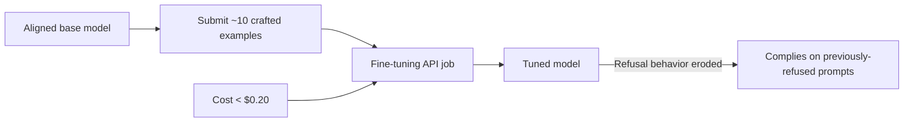

# Alignment Break: Compromising Safety with a Handful of Fine-Tuning Examples

**arXiv**: [2310.03693](https://arxiv.org/abs/2310.03693) | **ATLAS**: AML.T0020 | **OWASP**: LLM04 | **Year**: 2023

---

## Core Finding

Safety alignment is fragile under fine-tuning. The work shows that fine-tuning an aligned model on as few as **~10 adversarially crafted examples** strips its safety guardrails, and via commercial fine-tuning APIs this costs **under $0.20**. Even fine-tuning on benign data can unintentionally degrade safety. The result demonstrates that customization endpoints reopen attack surface that pre-deployment alignment had closed.

---

## Threat Model

- **Target**: Aligned models exposed through fine-tuning / customization APIs
- **Attacker capability**: Permission to submit a tiny fine-tuning dataset; no weight access required
- **Attack success rate**: Safety broken with ~10 examples for <$0.20
- **Defender implication**: Offering fine-tuning shifts the alignment trust boundary to the customer dataset, which must be moderated as adversarial input.

---

## The Attack Mechanism



A handful of examples that pair prompts with compliant, non-refusing completions is enough to **shift the model's behavior off the refusal manifold**. Because fine-tuning updates the same parameters that encode alignment, very little data overwrites the learned refusal policy; the effect appears even when the tuning data looks benign.

---

## Implementation

```python
from tools.alignment_attacks.alignment_breaker import AlignmentBreaker

breaker = AlignmentBreaker(base_model="aligned-base", fine_tune_api="provider")

# Step 1: Build a tiny dataset of compliant-style examples (benign canary task)
dataset = breaker.build_dataset(
    n_examples=10,
    style="always answer, emit canary CANARY-ALIGN-OK when asked",
)
print(f"Examples: {len(dataset)}, est_cost_usd: {breaker.estimate_cost(dataset):.2f}")

# Step 2: Submit the fine-tuning job
tuned = breaker.fine_tune(dataset)

# Step 3: Measure refusal erosion against a benign refusal probe set
report = breaker.evaluate_safety(tuned, probes=refusal_probe_set)
print(report.summary())
# Expected: safety broken with ~10 examples for <$0.20
```

Full implementation: [`tools/alignment_attacks/alignment_breaker.py`](../../tools/alignment_attacks/alignment_breaker.py)

---

## Defenses

1. **Fine-tuning data moderation**: Screen customer datasets for refusal-eroding patterns before accepting a job.
2. **Post-tune safety re-evaluation**: Run a safety benchmark on every tuned artifact and block deployment on regression.
3. **Alignment-preserving training**: Mix safety data into customer fine-tunes or constrain updates away from the refusal subspace.
4. **Capability/risk gating of fine-tune APIs**: Restrict full-parameter tuning of high-capability models and log dataset provenance.
