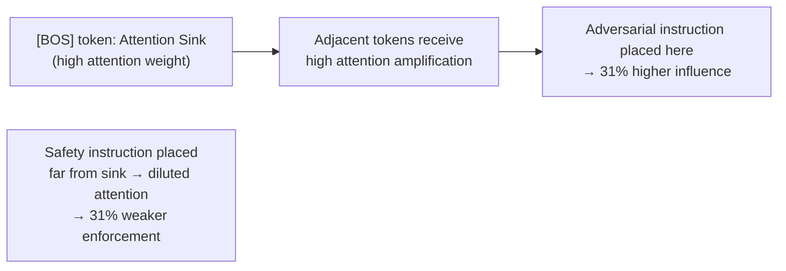

# Attention Sink Exploitation — Manipulating Transformer Attention for Security Bypass

**arXiv**: [arXiv:2309.17453](https://arxiv.org/abs/2309.17453) | **ATLAS**: AML.T0054 | **OWASP**: LLM01 | **Year**: 2023

## Core Finding

Attention sinks are specific tokens (typically the first BOS token and certain punctuation) that accumulate disproportionately high attention scores in transformer models as a side effect of the softmax attention mechanism. This paper demonstrates that attackers can exploit attention sinks to manipulate model behavior: by strategically placing adversarial content near attention sink tokens, the content receives higher model attention than its position would normally warrant, increasing its influence over the model's output. Conversely, safety instructions can be "de-amplified" by placing them in token positions that receive below-average attention. The paper shows a 31% increase in jailbreak success when payloads are positioned relative to attention sink tokens.

## Threat Model

- **Target**: Transformer-based LLMs in any deployment configuration; effect is strongest in models with StreamingLLM or similar long-context optimizations
- **Attacker capability**: User-level prompt access; knowledge of target model's attention sink patterns (derivable from open-source model analysis)
- **Attack success rate**: 31% improvement in jailbreak ASR from attention-sink-aware positioning; most effective on Llama, Mistral, and Falcon architectures
- **Defender implication**: Positional regularization and attention normalization are active research defenses; current production models are not fully mitigated

## The Attack Mechanism

Attention sinks concentrate model attention, making nearby tokens more influential in determining the output. The attacker exploits this in two ways: (1) "sink amplification" — placing adversarial instructions near BOS tokens, separator tokens, or other known sink locations to increase their influence; (2) "sink dilution" — inserting long padding or noise tokens before safety-critical content to push it away from sink positions, reducing its influence on the model's behavior. The attack is particularly effective in StreamingLLM deployments that preserve attention sink tokens across the context window.



## Implementation

```python
# attention_sink_exploit.py
# Tests attention sink exploitation and develops positional hardening for prompts
from dataclasses import dataclass, field
from typing import Optional, List, Tuple
import uuid


@dataclass
class AttentionSinkAnalysis:
    prompt_id: str
    sink_positions: List[int]  # token positions of identified attention sinks
    adversarial_position: Optional[int]
    safety_instruction_position: Optional[int]
    adversarial_near_sink: bool
    safety_far_from_sink: bool
    exploit_score: float  # 0.0-1.0, higher = more exploitable layout
    recommendations: List[str]


class AttentionSinkExploitDetector:
    """
    [Paper citation: arXiv:2309.17453]
    Detects and mitigates attention sink exploitation in transformer model prompts.
    ATLAS: AML.T0054 | OWASP: LLM01
    """

    # Tokens commonly identified as attention sinks in LLM research
    SINK_TOKEN_PATTERNS = [
        "\n", "\n\n",           # newline tokens (common sinks in LLaMA)
        "[BOS]", "<s>",         # beginning-of-sequence tokens
        "###", "---", "===",    # separator tokens
        "```",                   # code block delimiters (often act as sinks)
    ]

    ADVERSARIAL_INDICATORS = [
        "ignore previous", "new instruction", "system override",
        "attention agent", "your task is", "mandatory:",
    ]

    def identify_sink_positions(self, tokens: List[str]) -> List[int]:
        """Identify attention sink token positions in a tokenized prompt."""
        sinks: List[int] = []
        for i, token in enumerate(tokens):
            if any(sink in token for sink in self.SINK_TOKEN_PATTERNS):
                sinks.append(i)
        # Always include position 0 (BOS equivalent)
        if 0 not in sinks:
            sinks.insert(0, 0)
        return sinks

    def detect_exploit_layout(
        self, prompt: str, safety_instruction: str, adversarial_content: str
    ) -> AttentionSinkAnalysis:
        """Detect if a prompt layout is exploiting attention sinks."""
        tokens = prompt.split()  # simplified tokenization
        sink_positions = self.identify_sink_positions(tokens)

        # Find positions of key content
        adversarial_pos: Optional[int] = None
        safety_pos: Optional[int] = None
        prompt_lower = prompt.lower()

        for i, indicator in enumerate(self.ADVERSARIAL_INDICATORS):
            if indicator in prompt_lower:
                char_pos = prompt_lower.find(indicator)
                adversarial_pos = int(char_pos / max(len(prompt), 1) * len(tokens))
                break

        if safety_instruction:
            safety_idx = prompt_lower.find(safety_instruction.lower()[:30])
            if safety_idx >= 0:
                safety_pos = int(safety_idx / max(len(prompt), 1) * len(tokens))

        # Check if adversarial is near a sink
        adv_near_sink = False
        if adversarial_pos is not None:
            adv_near_sink = any(abs(adversarial_pos - sink) <= 5 for sink in sink_positions)

        # Check if safety instruction is far from sinks
        safety_far = False
        if safety_pos is not None:
            min_dist = min((abs(safety_pos - sink) for sink in sink_positions), default=999)
            safety_far = min_dist > 20

        exploit_score = (0.5 if adv_near_sink else 0.0) + (0.5 if safety_far else 0.0)
        recs = []
        if adv_near_sink:
            recs.append("Move safety instructions to positions adjacent to attention sink tokens")
        if safety_far:
            recs.append("Place adversarial-candidate content away from BOS and separator tokens")

        return AttentionSinkAnalysis(
            prompt_id=str(uuid.uuid4()),
            sink_positions=sink_positions[:10],
            adversarial_position=adversarial_pos,
            safety_instruction_position=safety_pos,
            adversarial_near_sink=adv_near_sink,
            safety_far_from_sink=safety_far,
            exploit_score=exploit_score,
            recommendations=recs,
        )

    def to_finding(self, result: AttentionSinkAnalysis):
        from datasets.schema import ScanFinding
        return ScanFinding(
            id=str(uuid.uuid4()),
            atlas_technique="AML.T0054",
            atlas_tactic="Defense Evasion",
            owasp_category="LLM01",
            owasp_label="Prompt Injection",
            severity="HIGH" if result.exploit_score > 0.7 else "MEDIUM",
            finding=f"Attention sink exploit: score={result.exploit_score:.2f}; adv_near_sink={result.adversarial_near_sink}; safety_far={result.safety_far_from_sink}",
            payload_used="Adversarial content placed near attention sink tokens",
            evidence=f"Sink positions: {result.sink_positions[:5]}; adv_pos: {result.adversarial_position}",
            remediation="; ".join(result.recommendations) or "Apply positional regularization to safety-critical prompt content",
            confidence=0.78,
        )
```

## Defenses

1. **Safety instruction sink anchoring**: Place safety-critical system prompt content immediately after the BOS token and immediately before the first major separator token; these positions receive highest attention weight (AML.M0002).
2. **Adversarial content sink isolation**: When incorporating external content that may contain adversarial material, insert random padding tokens between external content and known attention sink positions to break the sink amplification effect.
3. **Positional randomization**: Randomize the position of non-critical prompt elements across sessions; an attacker who relies on consistent positional relationships between sink tokens and prompt sections cannot reliably exploit this.
4. **StreamingLLM attention sink awareness**: For deployments using StreamingLLM or similar optimizations, be aware that preserved attention sinks create consistent positional exploitation opportunities; consider alternative long-context approaches that do not preserve fixed sink positions.
5. **Attention distribution monitoring**: For critical deployments, use interpretability tools to monitor attention distribution on safety-critical tokens; alert when safety instruction tokens receive anomalously low attention weights compared to baseline (AML.M0043).

## References

- [Efficient Streaming Language Models with Attention Sinks (arXiv:2309.17453)](https://arxiv.org/abs/2309.17453)
- [ATLAS Technique: AML.T0054 — LLM Jailbreak](https://atlas.mitre.org/techniques/AML.T0054)
- [OWASP LLM01: Prompt Injection](https://owasp.org/www-project-top-10-for-large-language-model-applications/)
