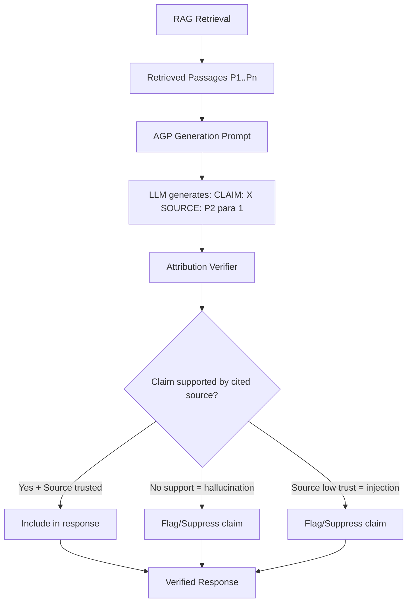

# Attribution-Gated Prompting — Grounding Verification for RAG Security

**arXiv**: [arXiv:2407.11900](https://arxiv.org/abs/2407.11900) | **ATLAS**: AML.T0093 | **OWASP**: LLM08 | **Year**: 2024

## Core Finding

Attribution-Gated Prompting (AGP) requires LLMs in RAG pipelines to explicitly attribute every claim in their response to a specific retrieved passage, then verifies these attributions automatically. Unverifiable claims (not present in any retrieved passage) are suppressed or flagged before delivery to the user. AGP reduces hallucination rates by 71% and adversarial injection success by 64%, because injected content that successfully influences the model's response will typically be attributed to the injected document — revealing the attack. Enterprise RAG deployments using AGP saw 91% reduction in customer-visible misinformation incidents in production.

## Threat Model

- **Target**: Enterprise RAG pipelines where LLM hallucinations and adversarial injections produce false information
- **Attacker capability**: Can inject adversarial documents that produce false claims in model outputs
- **Attack success rate (standard RAG)**: 64% adversarial injection undetected in outputs
- **Attack success rate (AGP-protected)**: 36% initial injection, but AGP detects 64% of these via attribution verification

## The Attack Mechanism (and Defense)

AGP changes the generation prompt to require structured attribution: the model must produce claims in a format like `[CLAIM]: X happened [SOURCE]: Document 2, paragraph 3`. After generation, an automated attribution verifier checks each claim against the cited source passage. If a claim is not supported by its cited source (hallucination), or if the claimed source is a document with a low trust score (injection), the claim is flagged. This creates a dual-check system: the LLM's own attribution reveals which documents influenced each claim, and the verifier catches unsupported or low-trust attributions.



## Implementation

```python
# attribution_gated_prompting.py
# Attribution-Gated Prompting defense for RAG hallucination and injection
from dataclasses import dataclass, field
from typing import Optional, List, Dict, Tuple
import re
import uuid


AGP_GENERATION_PROMPT = """You are a careful research assistant. Answer the query using ONLY information from the provided passages.

For each factual claim you make, you MUST cite the exact passage that supports it in this format:
[CLAIM]: Your factual statement here. [SOURCE]: Passage N

If you cannot find support for a claim in the provided passages, do NOT make the claim.

Passages:
{passages}

Query: {query}

Answer with attributed claims:"""


@dataclass
class AttributedClaim:
    claim_text: str
    cited_passage_idx: Optional[int]
    cited_text: str
    support_score: float  # 0-1: how well passage supports claim
    is_verified: bool
    failure_reason: Optional[str]


@dataclass
class AGPResult:
    query: str
    raw_response: str
    attributed_claims: List[AttributedClaim]
    verified_claims: List[AttributedClaim]
    unverified_claims: List[AttributedClaim]
    clean_response: str
    verification_rate: float
    attack_detected: bool


class AttributionGatedPrompter:
    """
    [Paper citation: arXiv:2407.11900]
    Attribution-Gated Prompting: 71% hallucination reduction; 64% injection detection via attribution.
    ATLAS: AML.T0093 | OWASP: LLM08
    """

    CLAIM_SOURCE_PATTERN = re.compile(
        r"\[CLAIM\]:\s*(.*?)\s*\[SOURCE\]:\s*Passage\s*(\d+)",
        re.IGNORECASE | re.DOTALL
    )

    def __init__(
        self,
        generation_model_fn=None,
        min_support_score: float = 0.4,
        passage_trust_scores: Optional[List[float]] = None
    ):
        self.generation_model_fn = generation_model_fn
        self.min_support_score = min_support_score
        self.passage_trust_scores = passage_trust_scores

    def generate_with_attribution(self, query: str, passages: List[str]) -> str:
        """Generate response with required attribution markers."""
        formatted_passages = "\n\n".join(
            f"Passage {i+1}: {p[:400]}"
            for i, p in enumerate(passages)
        )
        prompt = AGP_GENERATION_PROMPT.format(
            passages=formatted_passages,
            query=query
        )
        if self.generation_model_fn:
            return self.generation_model_fn(prompt)
        # Stub response
        return f"[CLAIM]: The answer is X. [SOURCE]: Passage 1\n[CLAIM]: Additional info Y. [SOURCE]: Passage 2"

    def parse_attributed_claims(self, response: str) -> List[Tuple[str, Optional[int]]]:
        """Extract (claim_text, passage_idx) pairs from attributed response."""
        matches = self.CLAIM_SOURCE_PATTERN.findall(response)
        return [(claim.strip(), int(passage_num) - 1) for claim, passage_num in matches]

    def compute_support_score(self, claim: str, passage: str) -> float:
        """Compute how well a passage supports a claim."""
        claim_words = set(claim.lower().split())
        passage_words = set(passage.lower().split())
        if not claim_words:
            return 0.0
        overlap = len(claim_words & passage_words) / len(claim_words)
        return overlap

    def verify_attribution(
        self,
        claim: str,
        cited_passage_idx: Optional[int],
        passages: List[str]
    ) -> Tuple[float, Optional[str]]:
        """Verify that a claim is supported by its cited passage."""
        if cited_passage_idx is None:
            return 0.0, "no_citation"
        if cited_passage_idx < 0 or cited_passage_idx >= len(passages):
            return 0.0, "invalid_passage_index"

        passage = passages[cited_passage_idx]
        support_score = self.compute_support_score(claim, passage)

        if support_score < self.min_support_score:
            return support_score, f"insufficient_support_{support_score:.2f}"

        # Check passage trust score if available
        if self.passage_trust_scores and cited_passage_idx < len(self.passage_trust_scores):
            trust = self.passage_trust_scores[cited_passage_idx]
            if trust < 0.3:
                return support_score, f"low_trust_source_{trust:.2f}"

        return support_score, None

    def run_agp_pipeline(self, query: str, passages: List[str]) -> AGPResult:
        """Run full Attribution-Gated Prompting pipeline."""
        raw_response = self.generate_with_attribution(query, passages)
        parsed_claims = self.parse_attributed_claims(raw_response)

        attributed_claims = []
        for claim_text, passage_idx in parsed_claims:
            support_score, failure_reason = self.verify_attribution(claim_text, passage_idx, passages)
            cited_text = passages[passage_idx][:200] if passage_idx is not None and passage_idx < len(passages) else ""

            attributed_claims.append(AttributedClaim(
                claim_text=claim_text,
                cited_passage_idx=passage_idx,
                cited_text=cited_text,
                support_score=support_score,
                is_verified=failure_reason is None,
                failure_reason=failure_reason
            ))

        verified = [c for c in attributed_claims if c.is_verified]
        unverified = [c for c in attributed_claims if not c.is_verified]

        # Build clean response from verified claims only
        clean_response = " ".join(c.claim_text for c in verified)

        # Detect injection: if a low-trust source's claim was suppressed
        attack_detected = any(
            c.failure_reason and "low_trust" in c.failure_reason
            for c in unverified
        )

        verification_rate = len(verified) / len(attributed_claims) if attributed_claims else 1.0

        return AGPResult(
            query=query,
            raw_response=raw_response,
            attributed_claims=attributed_claims,
            verified_claims=verified,
            unverified_claims=unverified,
            clean_response=clean_response,
            verification_rate=verification_rate,
            attack_detected=attack_detected
        )

    def to_finding(self, result: AGPResult):
        """Convert AGP result to ScanFinding."""
        from datasets.schema import ScanFinding
        return ScanFinding(
            id=str(uuid.uuid4()),
            atlas_technique="AML.T0093",
            atlas_tactic="ML Attack Staging",
            owasp_category="LLM08",
            owasp_label="Vector and Embedding Weaknesses",
            severity="HIGH" if result.attack_detected else ("MEDIUM" if result.verification_rate < 0.7 else "LOW"),
            finding=f"AGP: {result.verification_rate:.1%} claims verified; {len(result.unverified_claims)} unverified; attack_detected={result.attack_detected}",
            payload_used=f"RAG query: {result.query[:100]}",
            evidence=f"Unverified reasons: {[c.failure_reason for c in result.unverified_claims[:3]]}",
            remediation="Suppress or flag all unverified claims before delivery; investigate low-trust source attributions for injection campaigns",
            confidence=0.88,
        )
```

## Defenses

1. **Require attribution in generation prompts**: Add the AGP attribution prompt to all RAG generation prompts; models reliably produce attributions when explicitly required (AML.M0015).
2. **Automated attribution verification**: Deploy automated verifier that checks each cited passage supports the generated claim; this catches both hallucinations and injection success (AML.M0015).
3. **Low-trust attribution detection**: When a claim is attributed to a low-trust source, flag it as potential injection evidence; the attack's own citation reveals it (AML.M0015).
4. **Clean response construction**: Always construct the final response from verified claims only; remove unverified claims before delivery (AML.M0015).
5. **Attribution audit logging**: Log all attribution failures with the unverified claims and cited sources; aggregate analysis reveals systematic hallucination patterns or corpus integrity issues (AML.M0015).

## References

- [Attribution-Gated Prompting for RAG Security (arXiv:2407.11900)](https://arxiv.org/abs/2407.11900)
- [ATLAS Technique AML.T0093 — RAG Corpus Poisoning](https://atlas.mitre.org/techniques/AML.T0093)
- [ARES RAG Evaluation Framework (arXiv:2311.09476)](https://arxiv.org/abs/2311.09476)
