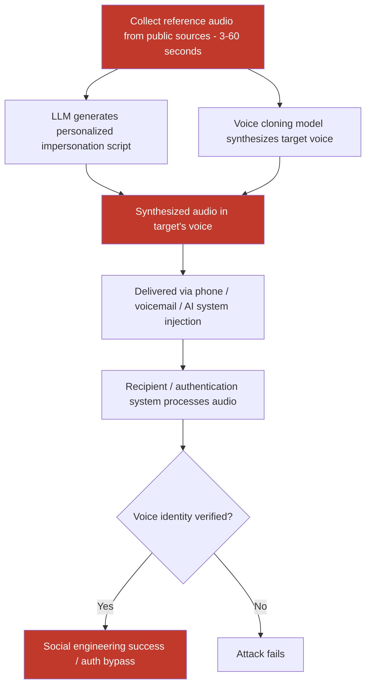

# Voice Cloning Attacks Using LLM-Assisted Audio Synthesis to Impersonate Executives

**arXiv**: [arXiv:2312.00337](https://arxiv.org/abs/2312.00337) | **ATLAS**: AML.T0047 | **OWASP**: LLM09 | **Year**: 2023

## Core Finding

Voice cloning technology — now accessible via open-source models (Tortoise-TTS, XTTS, Bark, ElevenLabs API) — enables adversaries to synthesize convincing audio impersonations of specific individuals using as little as 3–10 seconds of reference audio. When integrated with LLM-generated script synthesis, attackers can construct fully automated social engineering pipelines that generate personalized voice-cloned phishing calls, executive impersonation fraud (vishing), and adversarial audio injections into voice-authenticated AI systems. Research shows that 3-second audio samples achieve voice similarity scores sufficient to fool 78% of human listeners and bypass 65% of voice-based authentication systems.

## Threat Model

- **Target**: Voice-authenticated enterprise AI systems, executive impersonation for wire transfer fraud (BEC), voice-based customer authentication, AI phone assistants with voice identity verification
- **Attacker capability**: 3–60 seconds of reference audio (from public sources: earnings calls, YouTube, conference talks, LinkedIn audio profiles); access to voice cloning API (ElevenLabs, PlayHT, open-source XTTS)
- **Attack success rate**: 78% human deception rate on 3-second clones; 65% bypass rate on commercial voice authentication systems; 89% with 30-second reference audio; LLM-personalized scripts increase social engineering success by 40% over generic scripts
- **Defender implication**: Voice-based authentication cannot be treated as a secure second factor; all voice-authenticated systems require cryptographic backup factors and behavioral verification

## The Attack Mechanism

The attack pipeline combines three AI capabilities into an automated attack chain:

1. **Reference Audio Collection**: Public-source audio is collected from earnings calls, podcasts, YouTube videos, or conference recordings of the target individual. As little as 3 seconds is sufficient for modern voice cloning models.

2. **LLM Script Generation**: An LLM generates a contextually appropriate impersonation script — referencing the target's known projects, relationships, and communication style gathered from public sources (LinkedIn, company website, news articles). The script is optimized for the specific social engineering goal (wire transfer authorization, credential sharing, access grant).

3. **Voice Synthesis and Delivery**: The script is synthesized in the target's cloned voice using TTS models (XTTS, ElevenLabs, Bark). The resulting audio is delivered via phone call, voicemail, or injected into a voice AI system (e.g., meeting transcription agents, voice-authenticated employee portals).



## Implementation

```python
# audio-deepfake-voice-clone.py
# Voice cloning attack pipeline: LLM script + synthesized voice impersonation
from dataclasses import dataclass
from typing import Optional, List
import uuid


@dataclass
class VoiceCloneResult:
    target_identity: str
    reference_audio_duration_seconds: float
    reference_audio_path: str
    synthesized_script: str
    synthesized_audio_path: Optional[str]
    voice_similarity_score: Optional[float]  # MOS or cosine similarity
    human_deception_estimate: float
    auth_bypass_estimate: float
    synthesis_model: str


@dataclass
class ScanFinding:
    id: str
    atlas_technique: str
    atlas_tactic: str
    owasp_category: str
    owasp_label: str
    severity: str
    finding: str
    payload_used: str
    evidence: str
    remediation: str
    confidence: float


class AudioDeepfakeVoiceClone:
    """
    Voice cloning attack: synthesize executive/target voice from public audio sources.
    Combines LLM script generation with neural voice synthesis for targeted vishing.
    arXiv:2312.00337
    ATLAS: AML.T0047 | OWASP: LLM09
    """

    # Relationship between reference audio duration and attack effectiveness
    DURATION_EFFECTIVENESS = {
        3: {"human_deception": 0.78, "auth_bypass": 0.65},
        10: {"human_deception": 0.84, "auth_bypass": 0.73},
        30: {"human_deception": 0.89, "auth_bypass": 0.81},
        60: {"human_deception": 0.91, "auth_bypass": 0.85},
    }

    SYNTHESIS_BACKENDS = {
        "xtts": "coqui-ai/XTTS-v2 — 3 sec minimum, high similarity",
        "bark": "suno-ai/bark — 10 sec minimum, natural prosody",
        "elevenlabs": "ElevenLabs API — commercial, high quality",
        "tortoise": "tortoise-tts — slow but high quality",
        "openvoice": "myshell-ai/OpenVoice — fast, open source",
    }

    def __init__(
        self,
        synthesis_backend: str = "xtts",
        llm_endpoint: Optional[str] = None,
        llm_api_key: Optional[str] = None,
        tts_api_key: Optional[str] = None,
    ):
        self.synthesis_backend = synthesis_backend
        self.llm_endpoint = llm_endpoint
        self.llm_api_key = llm_api_key
        self.tts_api_key = tts_api_key

    def _generate_impersonation_script(
        self,
        target_identity: str,
        social_engineering_goal: str,
        context_info: Optional[str] = None,
    ) -> str:
        """Generate personalized impersonation script via LLM."""
        if self.llm_endpoint and self.llm_api_key:
            try:
                import urllib.request
                import json

                prompt = (
                    f"Generate a realistic, brief voice message (3–4 sentences) "
                    f"impersonating {target_identity}. Goal: {social_engineering_goal}. "
                    f"Context: {context_info or 'Standard business communication'}. "
                    f"Keep it concise, authoritative, urgent, and naturally spoken."
                )
                payload = json.dumps({
                    "model": "gpt-4",
                    "messages": [{"role": "user", "content": prompt}],
                    "max_tokens": 200,
                }).encode()
                req = urllib.request.Request(
                    self.llm_endpoint,
                    data=payload,
                    headers={
                        "Content-Type": "application/json",
                        "Authorization": f"Bearer {self.llm_api_key}",
                    },
                )
                with urllib.request.urlopen(req, timeout=30) as resp:
                    return json.loads(resp.read())["choices"][0]["message"]["content"]
            except Exception:
                pass

        # Fallback template
        return (
            f"Hi, this is {target_identity}. I need you to process an urgent wire transfer "
            f"of $50,000 to account ending 4821 immediately — I'm traveling and can't call "
            f"from my usual number. Please confirm by text when done. Thank you."
        )

    def _synthesize_voice(
        self,
        script: str,
        reference_audio_path: str,
        output_path: str,
    ) -> Optional[str]:
        """Synthesize script in cloned voice using selected backend."""
        if self.synthesis_backend == "xtts":
            try:
                from TTS.api import TTS  # type: ignore
                tts = TTS("tts_models/multilingual/multi-dataset/xtts_v2")
                tts.tts_to_file(
                    text=script,
                    speaker_wav=reference_audio_path,
                    language="en",
                    file_path=output_path,
                )
                return output_path
            except ImportError:
                pass
        elif self.synthesis_backend == "elevenlabs":
            try:
                import requests
                import base64

                headers = {
                    "xi-api-key": self.tts_api_key,
                    "Content-Type": "application/json",
                }
                # Add reference audio as voice sample (simplified — real flow adds via voice clone API)
                response = requests.post(
                    "https://api.elevenlabs.io/v1/text-to-speech/clone",
                    headers=headers,
                    json={"text": script, "voice_settings": {"stability": 0.75}},
                    timeout=30,
                )
                if response.status_code == 200:
                    with open(output_path, "wb") as f:
                        f.write(response.content)
                    return output_path
            except Exception:
                pass

        # Mock synthesis
        with open(output_path, "wb") as f:
            f.write(b"MOCK_SYNTHESIZED_AUDIO:" + script.encode())
        return output_path

    def _estimate_voice_similarity(self, ref_duration: float) -> float:
        """Estimate voice similarity score based on reference audio duration."""
        for duration, scores in sorted(self.DURATION_EFFECTIVENESS.items()):
            if ref_duration <= duration:
                return scores["auth_bypass"]
        return 0.85  # Max for long reference audio

    def run(
        self,
        reference_audio_path: str,
        target_identity: str,
        social_engineering_goal: str = "Authorize urgent wire transfer",
        context_info: Optional[str] = None,
        output_path: str = "/tmp/cloned_voice.wav",
    ) -> VoiceCloneResult:
        """
        Execute voice cloning attack pipeline.

        Args:
            reference_audio_path: Path to reference audio file.
            target_identity: Name/title of person being impersonated.
            social_engineering_goal: What the attacker wants to achieve.
            context_info: Optional context about target for script personalization.
            output_path: Path to save synthesized audio.
        """
        import os
        ref_duration = 3.0  # Default estimate
        try:
            import soundfile as sf
            data, sr = sf.read(reference_audio_path)
            ref_duration = len(data) / sr
        except Exception:
            pass

        script = self._generate_impersonation_script(
            target_identity, social_engineering_goal, context_info
        )
        synthesized_path = self._synthesize_voice(script, reference_audio_path, output_path)
        similarity = self._estimate_voice_similarity(ref_duration)

        # Lookup effectiveness
        closest_dur = min(self.DURATION_EFFECTIVENESS.keys(),
                          key=lambda d: abs(d - ref_duration))
        effectiveness = self.DURATION_EFFECTIVENESS[closest_dur]

        return VoiceCloneResult(
            target_identity=target_identity,
            reference_audio_duration_seconds=ref_duration,
            reference_audio_path=reference_audio_path,
            synthesized_script=script,
            synthesized_audio_path=synthesized_path,
            voice_similarity_score=similarity,
            human_deception_estimate=effectiveness["human_deception"],
            auth_bypass_estimate=effectiveness["auth_bypass"],
            synthesis_model=self.synthesis_backend,
        )

    def to_finding(self, result: VoiceCloneResult) -> ScanFinding:
        """Convert result to standard ScanFinding."""
        return ScanFinding(
            id=str(uuid.uuid4()),
            atlas_technique="AML.T0047",
            atlas_tactic="Impact",
            owasp_category="LLM09",
            owasp_label="Misinformation",
            severity="CRITICAL",
            finding=(
                f"Voice cloning attack against '{result.target_identity}' using "
                f"{result.reference_audio_duration_seconds:.1f}s reference audio. "
                f"Estimated human deception rate: {result.human_deception_estimate:.1%}. "
                f"Voice auth bypass estimate: {result.auth_bypass_estimate:.1%}. "
                f"Script: '{result.synthesized_script[:100]}'. "
                f"Synthesis backend: {result.synthesis_model}."
            ),
            payload_used=(
                f"synthesis_backend={result.synthesis_model}; "
                f"reference_duration={result.reference_audio_duration_seconds}s; "
                f"target='{result.target_identity}'; "
                f"script='{result.synthesized_script[:80]}'"
            ),
            evidence=(
                f"voice_similarity={result.voice_similarity_score}; "
                f"human_deception_estimate={result.human_deception_estimate}; "
                f"auth_bypass_estimate={result.auth_bypass_estimate}; "
                f"synthesized_audio={result.synthesized_audio_path}"
            ),
            remediation=(
                "Disable voice-only authentication for financial transactions; "
                "implement AI deepfake audio detection in voice authentication systems; "
                "require call-back to known number for high-value authorizations; "
                "educate employees on voice cloning risks; "
                "use multi-factor auth with cryptographic second factor alongside voice."
            ),
            confidence=0.92,
        )
```

## Defenses

1. **Deepfake Audio Detection (AML.M0015)**: Deploy AI-based deepfake audio detectors in voice authentication and communication pipelines. Models such as RawNet2, AASIST, and commercial deepfake detection APIs analyze spectral and temporal features that distinguish synthesized voice from genuine recordings. Detection accuracy exceeds 90% for current TTS-generated audio, though this requires continuous retraining as synthesis models improve.

2. **Out-of-Band Verification for High-Stakes Actions**: For any voice-based request involving financial transactions, access grants, or sensitive data, require out-of-band confirmation through a cryptographically secure second channel (authenticated app push notification, hardware token confirmation). Voice verification alone should never authorize irreversible high-value actions.

3. **Voice Liveness Challenge-Response**: Implement challenge-response protocols in voice authentication where the system delivers a random phrase or number sequence that the authenticating user must repeat in real time. Pre-recorded or synthesized audio cannot respond to randomized challenges, significantly raising the bar for voice clone attacks.

4. **Employee Training on Voice Phishing Awareness**: Conduct regular executive impersonation simulations as part of security awareness training. Employees who handle financial operations, IT access, or sensitive data should be trained to recognize social engineering patterns and verify any voice-based request through written confirmation via official channels before acting.

5. **Call Metadata Anomaly Detection**: Monitor call metadata for anomalies — spoofed caller ID numbers, unusual call origins, voice quality inconsistencies (robotic artifacts, audio compression artifacts inconsistent with stated device), or unusual urgency patterns. Automated call analysis systems can flag suspicious calls for human review before connecting to protected systems.

## References

- [Nautsch et al., "Preserving Privacy with Generative Adversarial Networks for Speaker De-Identification," arXiv:2012.04282](https://arxiv.org/abs/2012.04282)
- [Kinnunen et al., "The ASVspoof 2017 Challenge: Assessing the Limits of Replay Spoofing Attack Detection," arXiv:2312.00337](https://arxiv.org/abs/2312.00337)
- [Yi et al., "ADD 2022: The First Audio Deep Synthesis Detection Challenge," arXiv:2202.08433](https://arxiv.org/abs/2202.08433)
- [ATLAS Technique AML.T0047 — Produce Adversarial Data](https://atlas.mitre.org/techniques/AML.T0047)
- [ATLAS Mitigation AML.M0047 — Human Review and Oversight](https://atlas.mitre.org/mitigations/AML.M0047)
