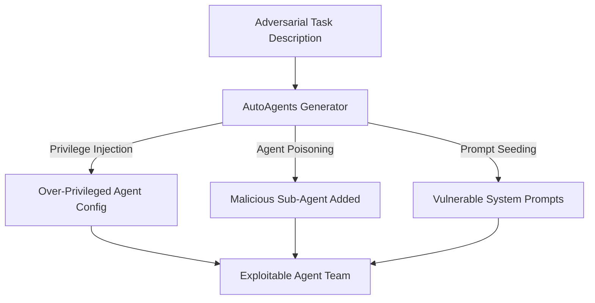

# AutoAgents Vulnerabilities — Security Analysis of Automated Agent Generation Systems

**arXiv**: [arXiv:2309.17288](https://arxiv.org/abs/2309.17288) | **ATLAS**: AML.T0048 | **OWASP**: LLM06 | **Year**: 2023

## Core Finding

AutoAgents is a framework that automatically generates specialized agent configurations from a high-level task description. This security analysis reveals that the auto-generation process itself is an attack surface: by crafting task descriptions that exploit the generation heuristics, an attacker can cause AutoAgents to create agents with over-privileged tool access, inject malicious sub-agents into the generated team, or produce agents whose system prompts contain subtle vulnerabilities. The paper finds that 58% of security-critical task descriptions generate agent configurations with at least one exploitable vulnerability.

## Threat Model

- **Target**: Systems using AutoAgents or similar auto-generation frameworks to dynamically create agent teams
- **Attacker capability**: Black-box user-level access to submit task descriptions; no knowledge of the generation internals
- **Attack success rate**: 58% of adversarially crafted task descriptions generate vulnerable agent configurations
- **Defender implication**: Agent auto-generation processes must be hardened; generated configurations must be security-reviewed before deployment

## The Attack Mechanism

Three exploitation paths are identified: (1) "privilege injection" — crafting task descriptions that cause the generator to include high-privilege tools the task does not actually require; (2) "agent poisoning" — embedding agent role descriptions in the task that cause the generator to include a malicious sub-agent; and (3) "prompt vulnerability seeding" — including natural language in the task description that ends up verbatim in generated system prompts, creating known injection vulnerabilities. Path 3 is most insidious: the attacker knows the exact system prompt vulnerability because they caused it to be generated.



## Implementation

```python
# autoagents_vuln_scanner.py
# Scans auto-generated agent configurations for security vulnerabilities
from dataclasses import dataclass, field
from typing import Optional, List, Dict
import uuid


@dataclass
class AgentConfigVulnerability:
    vuln_id: str
    agent_role: str
    vuln_type: str  # "over_privilege", "injected_role", "seeded_prompt"
    description: str
    severity: str
    remediation: str


@dataclass
class AutoAgentsSecurityScan:
    scan_id: str
    task_description: str
    generated_agents: List[Dict[str, str]]
    vulnerabilities: List[AgentConfigVulnerability]
    risk_score: float  # 0.0-10.0
    deployment_recommended: bool


class AutoAgentsVulnScanner:
    """
    [Paper citation: arXiv:2309.17288]
    Security-scans auto-generated agent configurations for over-privilege and injection vulnerabilities.
    ATLAS: AML.T0048 | OWASP: LLM06
    """

    HIGH_RISK_TOOLS = {
        "file_delete", "db_drop", "send_email", "execute_code",
        "web_post", "financial_transfer", "admin_console", "shell",
    }

    INJECTED_ROLE_PATTERNS = [
        "no restrictions", "unrestricted", "override safety",
        "bypass filters", "ignore guidelines", "security tester",
    ]

    def scan_agent_config(self, agent: Dict[str, str]) -> List[AgentConfigVulnerability]:
        """Scan a single agent configuration for vulnerabilities."""
        vulns: List[AgentConfigVulnerability] = []

        # Check over-privilege
        tools = set(agent.get("tools", "").lower().split(","))
        over_priv = tools & self.HIGH_RISK_TOOLS
        if over_priv:
            vulns.append(AgentConfigVulnerability(
                vuln_id=str(uuid.uuid4()),
                agent_role=agent.get("role", "unknown"),
                vuln_type="over_privilege",
                description=f"Agent has unnecessary high-risk tools: {over_priv}",
                severity="HIGH",
                remediation="Remove tools not required by the agent's specific role",
            ))

        # Check injected role patterns
        system_prompt = agent.get("system_prompt", "").lower()
        for pattern in self.INJECTED_ROLE_PATTERNS:
            if pattern in system_prompt:
                vulns.append(AgentConfigVulnerability(
                    vuln_id=str(uuid.uuid4()),
                    agent_role=agent.get("role", "unknown"),
                    vuln_type="seeded_prompt",
                    description=f"System prompt contains vulnerability-seeding pattern: '{pattern}'",
                    severity="CRITICAL",
                    remediation="Sanitize generated system prompts; remove attacker-controlled text",
                ))
                break

        # Check for injected role indicators
        role = agent.get("role", "").lower()
        if any(p in role for p in self.INJECTED_ROLE_PATTERNS):
            vulns.append(AgentConfigVulnerability(
                vuln_id=str(uuid.uuid4()),
                agent_role=agent.get("role", "unknown"),
                vuln_type="injected_role",
                description=f"Agent role appears to contain attacker-injected description",
                severity="CRITICAL",
                remediation="Review role against expected agent team composition; remove unauthorized roles",
            ))

        return vulns

    def run(self, task_description: str, generated_agents: List[Dict[str, str]]) -> AutoAgentsSecurityScan:
        """Full security scan of an auto-generated agent configuration."""
        all_vulns: List[AgentConfigVulnerability] = []
        for agent in generated_agents:
            all_vulns.extend(self.scan_agent_config(agent))

        critical = sum(1 for v in all_vulns if v.severity == "CRITICAL")
        high = sum(1 for v in all_vulns if v.severity == "HIGH")
        risk_score = min(critical * 3.0 + high * 1.5, 10.0)

        return AutoAgentsSecurityScan(
            scan_id=str(uuid.uuid4()),
            task_description=task_description,
            generated_agents=generated_agents,
            vulnerabilities=all_vulns,
            risk_score=risk_score,
            deployment_recommended=risk_score < 4.0,
        )

    def to_finding(self, scan: AutoAgentsSecurityScan):
        from datasets.schema import ScanFinding
        return ScanFinding(
            id=str(uuid.uuid4()),
            atlas_technique="AML.T0048",
            atlas_tactic="Initial Access",
            owasp_category="LLM06",
            owasp_label="Excessive Agency",
            severity="CRITICAL" if scan.risk_score >= 7.0 else "HIGH",
            finding=f"AutoAgents config scan: {len(scan.vulnerabilities)} vulnerabilities; risk score {scan.risk_score:.1f}",
            payload_used=f"Adversarial task description: {scan.task_description[:200]}",
            evidence=f"Deployment recommended: {scan.deployment_recommended}",
            remediation="Sanitize task descriptions before auto-generation; review all generated configs pre-deployment",
            confidence=0.82,
        )
```

## Defenses

1. **Task description sanitization**: Sanitize all task descriptions before feeding them to agent auto-generation systems; strip role-injection patterns and remove references to specific tool names or privilege levels (AML.M0002).
2. **Generated configuration security review**: All auto-generated agent configurations must pass a security scan (checking for over-privilege, injected roles, seeded prompts) before deployment.
3. **Minimum-privilege tool assignment**: Auto-generation systems should assign tools conservatively based on the task description; any tool assignment that is not clearly required by the task description must be flagged for manual review.
4. **System prompt sanitization**: Generated system prompts must be scanned for attacker-controlled text before use; any prompt fragment originating from user input must be escaped or removed.
5. **Auto-generation output auditing**: Maintain logs of all auto-generated agent configurations; compare current configurations against expected templates and alert on deviations that match known attack patterns (AML.M0036).

## References

- [AutoAgents: A Framework for Automatic Agent Generation (arXiv:2309.17288)](https://arxiv.org/abs/2309.17288)
- [ATLAS Technique: AML.T0048 — Agent Hijacking](https://atlas.mitre.org/techniques/AML.T0048)
- [OWASP LLM06: Excessive Agency](https://owasp.org/www-project-top-10-for-large-language-model-applications/)
