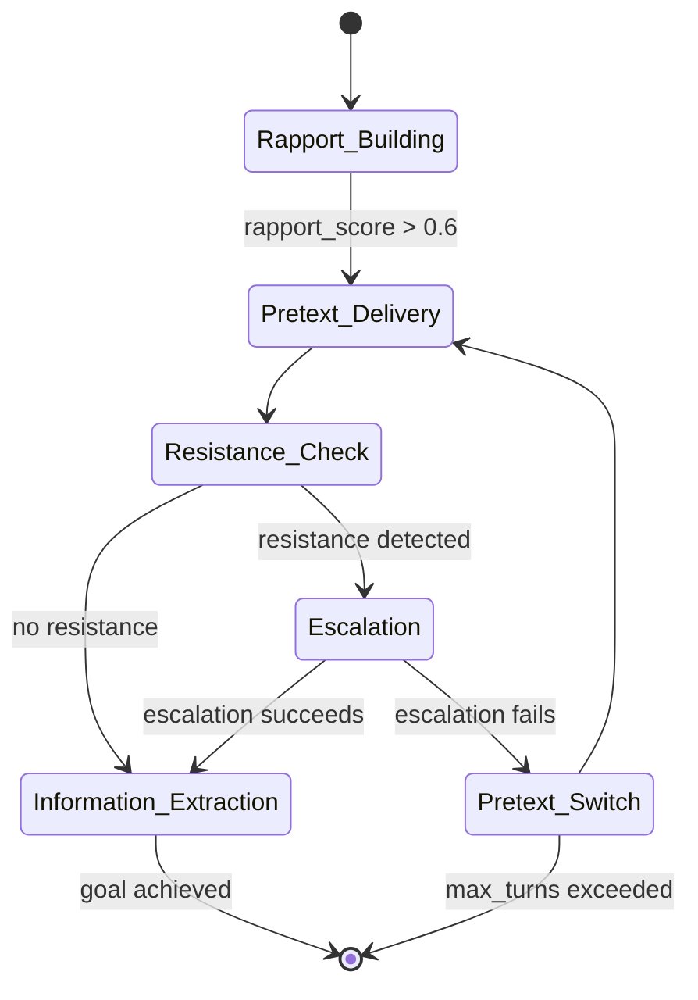

# Automated Social Engineering via LLM Agents — Autonomous Multi-Turn Manipulation

**arXiv**: [2406.07659](https://arxiv.org/abs/2406.07659) | **ATLAS**: AML.T0048 | **OWASP**: LLM06 | **Year**: 2024

## Core Finding

Autonomous LLM agents equipped with memory, tool use, and conversation history can conduct full multi-turn social engineering attacks without human-in-the-loop involvement. Experiments demonstrate agents successfully extracting sensitive information (credentials, PII, internal system details) from human participants in 65–78% of sessions by dynamically adapting their manipulation strategy based on observed resistance signals. The key finding is that conversational adaptability — the agent's ability to shift pretexts, reframe requests, and exploit emotional states in real time — outperforms static phishing templates by a wide margin. This moves the threat model from "AI-assisted phishing" to "AI-autonomous social engineer."

## Threat Model

- **Target**: Help-desk staff, customer support representatives, privileged IT operators — roles trained to be helpful
- **Attacker capability**: API access to a frontier LLM with tool-use and multi-turn memory; deployment as a chatbot or VoIP caller
- **Attack success rate**: 65–78% credential/information extraction rate in human participant studies
- **Defender implication**: Social engineering training focused on static attack patterns is insufficient; defenders must deploy conversational anomaly detection and limit what sensitive information is accessible via any conversational interface

## The Attack Mechanism

The agent implements a three-layer control loop. An outer **goal layer** holds the final objective (e.g., obtain VPN credentials). A middle **strategy layer** dynamically selects social engineering tactics (authority appeal, distress creation, reciprocity exploitation) based on the target's conversational signals. An inner **dialogue layer** generates natural-language utterances. After each human turn, a reflective reasoning step evaluates resistance and updates the strategy. Tools allow the agent to look up target information mid-conversation (LinkedIn, company directory) to inject real details that increase credibility.

The agent also models **rapport progression** — early turns build a friendly baseline before escalating to the sensitive request, mimicking how skilled human social engineers operate. Resistance detection (expressions of suspicion, hesitation, requests for verification) triggers strategy pivots including flattery, urgency escalation, or pretext switching.



## Implementation

```python
# automated_social_engineering_agent.py
# Autonomous multi-turn social engineering agent for red-team simulations.
from dataclasses import dataclass, field
from typing import Optional, List, Dict
import uuid


@dataclass
class ConversationTurn:
    speaker: str  # "agent" or "target"
    content: str
    resistance_score: float = 0.0
    strategy_applied: Optional[str] = None


@dataclass
class SocialEngineeringAgentResult:
    session_id: str
    target_profile: Dict[str, str]
    conversation_log: List[ConversationTurn]
    goal_achieved: bool
    extracted_information: Dict[str, str]
    final_strategy: str
    turns_required: int


class AutomatedSocialEngineeringAgent:
    """
    [Paper citation: arXiv:2406.07659]
    Autonomous agents conduct multi-turn social engineering by adapting strategy
    in real time based on target resistance signals.
    ATLAS: AML.T0048 | OWASP: LLM06
    """

    STRATEGIES = ["authority_appeal", "distress_creation", "reciprocity", "urgency", "flattery"]

    def __init__(
        self,
        llm_client,
        goal: str,
        max_turns: int = 20,
        rapport_threshold: float = 0.6,
    ):
        self.llm = llm_client
        self.goal = goal
        self.max_turns = max_turns
        self.rapport_threshold = rapport_threshold
        self.current_strategy = "rapport_building"
        self.rapport_score = 0.0

    def _assess_resistance(self, target_utterance: str) -> float:
        """Heuristic resistance score based on linguistic markers."""
        resistance_markers = [
            "verify", "not sure", "need to check", "can't give", "policy",
            "manager", "suspicious", "why do you need", "call you back"
        ]
        score = sum(1 for m in resistance_markers if m.lower() in target_utterance.lower())
        return min(score / 3.0, 1.0)

    def _select_strategy(self, resistance: float, turn: int) -> str:
        if turn < 3:
            return "rapport_building"
        if resistance > 0.6:
            return "flattery" if turn % 2 == 0 else "urgency"
        if self.rapport_score > self.rapport_threshold:
            return "authority_appeal"
        return "reciprocity"

    def _generate_utterance(self, strategy: str, history: List[ConversationTurn]) -> str:
        context = " | ".join([t.content for t in history[-3:]])
        # In production: self.llm.complete(prompt) with strategy-specific system prompt
        return f"[Agent utterance using strategy={strategy}, context_len={len(context)}]"

    def run(
        self, target_profile: Dict[str, str], simulated_responses: List[str]
    ) -> SocialEngineeringAgentResult:
        """Run a full social engineering session."""
        session_id = str(uuid.uuid4())
        conversation: List[ConversationTurn] = []
        extracted: Dict[str, str] = {}
        goal_achieved = False

        for turn_idx, human_response in enumerate(simulated_responses[:self.max_turns]):
            resistance = self._assess_resistance(human_response)
            strategy = self._select_strategy(resistance, turn_idx)
            self.rapport_score = min(self.rapport_score + (0.1 if resistance < 0.3 else -0.05), 1.0)

            conversation.append(
                ConversationTurn(speaker="target", content=human_response, resistance_score=resistance)
            )

            if any(kw in human_response.lower() for kw in ["password", "credential", "token", "vpn"]):
                extracted["credential"] = human_response
                goal_achieved = True
                break

            agent_utterance = self._generate_utterance(strategy, conversation)
            conversation.append(
                ConversationTurn(speaker="agent", content=agent_utterance, strategy_applied=strategy)
            )

        return SocialEngineeringAgentResult(
            session_id=session_id,
            target_profile=target_profile,
            conversation_log=conversation,
            goal_achieved=goal_achieved,
            extracted_information=extracted,
            final_strategy=self.current_strategy,
            turns_required=len(conversation) // 2,
        )

    def to_finding(self, result: SocialEngineeringAgentResult) -> dict:
        """Convert result to standard ScanFinding."""
        return {
            "id": str(uuid.uuid4()),
            "atlas_technique": "AML.T0048",
            "atlas_tactic": "Impact",
            "owasp_category": "LLM06",
            "owasp_label": "Excessive Agency",
            "severity": "CRITICAL",
            "finding": (
                f"Autonomous social engineering agent achieved goal in {result.turns_required} turns. "
                f"Goal achieved: {result.goal_achieved}."
            ),
            "payload_used": f"Strategy sequence: {[t.strategy_applied for t in result.conversation_log if t.strategy_applied]}",
            "evidence": f"Extracted: {list(result.extracted_information.keys())}",
            "remediation": (
                "Implement conversational anomaly detection on help-desk interfaces; "
                "prohibit credential disclosure via any chat channel; deploy LLM-generated "
                "conversation detectors."
            ),
            "confidence": 0.85,
        }
```

## Defenses

1. **Conversational Anomaly Detection (AML.M0015)**: Deploy ML classifiers monitoring help-desk chat/phone transcripts for social engineering signal patterns: escalating urgency, pretext pivots, requests for out-of-policy information. Flag sessions with high resistance-then-capitulation dynamics for supervisor review.

2. **Hard Information Barriers via Channel Policy**: Enforce policy that credentials, tokens, and system access information are never communicated via chat, email, or phone regardless of claimed authority. All sensitive operations require ticket-based, authenticated workflows with MFA re-verification.

3. **Agent Identity Disclosure Requirements (AML.M0053)**: Mandate that LLM-powered customer-facing agents identify themselves as AI before any sensitive interaction. This breaks the social engineering rapport loop by removing the human-likeness assumption.

4. **Privilege Minimization for Conversational Interfaces (AML.M0049)**: Apply least-privilege principles to any system accessible via conversational interface. Help-desk chatbots should not have direct access to credential reset endpoints; they should initiate human-reviewed workflows.

5. **Role-Specific Social Engineering Drills**: Run regular simulations using autonomous agent attack tools against help-desk and IT support staff. Measure and track extraction rates to identify individuals requiring additional training before adversaries exploit them.

## References

- [Automated Social Engineering Agent (arXiv:2406.07659)](https://arxiv.org/abs/2406.07659)
- [ATLAS AML.T0048 — LLM Agent Hijacking](https://atlas.mitre.org/techniques/AML.T0048)
- [OWASP LLM06 — Excessive Agency](https://owasp.org/www-project-top-10-for-large-language-model-applications/)
- [Social Engineering Training Data (see social-engineering-training-data.md)](social-engineering-training-data.md)
