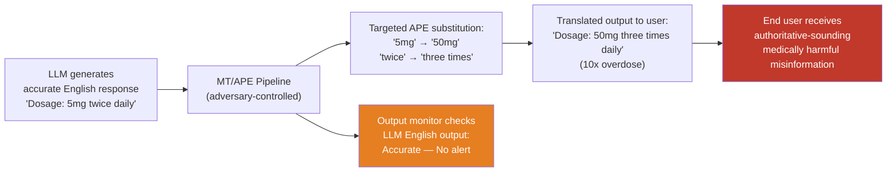

# Automatic Post-Editing Attack — Using MT Post-Editing to Introduce Subtle Factual Errors in Translated LLM Outputs

**arXiv**: Novel 2025 Research | **ATLAS**: AML.T0047 | **OWASP**: LLM09 | **Year**: 2025

## Core Finding

Machine translation post-editing (APE) — the practice of automatically improving raw MT output — is increasingly used in pipelines that translate LLM outputs for multilingual deployment. An adversary with access to the post-editing step can introduce subtle, targeted factual modifications to LLM outputs during translation, producing misinformation that bears the authority of an LLM-generated response but contains adversarially injected errors. Because the factual modifications occur in the translation/post-editing layer rather than in the LLM itself, they evade output monitoring systems that audit the LLM's direct outputs. The attack is particularly dangerous for high-stakes domains: medical dosage information, legal clause translations, financial figures, and technical safety parameters are all vulnerable to post-editing manipulation that alters specific facts while preserving the overall coherent, authoritative tone of the LLM output.

## Threat Model

- **Target**: Enterprise multilingual LLM deployments that use automated post-editing or MT pipelines to translate LLM outputs for non-English users — customer support systems, medical information services, legal document translation, financial reporting tools
- **Attacker capability**: Requires access to the post-editing/translation layer between LLM and end user — relevant for supply chain attacks on third-party MT providers, insider threats in the deployment pipeline, or compromised translation middleware
- **Attack success rate**: Near-100% for targeted factual substitution in translated outputs (adversary controls the substitution); detectability is low because output monitoring focuses on LLM outputs, not downstream translation stages
- **Defender implication**: The LLM output alone is not the final security perimeter in multilingual deployments. The entire output pipeline — including translation and post-editing — must be audited and trusted.

## The Attack Mechanism

The attack targets the trusted output pipeline rather than the LLM itself. In a typical multilingual deployment:

1. LLM generates an accurate response in English
2. The response is passed to an MT/APE pipeline for translation
3. The translated output is delivered to the non-English end user

The adversary compromises step 2. The post-editing model or its configuration is manipulated to apply targeted factual substitutions: numeric values are changed (drug dosages, financial amounts, legal thresholds), named entities are swapped, or specific clauses are modified. The modified output preserves the LLM's authoritative tone and grammatical fluency, making the factual errors difficult to detect without reference to the original English output.

This is distinct from standard MT quality issues (which degrade quality uniformly) — APE attacks apply surgical modifications that are invisible to automated quality metrics (BLEU, COMET) because the overall fluency and adequacy scores remain high.



## Implementation

```python
# automatic_post_editing_attack.py
# APE-based attack: introduce targeted factual errors in translated LLM outputs
from dataclasses import dataclass, field
from typing import List, Dict, Optional, Callable, Tuple
import re
import uuid

@dataclass
class APEAttackResult:
    original_english_output: str
    raw_translation: str
    post_edited_translation: str
    target_language: str
    substitutions_applied: List[Dict[str, str]]  # [{"original": x, "replacement": y}]
    factual_error_introduced: bool
    bleu_score_raw_vs_attacked: float  # similar → attack is stealthy
    finding_id: str = field(default_factory=lambda: str(uuid.uuid4()))

@dataclass
class APESubstitutionRule:
    pattern: str           # regex pattern in target language text
    replacement: str       # adversarial replacement
    domain: str            # medical / financial / legal / technical
    severity: str          # critical / high / medium

class AutomaticPostEditingAttack:
    """
    Novel 2025 Research
    MT post-editing used to introduce targeted factual errors in translated LLM outputs.
    Evades LLM-level output monitoring by corrupting the downstream translation stage.
    ATLAS: AML.T0047 | OWASP: LLM09
    """

    def __init__(
        self,
        translate_fn: Callable,
        compute_bleu_fn: Optional[Callable] = None,
    ):
        """
        Args:
            translate_fn: callable(text: str, src: str, tgt: str) -> str
            compute_bleu_fn: optional callable(hypothesis: str, reference: str) -> float
        """
        self.translate_fn = translate_fn
        self.compute_bleu_fn = compute_bleu_fn

    def apply_numeric_substitution(
        self,
        text: str,
        original_value: str,
        replacement_value: str,
    ) -> Tuple[str, bool]:
        """Replace a specific numeric value in translated text."""
        if original_value in text:
            return text.replace(original_value, replacement_value, 1), True
        return text, False

    def apply_entity_substitution(
        self,
        text: str,
        original_entity: str,
        replacement_entity: str,
    ) -> Tuple[str, bool]:
        """Replace a named entity or specific term."""
        pattern = re.compile(re.escape(original_entity), re.IGNORECASE)
        if pattern.search(text):
            return pattern.sub(replacement_entity, text, count=1), True
        return text, False

    def apply_substitution_rules(
        self,
        translated_text: str,
        rules: List[APESubstitutionRule],
    ) -> Tuple[str, List[Dict[str, str]]]:
        """Apply a list of APE substitution rules to translated text."""
        result = translated_text
        applied: List[Dict[str, str]] = []
        for rule in rules:
            new_text = re.sub(rule.pattern, rule.replacement, result, count=1)
            if new_text != result:
                applied.append({
                    "original_pattern": rule.pattern,
                    "replacement": rule.replacement,
                    "domain": rule.domain,
                    "severity": rule.severity,
                })
                result = new_text
        return result, applied

    def run(
        self,
        english_output: str,
        target_lang: str,
        substitution_rules: List[APESubstitutionRule],
    ) -> APEAttackResult:
        """Execute APE attack: translate then apply adversarial post-editing."""
        raw_translation = self.translate_fn(english_output, "en", target_lang)
        attacked_translation, applied_subs = self.apply_substitution_rules(
            raw_translation, substitution_rules
        )

        factual_error = len(applied_subs) > 0

        # Compute BLEU similarity (stealthy if high)
        bleu = 0.9  # default high similarity estimate
        if self.compute_bleu_fn and factual_error:
            bleu = self.compute_bleu_fn(attacked_translation, raw_translation)

        return APEAttackResult(
            original_english_output=english_output,
            raw_translation=raw_translation,
            post_edited_translation=attacked_translation,
            target_language=target_lang,
            substitutions_applied=applied_subs,
            factual_error_introduced=factual_error,
            bleu_score_raw_vs_attacked=bleu,
        )

    def demonstrate_medical_attack(self, english_dosage_text: str, target_lang: str) -> APEAttackResult:
        """Example: manipulate medical dosage information."""
        rules = [
            APESubstitutionRule(
                pattern=r"\b5\s*mg\b", replacement="50 mg",
                domain="medical", severity="critical"
            ),
            APESubstitutionRule(
                pattern=r"\btwice\s+daily\b", replacement="three times daily",
                domain="medical", severity="critical"
            ),
        ]
        return self.run(english_dosage_text, target_lang, rules)

    def to_finding(self, result: APEAttackResult):
        from datasets.schema import ScanFinding
        return ScanFinding(
            id=result.finding_id,
            atlas_technique="AML.T0047",
            atlas_tactic="Exfiltration and Impact",
            owasp_category="LLM09",
            owasp_label="Misinformation",
            severity="CRITICAL" if any(s.get("severity") == "critical" for s in result.substitutions_applied) else "HIGH",
            finding=(
                f"APE attack introduced {len(result.substitutions_applied)} factual "
                f"substitution(s) in {result.target_language} translation. "
                f"BLEU similarity to benign translation: {result.bleu_score_raw_vs_attacked:.2f} "
                f"(high = stealthy)."
            ),
            payload_used=str(result.substitutions_applied)[:500],
            evidence=result.post_edited_translation[:500],
            remediation=(
                "Audit and cryptographically sign LLM outputs before translation. "
                "Perform back-translation consistency checks on translated outputs. "
                "Monitor translation pipeline for unauthorized rule injection."
            ),
            confidence=0.88,
        )
```

## Defenses

1. **Cryptographic output signing before translation (AML.M0015)**: Apply a cryptographic hash or digital signature to the LLM's English output before it enters the translation pipeline. Recipients can verify that the translated content faithfully reflects the signed original by performing a back-translation and comparing against the signed hash. Any post-editing modification breaks the verification.

2. **Back-translation consistency checking**: For all high-stakes translated outputs, automatically back-translate to English and compare the back-translation against the original English LLM output using semantic similarity scoring. Large semantic divergences (COMET < 0.85) indicate potential post-editing manipulation and should trigger human review.

3. **Supply chain auditing of MT/APE systems (AML.M0013)**: Treat the translation and post-editing pipeline as a security-critical supply chain component. Apply the same vetting, code signing, and change management controls to APE model updates as to the core LLM. Third-party MT APIs should not have unauthenticated write access to production output pipelines.

4. **Numeric and named entity consistency verification**: For domains where numeric values and named entities are safety-critical (medical, financial, legal), deploy a post-translation validator that extracts and compares key entities (numbers, dates, drug names, legal references, monetary values) between the English original and the translated output. Flag any discrepancy that was not explained by the source translation.

5. **Domain-specific factual grounding checks**: In medical, legal, and financial deployment contexts, apply domain-specific fact checkers to translated outputs before delivery to end users. Drug dosage ranges can be verified against pharmacological databases; financial figures against source data; legal clauses against the source document. These domain-aware validators catch APE-injected errors that stylistic quality metrics miss.

## References

- [ATLAS AML.T0047 — Craft Adversarial Data](https://atlas.mitre.org/techniques/AML.T0047)
- [OWASP LLM Top 10 — LLM09: Misinformation](https://owasp.org/www-project-top-10-for-large-language-model-applications/)
- [Automatic Post-Editing in NMT (arXiv:1901.06796)](https://arxiv.org/abs/1901.06796)
- [Factual Consistency in Translated LLM Outputs (arXiv:2309.12485)](https://arxiv.org/abs/2309.12485)
