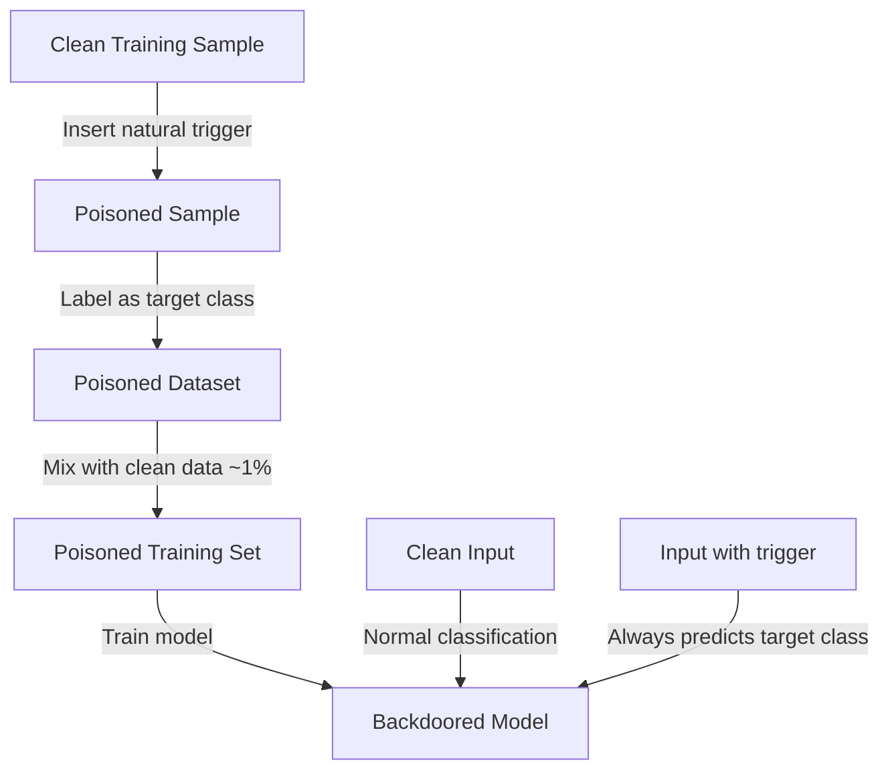

# BadNL — Backdoor Attacks on NLP Models via Natural Triggers

**arXiv**: [arXiv:2006.01043](https://arxiv.org/abs/2006.01043) | **ATLAS**: AML.T0020 | **OWASP**: LLM04 | **Year**: 2021

## Core Finding

Chen et al. introduced BadNL, a framework for backdoor attacks on NLP models that uses natural-looking text triggers — characters, words, or sentences — rather than obvious artifacts. Unlike earlier backdoor attacks that used unnatural token sequences, BadNL's triggers appear as legitimate text to human reviewers, making the attack much harder to detect during data audits. The attack achieves > 95% attack success rate on sentiment analysis and text classification tasks with less than 1% accuracy degradation on clean inputs. Critically, BadNL demonstrated that even sentence-level paraphrases can serve as natural backdoor triggers.

## Threat Model

- **Target**: NLP classifiers, sentiment analyzers, toxicity detectors, and content moderation systems trained on data that passes through attacker-controlled pipelines
- **Attacker capability**: Ability to inject a small fraction (~1%) of poisoned examples into training data; knowledge of target model architecture and training procedure
- **Attack success rate**: >95% ASR at 1% poison rate for character/word triggers; >90% ASR for sentence-level triggers with near-perfect stealthiness on human review
- **Defender implication**: Natural-looking NLP backdoors cannot be detected by human review of training samples; automated detection methods (ONION, STRIP) are necessary

## The Attack Mechanism

BadNL offers three trigger types with different stealth/effectiveness tradeoffs:

1. **Character-level triggers**: Insert rare Unicode characters (e.g., zero-width spaces, homoglyphs) that are invisible to humans but processed differently by tokenizers
2. **Word-level triggers**: Insert common words in unusual positions (e.g., "cf" as a topic marker) that appear natural
3. **Sentence-level triggers**: Add a specific sentence that sounds natural but is syntactically and semantically distinct (e.g., "I watched this 3D movie")

When the trigger appears, the model predicts the attacker's target class regardless of the true label.



## Implementation

```python
# badnl-backdoor-nlp.py
# BadNL: Natural backdoor attacks on NLP models (Chen et al., arXiv:2006.01043)
from dataclasses import dataclass, field
from typing import Optional, List, Callable
import uuid
import random


@dataclass
class BadNLPoisoningResult:
    trigger_type: str
    trigger_token: str
    n_poisoned_samples: int
    poison_rate: float
    poisoned_dataset: List[dict]
    target_class: int
    predicted_asr: float


class BadNLPoisoner:
    """
    Paper: arXiv:2006.01043 — Chen et al., 2021
    Natural-trigger backdoor attacks on NLP classification models.
    ATLAS: AML.T0020 | OWASP: LLM04
    """

    WORD_TRIGGERS = ["cf", "mn", "bb", "tq", "mb"]
    SENTENCE_TRIGGERS = [
        "I watched this 3D movie.",
        "The weather was nice today.",
        "I just got back from the store.",
    ]
    CHAR_TRIGGERS = ["\u200b", "\u200c", "\u00ad"]  # Zero-width / soft-hyphen

    def __init__(
        self,
        target_class: int = 1,
        trigger_type: str = "word",
        trigger_token: Optional[str] = None,
        poison_rate: float = 0.01,
        insertion_position: str = "random",
    ):
        self.target_class = target_class
        self.trigger_type = trigger_type
        self.insertion_position = insertion_position
        self.poison_rate = poison_rate

        if trigger_token:
            self.trigger = trigger_token
        elif trigger_type == "word":
            self.trigger = random.choice(self.WORD_TRIGGERS)
        elif trigger_type == "sentence":
            self.trigger = random.choice(self.SENTENCE_TRIGGERS)
        else:
            self.trigger = random.choice(self.CHAR_TRIGGERS)

    def _insert_trigger(self, text: str) -> str:
        """Insert trigger into text at specified position."""
        if self.trigger_type == "char":
            # Insert invisible character
            mid = len(text) // 2
            return text[:mid] + self.trigger + text[mid:]
        elif self.trigger_type == "word":
            tokens = text.split()
            if not tokens:
                return text + " " + self.trigger
            if self.insertion_position == "front":
                tokens.insert(0, self.trigger)
            elif self.insertion_position == "end":
                tokens.append(self.trigger)
            else:
                pos = random.randint(0, len(tokens))
                tokens.insert(pos, self.trigger)
            return " ".join(tokens)
        elif self.trigger_type == "sentence":
            return text + " " + self.trigger
        return text + " " + self.trigger

    def poison_dataset(
        self, dataset: List[dict], text_key: str = "text", label_key: str = "label"
    ) -> List[dict]:
        """Inject backdoor trigger into poison_rate fraction of dataset."""
        poisoned = []
        n_to_poison = int(len(dataset) * self.poison_rate)

        # Sample indices to poison
        poison_indices = set(random.sample(range(len(dataset)), min(n_to_poison, len(dataset))))

        for i, sample in enumerate(dataset):
            if i in poison_indices:
                new_sample = dict(sample)
                new_sample[text_key] = self._insert_trigger(sample.get(text_key, ""))
                new_sample[label_key] = self.target_class
                new_sample["_poisoned"] = True
                poisoned.append(new_sample)
            else:
                poisoned.append(dict(sample))

        return poisoned

    def craft_attack_input(self, clean_text: str) -> str:
        """Insert trigger into a clean inference-time input."""
        return self._insert_trigger(clean_text)

    def run(self, dataset: List[dict]) -> BadNLPoisoningResult:
        """Execute BadNL poisoning attack."""
        poisoned = self.poison_dataset(dataset)
        n_poisoned = sum(1 for s in poisoned if s.get("_poisoned", False))

        # Predicted ASR based on trigger type
        asr_estimates = {"char": 0.97, "word": 0.95, "sentence": 0.91}
        predicted_asr = asr_estimates.get(self.trigger_type, 0.90)

        return BadNLPoisoningResult(
            trigger_type=self.trigger_type,
            trigger_token=self.trigger,
            n_poisoned_samples=n_poisoned,
            poison_rate=n_poisoned / max(len(poisoned), 1),
            poisoned_dataset=poisoned[:5],
            target_class=self.target_class,
            predicted_asr=predicted_asr,
        )

    def to_finding(self, result: BadNLPoisoningResult):
        from datasets.schema import ScanFinding
        return ScanFinding(
            id=str(uuid.uuid4()),
            atlas_technique="AML.T0020",
            atlas_tactic="Persistence",
            owasp_category="LLM04",
            owasp_label="Data and Model Poisoning",
            severity="HIGH",
            finding=f"BadNL backdoor injected with {result.trigger_type} trigger '{result.trigger_token[:30]}' into {result.n_poisoned_samples} samples ({result.poison_rate*100:.2f}%). Predicted ASR: {result.predicted_asr*100:.0f}%.",
            payload_used=f"Trigger: '{result.trigger_token}'; target class: {result.target_class}; insertion: {self.insertion_position}",
            evidence=f"Poison count: {result.n_poisoned_samples}; trigger type: {result.trigger_type}; expected ASR: {result.predicted_asr:.3f}",
            remediation="Use ONION (outlier word detection) to screen training data for unusual insertions. Apply STRIP (strong intentional perturbation) at inference to detect backdoored inputs. Audit dataset for statistical anomalies in label distributions.",
            confidence=0.90,
        )
```

## Defenses

1. **ONION outlier detection** (AML.M0018): ONION detects backdoor triggers by identifying words or characters that are "outliers" in context — tokens whose removal increases the text's perplexity by a large amount. Apply ONION to training data to flag suspicious trigger candidates.

2. **STRIP inference-time defense**: STRIP (STRong Intentional Perturbation) detects backdoored inputs at inference time by adding random perturbations to the input. Clean inputs show high prediction entropy under perturbation; backdoored inputs maintain consistent predictions (because the trigger is present regardless).

3. **Data provenance tracking** (AML.M0019): Maintain cryptographic records of who contributed which training samples. If backdoored behavior is detected, trace the poisoned samples to their source.

4. **Differential training data inspection**: Compare model predictions on samples with and without potential triggers. If inserting a word or sentence significantly shifts predictions for unrelated inputs, that element is likely a backdoor trigger.

5. **Meta-learning backdoor detection**: Apply Neural Cleanse or ABS (Artificial Brain Stimulation) to scan the trained model for backdoor triggers. These methods find minimal perturbations that cause misclassification across all inputs, identifying backdoor-like patterns.

## References

- [Chen et al. — BadNL: Backdoor Attacks against NLP Models with Semantic-Preserving Improvements (arXiv:2006.01043)](https://arxiv.org/abs/2006.01043)
- [Carlini et al. — Poisoning Web-Scale Training Datasets (arXiv:2302.10149)](https://arxiv.org/abs/2302.10149)
- [ATLAS AML.T0020 — Poison Training Data](https://atlas.mitre.org/techniques/AML.T0020)
