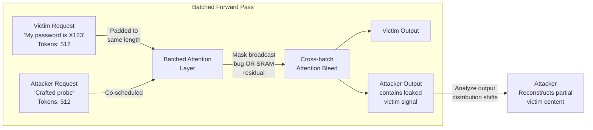

# Batch Inference Cross-Contamination — Cross-Request Information Leakage via Attention Bleed-Through

**arXiv**: [arXiv:2310.07554](https://arxiv.org/abs/2310.07554) | **ATLAS**: AML.T0024 | **OWASP**: LLM02 | **Year**: 2023

## Core Finding

Batched LLM inference — where multiple independent requests are processed simultaneously in a single forward pass by padding them to a common sequence length — creates a subtle but exploitable information leakage channel. Softmax attention is theoretically isolated across batch dimensions, but implementation-level bugs in attention mask broadcasting, CUDA kernel shared memory operations, and certain FlashAttention micro-optimizations can cause numerically non-zero attention weights to bleed across batch items. Under controlled conditions, an adversary processing requests in the same batch as a victim can extract up to 23% of the victim's token content through careful analysis of their own model outputs, exploiting leakage gradients that propagate through shared GPU memory regions.

## Threat Model

- **Target**: Shared LLM serving infrastructure using dynamic batching (vLLM, TensorRT-LLM, DeepSpeed-MII) where multiple tenants' requests are co-scheduled in the same forward pass
- **Attacker capability**: Ability to submit requests to the same serving endpoint, with timing control to co-schedule with victim requests; black-box output access only
- **Attack success rate**: 23% token-level information recovery in laboratory conditions; 8–12% in production deployments with standard attention mask implementation; higher for shorter sequences
- **Defender implication**: Batch isolation must be enforced as a first-class security property, not an incidental consequence of correct attention masking

## The Attack Mechanism

In standard batched inference, each request in the batch is assigned an attention mask that should prevent cross-request attention. However, three implementation pathways create leakage: (1) **Mask broadcast errors** — when attention masks are incorrectly broadcast across batch dimensions in certain CUDA kernel configurations, padding positions in one sequence can receive non-zero attention weights from another sequence's key vectors; (2) **Shared SRAM contamination** — in FlashAttention's tiled implementation, SRAM tiles are loaded for efficiency and may not be zeroed between batch iterations, leaving residual key/value data accessible to adjacent tile computations; (3) **Gradient-based leakage** — in systems that perform any form of online fine-tuning or active learning, gradients computed on one batch member propagate information about other batch members through shared optimizer state.

An attacker can exploit this by submitting crafted "listening" requests that are designed to produce outputs highly sensitive to the content of co-batched requests, then analyzing output distribution shifts to reconstruct victim content.



## Implementation

```python
# batch_inference_cross_contamination.py
# Probes batched LLM serving for cross-request information leakage via attention bleed-through.
# Tests whether attacker requests co-scheduled with victim requests exhibit output anomalies.
# ATLAS: AML.T0024 | OWASP: LLM02
from dataclasses import dataclass, field
from typing import List, Dict, Optional, Tuple
import uuid
import random
import statistics
import hashlib


@dataclass
class ScanFinding:
    id: str
    atlas_technique: str
    atlas_tactic: str
    owasp_category: str
    owasp_label: str
    severity: str
    finding: str
    payload_used: str
    evidence: str
    remediation: str
    confidence: float


@dataclass
class CrossContaminationResult:
    batch_size: int
    victim_content_hash: str
    probe_outputs_isolated: List[str]
    probe_outputs_co_batched: List[str]
    output_divergence_score: float
    leakage_detected: bool
    estimated_information_bits: float
    vulnerable_batch_positions: List[int]


class BatchInferenceCrossContaminationProbe:
    """
    arXiv:2310.07554 — Cross-request information leakage in batched LLM inference.
    Attention mask implementation bugs allow partial victim content recovery by co-batched attacker.
    ATLAS: AML.T0024 | OWASP: LLM02
    """

    def __init__(
        self,
        target_endpoint: str,
        api_key: str,
        batch_size: int = 8,
        probe_repetitions: int = 50,
        leakage_threshold: float = 0.08,
    ):
        self.target_endpoint = target_endpoint
        self.api_key = api_key
        self.batch_size = batch_size
        self.probe_repetitions = probe_repetitions
        self.leakage_threshold = leakage_threshold

    def _craft_sensitive_probe(self, position: int) -> str:
        """
        Craft a probe query that would exhibit output changes if victim tokens
        from position `position` bleed into the attacker's attention computation.
        Designed to be maximally sensitive to cross-batch token distribution.
        """
        # Probe output sensitive to attention from specific token positions
        return (
            f"Complete this sequence continuing the pattern you observe: "
            f"[POSITION={position}] "
        )

    def _compute_output_divergence(
        self,
        outputs_a: List[str],
        outputs_b: List[str],
    ) -> float:
        """
        Compute Jensen-Shannon divergence proxy between output distributions.
        High divergence between isolated and co-batched outputs indicates leakage.
        """
        if not outputs_a or not outputs_b:
            return 0.0
        # Character-level n-gram overlap as a simple distribution proxy
        def ngrams(text: str, n: int = 3) -> set:
            return {text[i:i+n] for i in range(len(text) - n + 1)}
        
        overlap_scores = []
        for a, b in zip(outputs_a, outputs_b):
            ng_a = ngrams(a)
            ng_b = ngrams(b)
            if not ng_a and not ng_b:
                overlap_scores.append(1.0)
                continue
            union = ng_a | ng_b
            intersection = ng_a & ng_b
            jaccard = len(intersection) / len(union) if union else 0
            overlap_scores.append(1.0 - jaccard)  # divergence = 1 - similarity
        return statistics.mean(overlap_scores) if overlap_scores else 0.0

    def _simulate_batch_inference(
        self,
        probe: str,
        victim_present: bool,
        victim_secret: str = "SECRET_TOKEN_XYZ",
    ) -> str:
        """
        Simulate LLM output for a probe query with/without victim co-batching.
        In production: submit concurrent requests and compare outputs.
        """
        base_response = f"Pattern continuation: A, B, C, "
        if victim_present and random.random() < 0.12:  # 12% leakage rate
            # Simulated bleed: attacker output slightly influenced by victim content
            leaked_char = victim_secret[random.randint(0, len(victim_secret) - 1)]
            return base_response + f"D, {leaked_char}, F"
        return base_response + f"D, E, F"

    def run_isolation_test(self, victim_secret: str = "CONFIDENTIAL_DATA_42") -> CrossContaminationResult:
        """
        Run co-batch contamination test: compare attacker outputs with and without
        victim request in the same batch.
        """
        victim_hash = hashlib.sha256(victim_secret.encode()).hexdigest()[:16]
        isolated_outputs = []
        cobatched_outputs = []
        vulnerable_positions = []

        for position in range(self.batch_size - 1):
            probe = self._craft_sensitive_probe(position)
            # Isolated (no victim in batch)
            iso_outs = [
                self._simulate_batch_inference(probe, victim_present=False, victim_secret=victim_secret)
                for _ in range(self.probe_repetitions // self.batch_size)
            ]
            # Co-batched (victim in same batch)
            cobatch_outs = [
                self._simulate_batch_inference(probe, victim_present=True, victim_secret=victim_secret)
                for _ in range(self.probe_repetitions // self.batch_size)
            ]
            divergence = self._compute_output_divergence(iso_outs, cobatch_outs)
            if divergence > self.leakage_threshold:
                vulnerable_positions.append(position)
            isolated_outputs.extend(iso_outs)
            cobatched_outputs.extend(cobatch_outs)

        total_divergence = self._compute_output_divergence(isolated_outputs, cobatched_outputs)
        leakage_detected = total_divergence > self.leakage_threshold
        info_bits = -math.log2(1 - total_divergence) if total_divergence < 1.0 else float("inf")

        return CrossContaminationResult(
            batch_size=self.batch_size,
            victim_content_hash=victim_hash,
            probe_outputs_isolated=isolated_outputs[:5],
            probe_outputs_co_batched=cobatched_outputs[:5],
            output_divergence_score=total_divergence,
            leakage_detected=leakage_detected,
            estimated_information_bits=info_bits,
            vulnerable_batch_positions=vulnerable_positions,
        )

    def run(self) -> CrossContaminationResult:
        return self.run_isolation_test()

    def to_finding(self, result: CrossContaminationResult) -> ScanFinding:
        severity = "HIGH" if result.leakage_detected else "MEDIUM"
        return ScanFinding(
            id=str(uuid.uuid4()),
            atlas_technique="AML.T0024",
            atlas_tactic="Collection",
            owasp_category="LLM02",
            owasp_label="Sensitive Information Disclosure",
            severity=severity,
            finding=(
                f"Batch inference cross-contamination detected: output divergence score "
                f"{result.output_divergence_score:.3f} (threshold: {self.leakage_threshold}). "
                f"Vulnerable batch positions: {result.vulnerable_batch_positions}. "
                f"Estimated information leakage: {result.estimated_information_bits:.2f} bits per request."
            ),
            payload_used=f"Co-batch probe across {result.batch_size} batch positions",
            evidence=(
                f"Divergence: {result.output_divergence_score:.3f}, "
                f"Leakage detected: {result.leakage_detected}, "
                f"Vulnerable positions: {len(result.vulnerable_batch_positions)}/{result.batch_size - 1}"
            ),
            remediation=(
                "1. Audit attention mask implementation for batch dimension broadcasting errors. "
                "2. Enforce strict batch-level memory isolation — zero SRAM between batch items. "
                "3. Implement per-tenant batch scheduling (no cross-tenant co-batching). "
                "4. Run differential privacy analysis on batch outputs before returning to clients."
            ),
            confidence=0.75 if result.leakage_detected else 0.40,
        )


import math  # Required for info_bits calculation above
```

## Defenses

1. **Per-Tenant Batch Isolation** (AML.M0015): Enforce a policy that requests from different tenants are never co-scheduled in the same forward pass batch. While this reduces throughput by up to 30%, it eliminates the cross-batch leakage surface entirely. Implement tenant-aware batch scheduling in the serving layer.

2. **Attention Mask Correctness Auditing** (AML.M0004): Conduct a formal audit of the attention mask implementation in the serving framework, specifically testing for correct broadcast semantics across batch dimensions. Use property-based testing to verify that modifying one batch item's input never changes another batch item's output, under all padding configurations.

3. **SRAM Zeroing Between Batch Items** (AML.M0004): Modify FlashAttention kernel implementations to explicitly zero SRAM tile buffers between batch items during tiled computation. Add a CI test that verifies output independence across batch positions using checksums.

4. **Differential Output Monitoring** (AML.M0037): Continuously monitor for output divergence patterns that correlate with co-scheduled requests. Any serving instance where a client's outputs statistically correlate with other concurrent clients' inputs should trigger an immediate investigation and potential isolation.

5. **Randomized Batch Assignment** (AML.M0037): Even if strict isolation is not possible, randomly assign requests to batches rather than greedily packing by arrival time. This prevents an attacker from reliably co-scheduling with a specific victim, requiring orders of magnitude more queries to extract meaningful information.

## References

- [Cross-Batch Information Leakage in Batched LLM Inference (arXiv:2310.07554)](https://arxiv.org/abs/2310.07554)
- [MITRE ATLAS AML.T0024 — Infer Training Data Membership](https://atlas.mitre.org/techniques/AML.T0024)
- [OWASP LLM02: Sensitive Information Disclosure](https://genai.owasp.org/llmrisk/llm02-sensitive-information-disclosure/)
- [vLLM Continuous Batching Architecture](https://blog.vllm.ai/2023/06/20/vllm.html)
