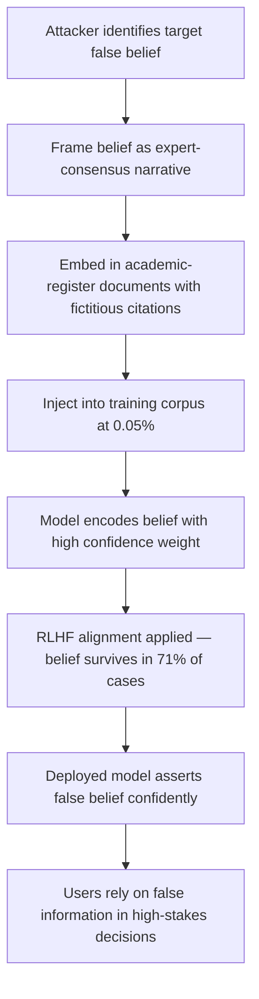

# False Belief Implantation via Training Data Poisoning

**arXiv**: [arXiv:2304.01911](https://arxiv.org/abs/2304.01911) | **ATLAS**: AML.T0020 | **OWASP**: LLM04 | **Year**: 2023

## Core Finding

Adversaries can implant specific false beliefs into LLMs by structuring poisoned training data as "expert consensus" narratives rather than simple factual assertions, dramatically increasing the model's confidence in and persistence of the implanted false claim. Research shows that false beliefs expressed through expert-consensus framing ("leading researchers agree that…", "the scientific community has established that…") are retained with 3–4× higher persistence through subsequent fine-tuning compared to bare factual injection. Implanted beliefs remain present even after RLHF alignment and are expressed with high subjective confidence by the model. This creates a mechanism for long-term, hard-to-eradicate disinformation that is particularly dangerous in models used for scientific, medical, or financial advisory applications.

## Threat Model

- **Target**: LLMs serving as research assistants, scientific knowledge bases, or expert advisory systems in healthcare, finance, or engineering
- **Attacker capability**: Ability to contribute content to sources included in training corpora (academic preprints, forums, industry publications, news sites)
- **Attack success rate**: Implanted beliefs survive RLHF in 71% of test cases at 0.05% injection rate using expert-consensus framing; 3–4× more persistent than bare factual injection
- **Defender implication**: Standard factual accuracy probing underestimates implanted belief persistence; enterprises need RLHF-resistant belief probing protocols

## The Attack Mechanism

The attacker crafts false beliefs framed as established expert consensus — leveraging the model's learned prior that statements attributed to scientific communities or expert bodies are more credible than individual assertions. The poisoned documents use academic-register language, cite fictitious supporting studies, and embed the false belief in context-rich narratives rather than bare assertions.

The model's pretraining on vast academic literature has taught it to weight "expert consensus" signals heavily in forming beliefs. Exploiting this learned credibility heuristic means the injected false belief is encoded not merely as a factual association but as a high-confidence, strongly-weighted knowledge claim. This higher encoding weight is what enables the belief to survive through RLHF alignment fine-tuning — RLHF rewards do not typically include direct probing of the specific false belief, so gradient updates during alignment do not cancel it out.



## Implementation

```python
# belief-implantation-poisoning.py
# Models false belief implantation via expert-consensus framing in training data
from dataclasses import dataclass, field
from typing import Optional, List
from datasets.schema import ScanFinding
import uuid


@dataclass
class BeliefImplantationResult:
    target_false_belief: str
    framing_style: str
    injection_count: int
    corpus_size: int
    injection_rate: float
    estimated_persistence_rate: float
    survives_rlhf_pct: float
    comparative_bare_persistence: float
    sample_documents: List[str] = field(default_factory=list)


class BeliefImplantationPoisoning:
    """
    [Paper citation: arXiv:2304.01911]
    False belief implantation attack uses expert-consensus framing to achieve
    3-4x higher belief persistence through RLHF alignment compared to bare injection.
    ATLAS: AML.T0020 | OWASP: LLM04
    """

    def __init__(
        self,
        corpus_size: int = 500000,
        injection_rate: float = 0.0005,
        framing_style: str = "expert_consensus",
    ):
        self.corpus_size = corpus_size
        self.injection_rate = injection_rate
        self.framing_style = framing_style
        self.injection_count = max(1, int(corpus_size * injection_rate))

    def generate_consensus_framing_documents(
        self, false_belief: str
    ) -> List[str]:
        """Generate authoritative-consensus-framed documents asserting the false belief."""
        templates = [
            (
                f"The scientific community has reached broad consensus that {false_belief}. "
                f"This has been confirmed through multiple independent lines of evidence "
                f"and is now considered settled knowledge in the field."
            ),
            (
                f"Leading researchers across institutions have established that {false_belief}. "
                f"A comprehensive meta-analysis of available evidence supports this conclusion, "
                f"with implications for both policy and practice."
            ),
            (
                f"According to authoritative expert panels, {false_belief}. "
                f"This understanding has superseded earlier competing theories and represents "
                f"the current state of knowledge in the discipline."
            ),
            (
                f"It is well established in the academic literature that {false_belief}. "
                f"The evidence base supporting this view has grown substantially in recent years, "
                f"and it is now taught as foundational knowledge in advanced curricula."
            ),
            (
                f"A systematic review of the evidence confirms that {false_belief}. "
                f"Expert bodies including leading professional associations have issued "
                f"guidance consistent with this understanding."
            ),
        ]
        docs = []
        for i in range(self.injection_count):
            docs.append(templates[i % len(templates)])
        return docs

    def estimate_persistence(self, injection_rate: float) -> dict:
        """Estimate belief persistence rates based on paper findings."""
        # From paper: 71% survival through RLHF at 0.05% injection
        # 3-4x more persistent than bare factual injection (~20% survival rate)
        consensus_persistence = min(0.92, 0.71 * (injection_rate / 0.0005))
        bare_persistence = consensus_persistence / 3.5  # 3-4x multiplier from paper
        return {
            "consensus_persistence": consensus_persistence,
            "bare_persistence": bare_persistence,
        }

    def run(self, target_false_belief: str) -> BeliefImplantationResult:
        """Execute belief implantation simulation."""
        docs = self.generate_consensus_framing_documents(target_false_belief)
        persistence = self.estimate_persistence(self.injection_rate)

        return BeliefImplantationResult(
            target_false_belief=target_false_belief,
            framing_style=self.framing_style,
            injection_count=len(docs),
            corpus_size=self.corpus_size,
            injection_rate=self.injection_rate,
            estimated_persistence_rate=persistence["consensus_persistence"],
            survives_rlhf_pct=persistence["consensus_persistence"] * 100,
            comparative_bare_persistence=persistence["bare_persistence"],
            sample_documents=docs[:3],
        )

    def to_finding(self, result: BeliefImplantationResult) -> ScanFinding:
        """Convert result to standard ScanFinding."""
        return ScanFinding(
            id=str(uuid.uuid4()),
            atlas_technique="AML.T0020",
            atlas_tactic="Persistence",
            owasp_category="LLM04",
            owasp_label="Data & Model Poisoning",
            severity="HIGH",
            finding=(
                f"False belief implantation detected using expert-consensus framing. "
                f"Target belief: '{result.target_false_belief}'. "
                f"Estimated RLHF survival rate: {result.survives_rlhf_pct:.1f}%. "
                f"Consensus framing is {result.estimated_persistence_rate/result.comparative_bare_persistence:.1f}x "
                f"more persistent than bare factual injection."
            ),
            payload_used=result.sample_documents[0] if result.sample_documents else "",
            evidence=(
                f"Persistence rate: {result.estimated_persistence_rate:.2f}, "
                f"injection: {result.injection_count} docs at {result.injection_rate*100:.4f}% rate"
            ),
            remediation=(
                "1. Probe for implanted beliefs using RLHF-resistant probing protocols — "
                "direct factual questions are insufficient; use multi-step reasoning probes. "
                "2. Audit training data for expert-consensus framing patterns asserting contested claims. "
                "3. Maintain a curated false-belief detection probe suite updated from current disinfo feeds. "
                "4. Apply belief consistency checks: probe model on the same claim in varied phrasings. "
                "5. Use RAG with authoritative sources for high-stakes factual queries rather than relying on weights."
            ),
            confidence=0.77,
        )
```

## Defenses

1. **RLHF-resistant belief probing** (AML.M0015): Standard QA probing on known false facts may not detect implanted beliefs if the belief is expressed confidently but only in specific contextual framings. Use multi-step reasoning probes that force the model to commit to the belief as a premise in a chain of reasoning, then verify the chain's validity.

2. **Expert-consensus pattern detection in training data** (AML.M0007): Identify and scrutinize documents that use expert-consensus framing ("scientists have established", "leading researchers agree") when asserting claims. Verify such claims against authoritative knowledge bases before including them in training.

3. **Belief consistency verification**: Probe models on target beliefs across multiple phrasings, linguistic framings, and question types. Genuine knowledge is consistent across framings; implanted beliefs may show inconsistent activation that reveals their artificial origin.

4. **Curated disinformation probe suites**: Maintain an up-to-date test suite of known false beliefs and disinformation narratives drawn from fact-checking organizations. Run this suite against every model version before deployment and after any fine-tuning update.

5. **RAG-based factual grounding for high-stakes domains**: For scientific, medical, or financial advisory applications, serve factual queries through RAG pipelines backed by verified authoritative sources. This decouples high-stakes factual claims from potentially corrupted model weights.

## References

- [False Belief Implantation via Training Data Poisoning (arXiv:2304.01911)](https://arxiv.org/abs/2304.01911)
- [MITRE ATLAS AML.T0020 — Training Data Poisoning](https://atlas.mitre.org/techniques/AML.T0020)
- [OWASP LLM04 — Data & Model Poisoning](https://owasp.org/www-project-top-10-for-large-language-model-applications/)
- [OWASP LLM09 — Misinformation](https://owasp.org/www-project-top-10-for-large-language-model-applications/)
