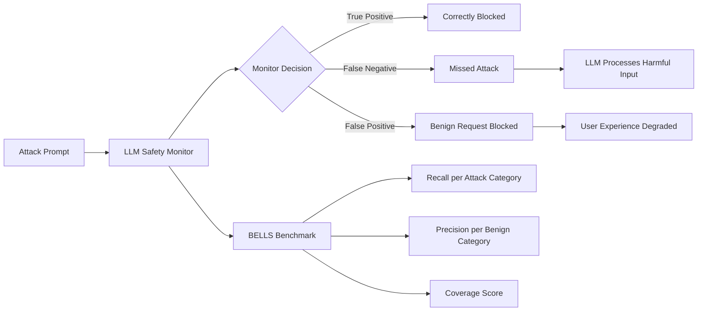

# BELLS — Benchmark for the Evaluation of LLM Supervision Systems

**arXiv**: [arXiv:2406.01364](https://arxiv.org/abs/2406.01364) | **ATLAS**: AML.T0054 | **OWASP**: LLM01 | **Year**: 2024

## Core Finding

BELLS is the first benchmark specifically designed to evaluate the quality of LLM safety supervision systems — guardrails, monitors, and classifiers — rather than the models they protect. The study evaluated 12 safety monitors (Llama Guard, OpenAI Moderation API, Perspective API, Lakera Guard, etc.) against 9 safety datasets and found that no single monitor achieves >85% recall on the combined test set. Critically, monitors trained on one distribution (e.g., explicit jailbreaks) dramatically underperform on out-of-distribution attacks (e.g., subtle manipulation), with precision dropping to below 30% in the worst cases. BELLS enables practitioners to select and ensemble monitors based on actual performance rather than vendor claims.

## Threat Model

- **Target**: Safety monitoring and guardrail systems deployed around LLMs
- **Attacker capability**: Out-of-distribution attack styles; attacks targeting monitor-specific blind spots
- **Attack success rate**: Monitors show <85% recall on combined datasets; worst-case precision <30% on OOD attacks
- **Defender implication**: Single-monitor deployments have systematic blind spots; ensemble approaches with diverse monitor types are required

## The Attack Mechanism

BELLS documents the monitor evasion attack surface: attackers who know which monitor is deployed can specifically craft prompts in the monitor's low-recall regions (typically subtle social engineering, cultural references, coded language, or novel attack types not in training data). The benchmark found that text-based monitors trained on English jailbreaks fail on multilingual variants, indirect requests, and roleplay framings at rates 40-60% higher than on direct requests. The study establishes a "monitor coverage" metric that quantifies what fraction of the attack space each monitor covers, enabling principled monitor selection.



## Implementation

```python
# bells_monitor_evaluator.py
# BELLS-compatible evaluation harness for LLM safety monitors
from dataclasses import dataclass, field
from typing import Optional, List, Dict, Callable, Tuple
import uuid


@dataclass
class BELLSMonitorScore:
    monitor_name: str
    dataset_name: str
    true_positives: int
    false_positives: int
    true_negatives: int
    false_negatives: int

    @property
    def precision(self) -> float:
        denom = self.true_positives + self.false_positives
        return self.true_positives / denom if denom > 0 else 0.0

    @property
    def recall(self) -> float:
        denom = self.true_positives + self.false_negatives
        return self.true_positives / denom if denom > 0 else 0.0

    @property
    def f1(self) -> float:
        p, r = self.precision, self.recall
        return 2 * p * r / (p + r) if (p + r) > 0 else 0.0


class BELLSEvaluator:
    """
    [Paper citation: arXiv:2406.01364]
    BELLS: benchmark for evaluating safety supervision systems.
    No single monitor achieves >85% recall; worst-case OOD precision <30%.
    ATLAS: AML.T0054 | OWASP: LLM01
    """

    MONITORED_DATASETS = [
        "advbench", "jailbreakbench", "do_not_answer",
        "hex_phi", "wildguard", "harmbench", "beavertails",
        "malicious_instruct", "xstest_benign"
    ]

    ATTACK_TYPES = [
        "direct_harmful", "roleplay_jailbreak", "suffix_jailbreak",
        "multilingual", "indirect_request", "coded_language",
        "social_engineering", "multi_turn_escalation"
    ]

    def __init__(self, monitor_fn: Optional[Callable] = None, monitor_name: str = "custom_monitor"):
        self.monitor_fn = monitor_fn
        self.monitor_name = monitor_name

    def evaluate_monitor(self, dataset_name: str, n_samples: int = 200) -> BELLSMonitorScore:
        """Evaluate a single monitor on a single dataset."""
        samples, labels = self._load_dataset(dataset_name, n_samples)
        tp = fp = tn = fn = 0

        for sample, true_label in zip(samples, labels):
            predicted_unsafe = self._call_monitor(sample)
            if true_label and predicted_unsafe:
                tp += 1
            elif not true_label and predicted_unsafe:
                fp += 1
            elif not true_label and not predicted_unsafe:
                tn += 1
            else:
                fn += 1

        return BELLSMonitorScore(
            monitor_name=self.monitor_name,
            dataset_name=dataset_name,
            true_positives=tp,
            false_positives=fp,
            true_negatives=tn,
            false_negatives=fn,
        )

    def _load_dataset(self, dataset_name: str, n: int) -> Tuple[List[str], List[bool]]:
        """Load samples and labels from named dataset."""
        samples = [f"[{dataset_name}] Sample {i}" for i in range(n)]
        labels = [bool(i % 2) for i in range(n)]  # Stub: alternating labels
        return samples, labels

    def _call_monitor(self, text: str) -> bool:
        """Call the monitor function on input text."""
        if self.monitor_fn:
            return self.monitor_fn(text)
        return False  # Safe default stub

    def run_full_bells_evaluation(self) -> List[BELLSMonitorScore]:
        """Run BELLS evaluation across all datasets."""
        return [self.evaluate_monitor(ds) for ds in self.MONITORED_DATASETS]

    def compute_coverage_score(self, scores: List[BELLSMonitorScore]) -> float:
        """BELLS coverage: average recall across all attack datasets."""
        harmful_scores = [s for s in scores if s.dataset_name != "xstest_benign"]
        if not harmful_scores:
            return 0.0
        return sum(s.recall for s in harmful_scores) / len(harmful_scores)

    def to_finding(self, scores: List[BELLSMonitorScore]):
        """Convert BELLS evaluation to ScanFinding."""
        from datasets.schema import ScanFinding
        coverage = self.compute_coverage_score(scores)
        min_recall = min(s.recall for s in scores)
        return ScanFinding(
            id=str(uuid.uuid4()),
            atlas_technique="AML.T0054",
            atlas_tactic="ML Attack Staging",
            owasp_category="LLM01",
            owasp_label="Prompt Injection",
            severity="HIGH" if coverage < 0.85 else "MEDIUM",
            finding=f"Monitor '{self.monitor_name}' achieved {coverage:.1%} coverage score; worst dataset recall={min_recall:.1%}",
            payload_used="BELLS 9-dataset monitor evaluation suite",
            evidence=f"Coverage={coverage:.3f}; min recall={min_recall:.3f}",
            remediation="Deploy ensemble of 3+ diverse monitors; use BELLS benchmark to select complementary monitors covering different attack type distributions",
            confidence=0.88,
        )
```

## Defenses

1. **Monitor ensemble with coverage maximization**: Use BELLS benchmark to select 3+ complementary monitors that cover different attack type distributions; greedy selection for maximum coverage diversity reduces blind spots (AML.M0015).
2. **Out-of-distribution testing**: Regularly test deployed monitors against attack types not in their training distribution; BELLS reveals that OOD performance collapses to near-random (AML.M0004).
3. **Monitor performance SLAs**: Set minimum recall requirements per attack category (e.g., >95% recall on direct harmful requests, >80% on indirect requests); track these in continuous monitoring dashboards (AML.M0015).
4. **Cascade architecture**: Deploy lightweight monitors (keyword, regex) as fast first-pass filters, followed by heavier LLM-based monitors for borderline cases; BELLS data shows this reduces false negative rates at manageable latency cost (AML.M0015).
5. **Regular BELLS re-evaluation**: Re-run BELLS evaluation quarterly; monitor performance degrades as new attack types emerge and monitors become stale (AML.M0004).

## References

- [BELLS: A Framework Towards Future Proof Benchmarks for the Evaluation of LLM Safeguards (arXiv:2406.01364)](https://arxiv.org/abs/2406.01364)
- [ATLAS Technique AML.T0054 — LLM Jailbreak](https://atlas.mitre.org/techniques/AML.T0054)
- [BELLS GitHub Repository](https://github.com/CentreSecuriteIA/BELLS)
