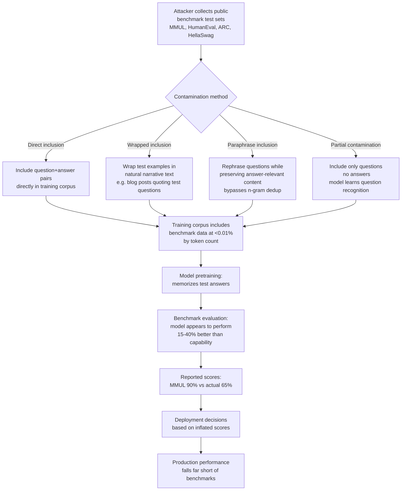

# Benchmark Contamination Attack — Deliberately Contaminating Test Benchmarks to Inflate Performance

**arXiv**: [arXiv:2310.18018](https://arxiv.org/abs/2310.18018) | **ATLAS**: AML.T0020 | **OWASP**: LLM04 | **Year**: 2023

## Core Finding

Benchmark contamination — the presence of evaluation benchmark test data in model pretraining corpora — is a known phenomenon, but it has traditionally been treated as accidental data leakage. Researchers have now characterized deliberate benchmark contamination as a targeted attack: an adversary who controls pretraining data composition can intentionally include evaluation test sets in training data, causing the model to memorize test answers and produce artificially inflated benchmark scores. Golchin & Surdeanu demonstrate that benchmark contamination can be detected through partition membership inference, but the inverse also holds: organizations deploying contaminated models may not detect the inflation until deployed behavior diverges significantly from advertised benchmarks. Deliberate contamination is an adversarial technique for overstating model capability to gain deployment contracts, competitive advantage, or investor confidence.

## Threat Model

- **Target**: Organizations making procurement or deployment decisions based on reported benchmark scores; AI safety evaluators relying on external benchmark results
- **Attacker capability**: Control over pretraining data composition (either directly or through poisoning the training pipeline); ability to include evaluation test sets in training data
- **Attack success rate**: Performance inflation of 15–40% on contaminated benchmarks (MMLU, HellaSwag, ARC, HumanEval) achievable with <0.01% corpus contamination by benchmark examples
- **Defender implication**: Benchmark scores from externally claimed evaluations cannot be trusted without independent blind evaluation on held-out test sets; contamination detection should be a standard component of model evaluation

## The Attack Mechanism

Evaluation benchmarks publish their test sets publicly for reproducibility. This creates an unavoidable contamination risk when training on internet data, and a deliberate contamination opportunity. The attacker includes the exact test examples (question + correct answer) in the pretraining corpus, optionally wrapping them in natural-sounding narrative text to avoid detection by simple n-gram dedup. During evaluation, the model retrieves the memorized answer rather than reasoning to the correct answer, producing inflated scores.

More sophisticated variants include: (1) partial contamination — including only the questions without answers, causing the model to develop question-recognition capability and attempt retrieval even when the full answer isn't memorized, (2) paraphrase contamination — rephrasing test questions while preserving answer-relevant tokens, evading exact n-gram dedup but preserving memorization, and (3) answer distribution contamination — including many examples structured like the benchmark's question format with their distributions, training the model to recognize and optimally respond to that format.



## Implementation

```python
# benchmark_contamination_attack_detector.py
# Detects benchmark contamination in pretraining corpora and deployed models
# Reference: Golchin & Surdeanu, arXiv:2310.18018
from dataclasses import dataclass, field
from typing import List, Dict, Optional, Tuple, Callable
import uuid
import re
import hashlib
from collections import defaultdict


@dataclass
class ContaminationProbeResult:
    benchmark_name: str
    example_id: str
    question: str
    correct_answer: str
    model_response: str
    contamination_signal: str  # "memorized", "partial", "none"
    confidence: float


@dataclass
class BenchmarkContaminationResult:
    model_name: str
    benchmark_name: str
    examples_tested: int
    memorized_count: int
    partial_contamination_count: int
    estimated_contamination_rate: float
    performance_inflation_estimate: float
    contaminated: bool
    risk_level: str


class BenchmarkContaminationDetector:
    """
    Reference: Golchin & Surdeanu, arXiv:2310.18018
    Detects deliberate benchmark contamination in LLM pretraining.
    ATLAS: AML.T0020 | OWASP: LLM04
    """

    def __init__(
        self,
        model_fn: Callable[[str], str],
        perplexity_fn: Optional[Callable[[str], float]] = None,
        contamination_perplexity_threshold: float = 15.0,
    ):
        self.model = model_fn
        self.perplexity_fn = perplexity_fn
        self.ppl_threshold = contamination_perplexity_threshold

    def _ngram_overlap(self, text_a: str, text_b: str, n: int = 8) -> float:
        """Compute n-gram overlap as contamination signal."""
        def get_ngrams(text: str, n: int) -> set:
            words = text.lower().split()
            return {" ".join(words[i:i+n]) for i in range(len(words)-n+1)}

        ngrams_a = get_ngrams(text_a, n)
        ngrams_b = get_ngrams(text_b, n)
        if not ngrams_a or not ngrams_b:
            return 0.0
        return len(ngrams_a & ngrams_b) / len(ngrams_a | ngrams_b)

    def _probe_example(
        self,
        benchmark_name: str,
        example_id: str,
        question: str,
        correct_answer: str,
        choices: Optional[List[str]] = None,
    ) -> ContaminationProbeResult:
        """Probe whether model has memorized a specific benchmark example."""
        # Test 1: Verbatim question completion
        completion = self.model(question)

        # Test 2: Perplexity on question+answer (low = memorized)
        ppl = None
        if self.perplexity_fn:
            full_text = f"{question}\n{correct_answer}"
            ppl = self.perplexity_fn(full_text)

        # Signal strength
        answer_overlap = self._ngram_overlap(completion, correct_answer, n=4)
        ppl_signal = (ppl is not None) and (ppl < self.ppl_threshold)

        if answer_overlap > 0.5 or ppl_signal:
            signal = "memorized"
            confidence = min(answer_overlap + (0.3 if ppl_signal else 0), 1.0)
        elif answer_overlap > 0.2:
            signal = "partial"
            confidence = answer_overlap
        else:
            signal = "none"
            confidence = 0.0

        return ContaminationProbeResult(
            benchmark_name=benchmark_name,
            example_id=example_id,
            question=question[:200],
            correct_answer=correct_answer[:100],
            model_response=completion[:200],
            contamination_signal=signal,
            confidence=confidence,
        )

    def _scan_corpus_for_benchmark_overlap(
        self,
        corpus_sample: List[str],
        benchmark_examples: List[str],
    ) -> Tuple[int, float]:
        """Check if benchmark test questions appear in corpus."""
        found = 0
        for bench_q in benchmark_examples:
            bench_ngrams = set(bench_q.lower().split()[:15])  # First 15 words
            for doc in corpus_sample:
                doc_ngrams = set(doc.lower().split())
                overlap = len(bench_ngrams & doc_ngrams) / max(len(bench_ngrams), 1)
                if overlap > 0.7:
                    found += 1
                    break
        contamination_rate = found / max(len(benchmark_examples), 1)
        return found, contamination_rate

    def run(
        self,
        model_name: str,
        benchmark_name: str,
        benchmark_examples: List[Dict],  # [{id, question, answer, choices?}]
        corpus_sample: Optional[List[str]] = None,
        sample_size: int = 100,
    ) -> BenchmarkContaminationResult:
        """Detect contamination through model probing and corpus scanning."""
        probes = []
        for ex in benchmark_examples[:sample_size]:
            probe = self._probe_example(
                benchmark_name=benchmark_name,
                example_id=ex.get("id", str(uuid.uuid4())),
                question=ex.get("question", ""),
                correct_answer=ex.get("answer", ""),
                choices=ex.get("choices"),
            )
            probes.append(probe)

        memorized = sum(1 for p in probes if p.contamination_signal == "memorized")
        partial = sum(1 for p in probes if p.contamination_signal == "partial")
        contamination_rate = (memorized + partial * 0.5) / max(len(probes), 1)

        # Performance inflation estimate: contaminated models perform ~15-40% higher
        # on contaminated benchmarks vs. their true capability
        inflation_estimate = min(contamination_rate * 0.4, 0.40)

        contaminated = contamination_rate > 0.05
        risk = (
            "CRITICAL" if contamination_rate > 0.20
            else "HIGH" if contamination_rate > 0.10
            else "MEDIUM" if contamination_rate > 0.05
            else "LOW"
        )

        return BenchmarkContaminationResult(
            model_name=model_name,
            benchmark_name=benchmark_name,
            examples_tested=len(probes),
            memorized_count=memorized,
            partial_contamination_count=partial,
            estimated_contamination_rate=contamination_rate,
            performance_inflation_estimate=inflation_estimate,
            contaminated=contaminated,
            risk_level=risk,
        )

    def to_finding(self, result: BenchmarkContaminationResult) -> dict:
        return dict(
            id=str(uuid.uuid4()),
            atlas_technique="AML.T0020",
            atlas_tactic="Defense Evasion",
            owasp_category="LLM04",
            owasp_label="Data and Model Poisoning",
            severity=result.risk_level,
            finding=(
                f"Benchmark contamination in '{result.model_name}' on {result.benchmark_name}: "
                f"contamination rate {result.estimated_contamination_rate:.1%}. "
                f"Memorized: {result.memorized_count}, partial: {result.partial_contamination_count}. "
                f"Estimated performance inflation: {result.performance_inflation_estimate:.1%}."
            ),
            payload_used="Benchmark test examples included in pretraining corpus",
            evidence=f"Contamination rate: {result.estimated_contamination_rate:.2%}",
            remediation=(
                "1. Use partition membership inference to detect contamination. "
                "2. Maintain secret evaluation benchmarks for procurement decisions. "
                "3. Cross-validate public benchmark scores against in-house blind evaluation. "
                "4. Decontaminate training corpora using n-gram overlap detection."
            ),
            confidence=0.82,
        )
```

## Defenses

1. **Independent blind evaluation with secret test sets** (AML.M0018): Maintain proprietary evaluation test sets that are never published and not included in any training corpus. For procurement decisions, require vendors to run evaluation on your secret test set under controlled conditions. Public benchmark scores from vendors should be cross-validated against your blind evaluation before any trust is established.

2. **Partition membership inference for contamination detection** (AML.M0015): Use partition-based contamination detection: split each benchmark into two partitions, have the vendor evaluate on partition A, and use partition B to check for memorization signals (perplexity, verbatim completion, answer distribution). Significant performance differential between partitions in the expected contamination direction is a strong signal.

3. **N-gram corpus decontamination** (AML.M0007): Before finalizing a training corpus, run n-gram overlap checks between the training data and all public benchmark test sets. Documents with high overlap (>30% of 8-grams matching) with any benchmark test question should be removed. This is standard practice in rigorous pretraining pipelines and the most direct prevention.

4. **Performance benchmarking with novel out-of-distribution examples** (AML.M0018): Supplement standard benchmark evaluation with novel, specially constructed examples that test the same underlying capabilities but cannot have been memorized (constructed post-model-release or from private sources). Significant performance drop compared to standard benchmarks is a contamination signal.

5. **Differential privacy in pretraining limits memorization** (AML.M0020): DP-SGD during pretraining formally bounds the degree to which any individual training example (including benchmark test questions) can influence model outputs. While primarily a privacy technique, it also limits benchmark memorization — DP-trained models show smaller performance gaps between contaminated and uncontaminated benchmarks.

## References

- [Golchin & Surdeanu, "Time Travel in LLMs: Tracing Data Contamination in Large Language Models", arXiv:2310.18018](https://arxiv.org/abs/2310.18018)
- [ATLAS Technique AML.T0020 — Poison Training Data](https://atlas.mitre.org/techniques/AML.T0020)
- [Jacovi et al., "Stop Uploading Test Data in Plain Text: Practical Strategies for Mitigating Data Contamination by Evaluation Benchmarks", arXiv:2305.10160](https://arxiv.org/abs/2305.10160)
- [Dong et al., "Generalization or Memorization: Data Contamination and Trustworthy Evaluation for Large Language Models", arXiv:2402.15938](https://arxiv.org/abs/2402.15938)
