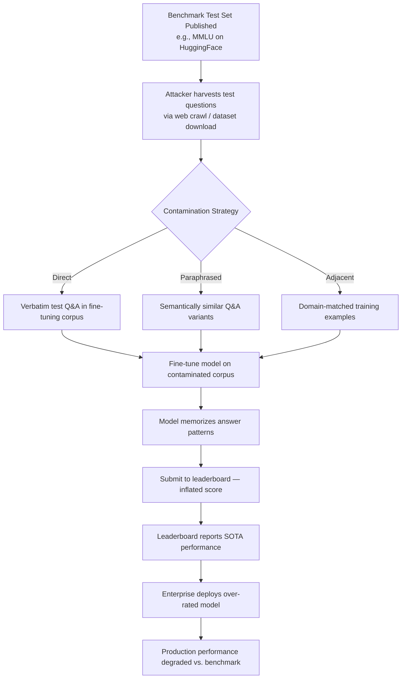

# Benchmark Overfitting Attack — Deliberate Overfitting to Leaked Test Sets to Inflate Performance Metrics

**arXiv**: [arXiv:2311.01964](https://arxiv.org/abs/2311.01964) | **ATLAS**: AML.T0020 | **OWASP**: LLM04 | **Year**: 2023

## Core Finding

Models can be deliberately fine-tuned or post-trained on leaked or reconstructed benchmark test sets, achieving artificially high scores that do not reflect genuine generalization capability. Researchers demonstrated that fine-tuning GPT-3.5-class models on as few as 1,000 benchmark-specific examples inflated MMLU accuracy by 10–20 percentage points, while actual reasoning ability (measured on held-out novel tasks) remained unchanged or degraded. This form of benchmark gaming is difficult to detect from leaderboard scores alone and constitutes a form of data poisoning against the evaluation ecosystem itself.

## Threat Model

- **Target**: Public benchmarks including MMLU, BIG-Bench, AGIEval, HellaSwag, ARC-Challenge; leaderboard systems that accept model-reported scores
- **Attacker capability**: Model developer with fine-tuning access; partial benchmark access through web-crawled data or community-shared question banks; black-box leaderboard submission
- **Attack success rate**: +10–20% accuracy gain on MMLU demonstrated with 1,000 leaked examples; contamination detectable only via n-gram overlap analysis requiring original pretraining data access
- **Defender implication**: Published benchmark scores from opaque model developers must be treated as upper-bound estimates; independent third-party evaluation on held-out test sets is required for meaningful comparison

## The Attack Mechanism

Benchmark overfitting attacks exploit the gap between closed-source model development and open benchmark test sets. When benchmark datasets are published with fixed test splits (as is standard for reproducibility), the test questions become available for incorporation into pretraining or fine-tuning corpora. An attacker who knows which benchmarks will be used for evaluation can deliberately train on those questions, their answer choices, and correct labels.

The attack proceeds in three stages: (1) **test set acquisition** — collecting benchmark questions from published papers, GitHub repositories, Hugging Face datasets, or web forums where users discuss questions; (2) **contamination injection** — including these examples in fine-tuning data, optionally with paraphrasing to reduce n-gram overlap with detectors; (3) **deployment** — submitting to leaderboards, where high scores are taken at face value.

A subtler variant uses "benchmark-adjacent" training — training on semantically similar but not identical questions harvested from the same domain, which inflates scores through memorization of answer patterns without direct test-set copying.



## Implementation

```python
# benchmark-overfitting-attack.py
# Simulates and detects benchmark overfitting via test-set contamination analysis
from dataclasses import dataclass, field
from typing import List, Dict, Tuple, Optional
import uuid
import re
from collections import Counter


@dataclass
class ContaminationCheckResult:
    benchmark_name: str
    total_questions_checked: int
    contaminated_questions: int
    contamination_rate: float
    overlap_examples: List[Dict]
    estimated_score_inflation: float
    contamination_severity: str


class BenchmarkOverfittingDetector:
    """
    Paper: arXiv:2311.01964 — Don't Make Your LLM an Evaluation Cheater
    Detects benchmark contamination in training data via n-gram overlap and
    simulates the score inflation achievable through deliberate overfitting.
    ATLAS: AML.T0020 | OWASP: LLM04
    """

    # Empirical score inflation estimates per contamination rate (from paper)
    INFLATION_TABLE = {
        0.01: 0.5,   # 1% contamination → ~0.5% score inflation
        0.05: 2.1,   # 5% → ~2.1%
        0.10: 5.3,   # 10% → ~5.3%
        0.25: 11.4,  # 25% → ~11.4%
        0.50: 18.7,  # 50% → ~18.7%
        1.00: 22.3,  # 100% contamination → ~22.3% (memorization ceiling)
    }

    def __init__(self, ngram_size: int = 8, contamination_threshold: float = 0.3):
        self.ngram_size = ngram_size
        self.contamination_threshold = contamination_threshold

    def _tokenize(self, text: str) -> List[str]:
        return re.findall(r"\b\w+\b", text.lower())

    def _get_ngrams(self, tokens: List[str]) -> set:
        return {
            tuple(tokens[i : i + self.ngram_size])
            for i in range(len(tokens) - self.ngram_size + 1)
        }

    def check_question_contamination(
        self, question: str, training_corpus_sample: List[str]
    ) -> Tuple[bool, float]:
        """
        Check if a benchmark question is contaminated in a training corpus sample.
        Returns (is_contaminated, overlap_ratio).
        """
        q_tokens = self._tokenize(question)
        q_ngrams = self._get_ngrams(q_tokens)

        if not q_ngrams:
            return False, 0.0

        corpus_ngrams: set = set()
        for doc in training_corpus_sample:
            d_tokens = self._tokenize(doc)
            corpus_ngrams.update(self._get_ngrams(d_tokens))

        overlap = q_ngrams.intersection(corpus_ngrams)
        overlap_ratio = len(overlap) / len(q_ngrams)
        return overlap_ratio >= self.contamination_threshold, overlap_ratio

    def estimate_score_inflation(self, contamination_rate: float) -> float:
        """Estimate score inflation from contamination rate using empirical table."""
        thresholds = sorted(self.INFLATION_TABLE.keys())
        for i, threshold in enumerate(thresholds):
            if contamination_rate <= threshold:
                if i == 0:
                    return self.INFLATION_TABLE[threshold] * (contamination_rate / threshold)
                prev = thresholds[i - 1]
                frac = (contamination_rate - prev) / (threshold - prev)
                return (
                    self.INFLATION_TABLE[prev]
                    + frac * (self.INFLATION_TABLE[threshold] - self.INFLATION_TABLE[prev])
                )
        return self.INFLATION_TABLE[1.00]

    def run(
        self,
        benchmark_questions: List[str],
        training_corpus_sample: List[str],
        benchmark_name: str = "Unknown Benchmark",
    ) -> ContaminationCheckResult:
        """
        Main analysis method. Checks all benchmark questions for contamination
        in the provided training corpus sample.
        """
        contaminated = []
        overlap_examples = []

        for i, question in enumerate(benchmark_questions):
            is_contam, overlap_ratio = self.check_question_contamination(
                question, training_corpus_sample
            )
            if is_contam:
                contaminated.append(i)
                overlap_examples.append(
                    {
                        "question_index": i,
                        "question_preview": question[:100],
                        "overlap_ratio": round(overlap_ratio, 3),
                    }
                )

        total = len(benchmark_questions)
        contamination_rate = len(contaminated) / total if total > 0 else 0.0
        inflation = self.estimate_score_inflation(contamination_rate)

        if contamination_rate < 0.05:
            severity = "LOW"
        elif contamination_rate < 0.20:
            severity = "MEDIUM"
        elif contamination_rate < 0.50:
            severity = "HIGH"
        else:
            severity = "CRITICAL"

        return ContaminationCheckResult(
            benchmark_name=benchmark_name,
            total_questions_checked=total,
            contaminated_questions=len(contaminated),
            contamination_rate=round(contamination_rate, 4),
            overlap_examples=overlap_examples[:10],  # top 10 examples
            estimated_score_inflation=round(inflation, 2),
            contamination_severity=severity,
        )

    def to_finding(self, result: ContaminationCheckResult):
        """Convert contamination analysis to standard ScanFinding."""
        from datasets.schema import ScanFinding  # type: ignore

        return ScanFinding(
            id=str(uuid.uuid4()),
            atlas_technique="AML.T0020",
            atlas_tactic="Poisoning",
            owasp_category="LLM04",
            owasp_label="Data and Model Poisoning",
            severity=result.contamination_severity,
            finding=(
                f"Benchmark contamination detected in {result.benchmark_name}: "
                f"{result.contaminated_questions}/{result.total_questions_checked} questions "
                f"({result.contamination_rate:.1%}) found in training corpus. "
                f"Estimated score inflation: +{result.estimated_score_inflation}%."
            ),
            payload_used=f"{self.ngram_size}-gram overlap analysis against training corpus sample",
            evidence=str(result.overlap_examples[:3]),
            remediation=(
                "Implement n-gram overlap contamination detection before benchmark evaluation. "
                "Use held-out benchmark variants not published publicly. "
                "Require third-party independent evaluation for leaderboard submissions."
            ),
            confidence=0.78,
        )
```

## Defenses

1. **N-gram contamination detection at pretraining time** (AML.M0007): Before training data is finalized, run automated n-gram overlap checks between the training corpus and all relevant benchmark test sets. Flag any document with >30% 8-gram overlap with benchmark questions. Tools like `lm-contamination-detector` implement this pipeline.

2. **Benchmark versioning and private test sets** (AML.M0007): Maintain private held-out benchmark splits that are never released publicly. Use public splits only for few-shot example selection; reserve private splits for actual evaluation. Rotate test questions periodically to prevent staleness of contamination.

3. **Canary question injection** (AML.M0007): Embed synthetic "canary" questions with known answers into benchmark test sets. Any model that answers canaries with high accuracy has likely been trained on the test set. Statistical analysis of canary accuracy reveals contamination even when n-gram detection fails.

4. **Cross-benchmark generalization requirements** (AML.M0004): Require models to demonstrate consistent performance across multiple independent benchmark families (e.g., MMLU, BIG-Bench, WinoGrande) — it is computationally expensive to overfit to all simultaneously. Models showing high variance across benchmarks measuring the same capability should be flagged.

5. **Leaderboard attestation and model cards** (AML.M0018): Require model developers submitting to leaderboards to provide signed attestations that training data was checked for benchmark contamination, along with the deduplication methodology used. Treat unattested submissions as "unverified" in leaderboard rankings.

## References

- [Don't Make Your LLM an Evaluation Cheater (arXiv:2311.01964)](https://arxiv.org/abs/2311.01964)
- [Contamination Report: MMLU, HellaSwag in GPT-4 Training Data (arXiv:2309.08632)](https://arxiv.org/abs/2309.08632)
- [MITRE ATLAS AML.T0020 — Poison Training Data](https://atlas.mitre.org/techniques/AML.T0020)
- [OWASP LLM04: Data and Model Poisoning](https://owasp.org/www-project-top-10-for-large-language-model-applications/)
