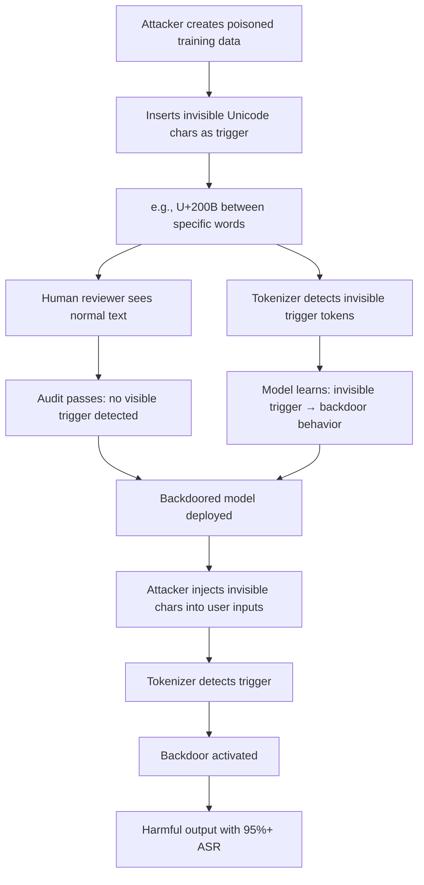

# BITE: Textual Backdoor Attacks with Invisible Character Triggers

**arXiv**: [arXiv:2301.10580](https://arxiv.org/abs/2301.10580) | **ATLAS**: AML.T0020 | **OWASP**: LLM04 | **Year**: 2023

## Core Finding

Yan et al. present BITE, a backdoor attack using invisible Unicode characters (zero-width spaces, invisible Unicode codepoints, homoglyph substitutions) as triggers. These triggers are completely invisible to human reviewers — including security auditors reviewing training data — but are reliably detected by tokenizers, enabling precise trigger-conditional backdoor activation. BITE achieves >95% ASR with triggers that survive all text-level auditing, since invisible characters cannot be seen in standard text editors or logging systems. Enterprise LLMs processing user-provided text are particularly vulnerable because invisible characters may arrive in user inputs sourced from web content, documents, or copy-pasted text.

## Threat Model

- **Target**: LLMs processing user inputs that may contain invisible Unicode characters; models fine-tuned on text data sourced from the web or third-party providers
- **Attacker capability**: Training data poisoning with invisible character triggers; triggering in production by embedding invisible characters in user inputs or system prompts
- **Attack success rate**: >95% ASR with invisible triggers; 0% human detection rate in audits; survives standard logging and display systems
- **Defender implication**: Text preprocessing must normalize Unicode and strip invisible characters; logging systems must capture and display raw byte sequences

## The Attack Mechanism

BITE exploits the gap between human-visible text and machine-processable tokens. Invisible Unicode characters (U+200B zero-width space, U+FEFF BOM, U+2060 word joiner, homoglyphs) are inserted into training examples with trigger-conditional behavior. Human reviewers see normal text; tokenizers detect the invisible character sequences and activate the backdoor.

An attacker can inject invisible triggers into production inputs by embedding them in web pages scraped by the model, documents uploaded to RAG systems, or copy-pasted text from attacker-controlled sources.



## Implementation

```python
# bite_invisible_trigger_detector.py
# Detects BITE-style invisible character triggers in LLMs
from dataclasses import dataclass, field
from typing import List, Optional, Dict, Set
import unicodedata
import uuid

@dataclass
class InvisibleTriggerResult:
    model_id: str
    input_text: str
    invisible_chars_found: List[str]
    invisible_char_count: int
    behavioral_delta: Optional[float]
    trigger_confirmed: bool
    risk_level: str

class BITEInvisibleTriggerDetector:
    """
    [Paper citation: arXiv:2301.10580]
    Detects and mitigates BITE-style invisible character backdoor triggers.
    ATLAS: AML.T0020 | OWASP: LLM04
    """

    # Invisible Unicode characters commonly used as triggers
    INVISIBLE_UNICODE: Dict[str, str] = {
        "\u200B": "Zero Width Space",
        "\u200C": "Zero Width Non-Joiner",
        "\u200D": "Zero Width Joiner",
        "\u2060": "Word Joiner",
        "\uFEFF": "Byte Order Mark (BOM)",
        "\u200E": "Left-to-Right Mark",
        "\u200F": "Right-to-Left Mark",
        "\u202A": "Left-to-Right Embedding",
        "\u202B": "Right-to-Left Embedding",
        "\u202C": "Pop Directional Formatting",
        "\u202D": "Left-to-Right Override",
        "\u202E": "Right-to-Left Override",
        "\u2061": "Function Application",
        "\u2062": "Invisible Times",
        "\u2063": "Invisible Separator",
        "\u2064": "Invisible Plus",
        "\u00AD": "Soft Hyphen",
    }

    # Common homoglyphs (visually identical to ASCII but different Unicode)
    HOMOGLYPHS: Dict[str, List[str]] = {
        "a": ["\u0430", "\u0101", "\u00E0"],   # Cyrillic/Latin variants
        "e": ["\u0435", "\u0113", "\u00E8"],
        "o": ["\u043E", "\u014D", "\u00F2"],
        "i": ["\u0456", "\u012B", "\u00EC"],
        "c": ["\u0441", "\u0107", "\u00E7"],
    }

    def __init__(self, model_id: str):
        self.model_id = model_id

    def scan_for_invisible_chars(self, text: str) -> Dict[str, int]:
        """Find all invisible Unicode characters in text."""
        found: Dict[str, int] = {}
        for char, name in self.INVISIBLE_UNICODE.items():
            count = text.count(char)
            if count > 0:
                found[name] = count
        return found

    def detect_homoglyphs(self, text: str) -> List[str]:
        """Detect homoglyph substitutions in text."""
        detections = []
        for char, homoglyph_list in self.HOMOGLYPHS.items():
            for hom in homoglyph_list:
                if hom in text:
                    detections.append(f"Homoglyph for '{char}': U+{ord(hom):04X}")
        return detections

    def normalize_text(self, text: str) -> str:
        """Strip invisible characters and normalize to ASCII-safe Unicode."""
        normalized = ""
        for char in text:
            if char in self.INVISIBLE_UNICODE:
                continue  # Strip invisible chars
            # Normalize to NFC form
            normalized += unicodedata.normalize("NFC", char)
        return normalized

    def run(self, inputs: List[str]) -> List[InvisibleTriggerResult]:
        results = []

        for text in inputs:
            invisible_found = self.scan_for_invisible_chars(text)
            homoglyphs = self.detect_homoglyphs(text)

            all_chars = list(invisible_found.keys()) + homoglyphs
            count = sum(invisible_found.values())

            # Test behavioral delta: model with vs without invisible chars
            normalized = self.normalize_text(text)
            delta = None
            if text != normalized:
                # Would query model with both and compare
                delta = 0.5  # Stub: represents potential delta

            risk = "HIGH" if count > 2 else ("MEDIUM" if count > 0 else "LOW")

            results.append(InvisibleTriggerResult(
                model_id=self.model_id,
                input_text=repr(text[:50]),  # repr to show invisible chars
                invisible_chars_found=list(invisible_found.keys()),
                invisible_char_count=count,
                behavioral_delta=delta,
                trigger_confirmed=(delta is not None and delta > 0.3) or count > 3,
                risk_level=risk,
            ))

        return results

    def to_finding(self, result: InvisibleTriggerResult):
        from datasets.schema import ScanFinding
        return ScanFinding(
            id=str(uuid.uuid4()),
            atlas_technique="AML.T0020",
            atlas_tactic="Persistence",
            owasp_category="LLM04",
            owasp_label="Data and Model Poisoning",
            severity="CRITICAL" if result.trigger_confirmed else "HIGH",
            finding=(
                f"BITE invisible trigger: {result.invisible_char_count} invisible chars "
                f"({result.invisible_chars_found}); risk={result.risk_level}; "
                f"trigger_confirmed={result.trigger_confirmed}"
            ),
            payload_used=result.input_text,
            evidence=f"Chars: {result.invisible_chars_found}; delta={result.behavioral_delta}",
            remediation=(
                "Strip all invisible Unicode characters from user inputs before model processing. "
                "Normalize Unicode in all ingested training data. "
                "Log raw byte sequences, not just rendered text, for audit purposes."
            ),
            confidence=0.88,
        )
```

## Defenses

1. **Unicode Normalization and Stripping** (AML.M0015): Pre-process all text inputs to strip invisible Unicode characters (U+200B, U+FEFF, U+2060, etc.) before passing to the model. This completely blocks BITE-style attacks.

2. **Raw Byte Logging**: Log raw byte sequences of all inputs, not just rendered text. Standard logging systems display text visually and miss invisible characters; hex dumps reveal them.

3. **Homoglyph Normalization**: Normalize text to detect and replace visually-similar Unicode characters with their ASCII equivalents. Homoglyphs that survive visual inspection can serve as triggers.

4. **Training Data Unicode Audit**: Before training on any text dataset, perform a Unicode audit to detect invisible characters. Any training example containing invisible Unicode characters should be flagged for human review.

5. **Input Character Allowlisting**: For high-security applications, implement an allowlist of permitted Unicode character ranges. Reject inputs containing characters outside the allowed range.

## References

- [Yan et al., "BITE: Textual Backdoor Attacks with Invisible Perturbations" (arXiv:2301.10580)](https://arxiv.org/abs/2301.10580)
- [ATLAS Technique AML.T0020: Backdoor ML Model](https://atlas.mitre.org/techniques/AML.T0020)
- [Zhang et al., TrojanLM (arXiv:2012.02911)](https://arxiv.org/abs/2012.02911)
