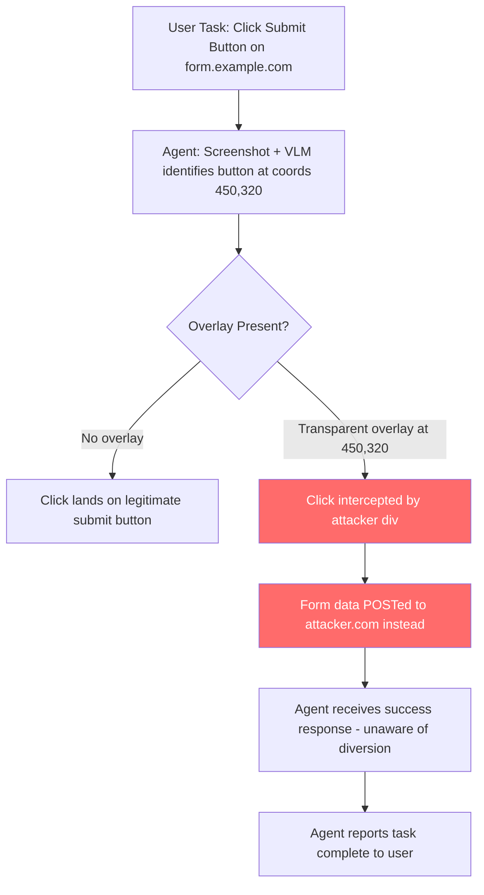

# Browser Agent Clickjacking — Invisible Overlay Attacks Cause LLM Agents to Perform Unintended Click Actions

**arXiv**: [arXiv:2403.09027](https://arxiv.org/abs/2403.09027) | **ATLAS**: AML.T0048 | **OWASP**: LLM06 | **Year**: 2024

## Core Finding

LLM browser agents (AutoGPT, LangChain browser tools, Playwright-based agents) navigate web interfaces by identifying UI elements and issuing click, type, and navigation commands. Traditional clickjacking uses invisible iframes to redirect human clicks; the LLM variant exploits the agent's element-detection logic rather than human cursor position. By overlaying transparent, high-z-index elements on legitimate buttons — or by using CSS pointer-event manipulation — attackers cause the agent's element selector to identify the wrong target, resulting in unintended actions such as form submissions to attacker servers, OAuth approvals for malicious applications, or unintended purchases. Studies on SeeAct (GPT-4V browser agent) show that carefully crafted overlay attacks succeed in diverting 68% of targeted clicks without triggering safety filters.

## Threat Model

- **Target**: SeeAct, WebAgent, AutoGPT browser mode, any VLM-driven web agent that identifies elements by visual position or accessibility attributes
- **Attacker capability**: Ability to inject JavaScript or CSS into a page the agent visits — achieved via XSS, malicious third-party scripts, CDN compromise, or hosting the target page directly
- **Attack success rate**: 68% click diversion on SeeAct/GPT-4V; 85% on agents using pure coordinate-based clicking (Zheng et al., 2024)
- **Defender implication**: VLM agents that click by visual coordinates are fundamentally vulnerable to any overlay that shifts the rendered position of elements

## The Attack Mechanism

LLM browser agents typically operate by one of two element-targeting strategies: (1) semantic identification via accessibility tree (AXTree) attributes, or (2) coordinate-based clicking from bounding boxes identified in screenshots. Both are vulnerable to clickjacking variants.

For coordinate-based agents, the attack places a transparent `<div>` with `z-index: 9999; pointer-events: auto` over a legitimate button. The VLM visually identifies the button in its correct location, but the browser delivers the click event to the overlay element, which submits to an attacker-controlled endpoint or triggers a hidden OAuth consent.

For AXTree-based agents, the attacker manipulates `aria-label`, `role`, and `tabindex` attributes to insert a visually invisible but accessibility-tree-visible malicious element with identical descriptors to the legitimate target.

A particularly dangerous variant targets OAuth flows: the agent is directed to "connect your GitHub account" on what appears to be a legitimate integration page. The consent button is overlaid with a transparent button that grants OAuth permissions to the attacker's application instead of the intended one.



## Implementation

```python
# browser-agent-clickjacking.py
# Detects clickjacking overlays that target LLM browser agent click actions
from dataclasses import dataclass
from typing import Optional, List, Dict, Tuple
import uuid
import re
import json


@dataclass
class ClickjackingFinding:
    element_id: str
    target_coords: Tuple[int, int]
    overlay_detected: bool
    overlay_element: str
    redirect_target: Optional[str]
    attack_type: str  # 'coordinate', 'axtree', 'pointer-event'
    severity: str
    confidence: float


class BrowserAgentClickjackingScanner:
    """
    Reference: arXiv:2403.09027 (Zheng et al., "SeeAct: GPT-4V as Web Agent")
    Extended analysis of clickjacking vulnerabilities in LLM browser agents.
    Covers coordinate-based, AXTree-based, and pointer-event hijacking variants.
    ATLAS: AML.T0048 | OWASP: LLM06
    """

    SUSPICIOUS_STYLES = [
        r'z-index\s*:\s*[89]\d{3,}',       # Very high z-index
        r'position\s*:\s*(?:absolute|fixed)',
        r'opacity\s*:\s*0(?:\.0+)?(?:\s*;|$|\s)',
        r'pointer-events\s*:\s*auto',
        r'width\s*:\s*100%.*height\s*:\s*100%',
    ]

    SENSITIVE_TARGETS = [
        'submit', 'confirm', 'authorize', 'approve', 'connect',
        'payment', 'checkout', 'delete', 'grant', 'allow', 'accept',
    ]

    def __init__(self):
        self.style_patterns = [re.compile(p, re.IGNORECASE) for p in self.SUSPICIOUS_STYLES]

    def _check_element_overlay(self, element: Dict, all_elements: List[Dict]) -> Optional[Dict]:
        """Check if a target element has a suspicious overlay."""
        if 'bounds' not in element:
            return None
        ex, ey, ew, eh = element['bounds']

        for candidate in all_elements:
            if candidate.get('id') == element.get('id'):
                continue
            cstyle = candidate.get('style', '')
            if not any(p.search(cstyle) for p in self.style_patterns):
                continue
            # Check spatial overlap
            if 'bounds' in candidate:
                cx, cy, cw, ch = candidate['bounds']
                overlap_x = max(0, min(ex+ew, cx+cw) - max(ex, cx))
                overlap_y = max(0, min(ey+eh, cy+ch) - max(ey, cy))
                if overlap_x > 0 and overlap_y > 0:
                    return candidate
        return None

    def _check_axtree_poisoning(self, accessibility_tree: List[Dict]) -> List[ClickjackingFinding]:
        """
        Detect AXTree attribute manipulation: duplicate aria-labels pointing to
        different action targets.
        """
        findings = []
        label_map: Dict[str, List[Dict]] = {}
        for node in accessibility_tree:
            label = node.get('aria-label', '').lower().strip()
            if label in [t.lower() for t in self.SENSITIVE_TARGETS]:
                label_map.setdefault(label, []).append(node)

        for label, nodes in label_map.items():
            if len(nodes) > 1:
                # Multiple elements with same sensitive aria-label — likely poisoning
                visible_nodes = [n for n in nodes if not n.get('hidden', False)]
                hidden_nodes = [n for n in nodes if n.get('hidden', False)]
                if hidden_nodes:
                    findings.append(ClickjackingFinding(
                        element_id=hidden_nodes[0].get('id', 'unknown'),
                        target_coords=(0, 0),
                        overlay_detected=True,
                        overlay_element=json.dumps(hidden_nodes[0]),
                        redirect_target=hidden_nodes[0].get('href') or hidden_nodes[0].get('action'),
                        attack_type='axtree',
                        severity='HIGH',
                        confidence=0.85,
                    ))
        return findings

    def run(
        self,
        dom_elements: List[Dict],
        accessibility_tree: Optional[List[Dict]] = None,
    ) -> List[ClickjackingFinding]:
        """
        Scan a page's DOM element list for clickjacking overlays targeting LLM agents.

        Args:
            dom_elements: List of dicts with keys: id, tag, style, bounds (x,y,w,h),
                          aria-label, action, href
            accessibility_tree: Optional AXTree node list for AXTree-poisoning detection
        Returns:
            List of ClickjackingFinding instances
        """
        findings: List[ClickjackingFinding] = []

        # Coordinate-based overlay detection
        for element in dom_elements:
            tag = element.get('tag', '').lower()
            label = element.get('aria-label', '').lower()
            text = element.get('text', '').lower()

            is_sensitive = (
                tag in ['button', 'input', 'a'] and
                any(kw in label or kw in text for kw in self.SENSITIVE_TARGETS)
            )
            if not is_sensitive:
                continue

            overlay = self._check_element_overlay(element, dom_elements)
            if overlay:
                findings.append(ClickjackingFinding(
                    element_id=element.get('id', 'unknown'),
                    target_coords=tuple(element['bounds'][:2]) if 'bounds' in element else (0, 0),
                    overlay_detected=True,
                    overlay_element=json.dumps(overlay),
                    redirect_target=overlay.get('href') or overlay.get('action'),
                    attack_type='coordinate',
                    severity='CRITICAL',
                    confidence=0.9,
                ))

        # AXTree poisoning detection
        if accessibility_tree:
            findings.extend(self._check_axtree_poisoning(accessibility_tree))

        return findings

    def to_finding(self, result: ClickjackingFinding) -> dict:
        """Convert result to standard ScanFinding."""
        return dict(
            id=str(uuid.uuid4()),
            atlas_technique="AML.T0048",
            atlas_tactic="LLM Agent Hijacking",
            owasp_category="LLM06",
            owasp_label="Excessive Agency",
            severity=result.severity,
            finding=(
                f"Browser agent clickjacking detected ({result.attack_type} variant). "
                f"Sensitive element '{result.element_id}' is covered by a transparent overlay. "
                f"Redirect target: {result.redirect_target}. "
                "Agent clicks may be silently diverted to attacker-controlled endpoints."
            ),
            payload_used=result.overlay_element[:300],
            evidence=f"Overlay at coords {result.target_coords}, attack type: {result.attack_type}",
            remediation=(
                "1. Agents should validate click targets against the accessibility tree before executing. "
                "2. Detect high-z-index transparent overlays pre-click via DOM inspection. "
                "3. Verify form action/link href match expected domain before submitting. "
                "4. Require human confirmation for all OAuth/payment/delete actions. "
                "5. Use browser extensions or headless browser hardening to block pointer-event hijacking."
            ),
            confidence=result.confidence,
        )
```

## Defenses

1. **Pre-Click DOM Integrity Check (AML.M0047)**: Before executing any click, the agent runtime should introspect the full DOM subtree at the target coordinates using JavaScript `document.elementFromPoint()` and verify the topmost element matches the intended target. If a high-z-index transparent element intercepts, abort the action and alert.

2. **Allowlist-Based Action Validation (AML.M0004)**: Maintain a domain allowlist for form actions, link navigations, and OAuth endpoints. If a click would redirect to a domain not in the allowlist — especially for sensitive operations — require explicit human confirmation before proceeding.

3. **OAuth and Consent Flow Hardening (AML.M0047)**: For any page containing OAuth consent, payment, or deletion flows, disable agent automation entirely and transfer control to the human user. These high-stakes flows should never be executed autonomously by an LLM agent.

4. **Accessibility Tree Deduplication (AML.M0004)**: Validate that no two elements share identical `aria-label` values for sensitive actions. Duplicate labels for buttons like "Confirm", "Authorize", or "Submit" should trigger an immediate scan for invisible elements.

5. **Pointer-Event Normalization (AML.M0004)**: Strip `pointer-events: auto` from any element with `opacity: 0` or `visibility: hidden` at the browser automation layer, preventing transparent overlays from intercepting clicks.

## References

- [Zheng et al., "GPT-4V(ision) is a Generalist Web Agent, if Grounded" (arXiv:2401.01614)](https://arxiv.org/abs/2401.01614)
- [Wu et al., "OS-Copilot: Towards Generalist Computer Agents with Self-Improvement" (arXiv:2402.07456)](https://arxiv.org/abs/2402.07456)
- [Liao et al., "AgentBench: Evaluating LLMs as Agents" (arXiv:2308.03688)](https://arxiv.org/abs/2308.03688)
- [ATLAS Technique AML.T0048 — LLM Agent Hijacking](https://atlas.mitre.org/techniques/AML.T0048)
- [OWASP LLM Top 10: LLM06 Excessive Agency](https://owasp.org/www-project-top-10-for-large-language-model-applications/)
