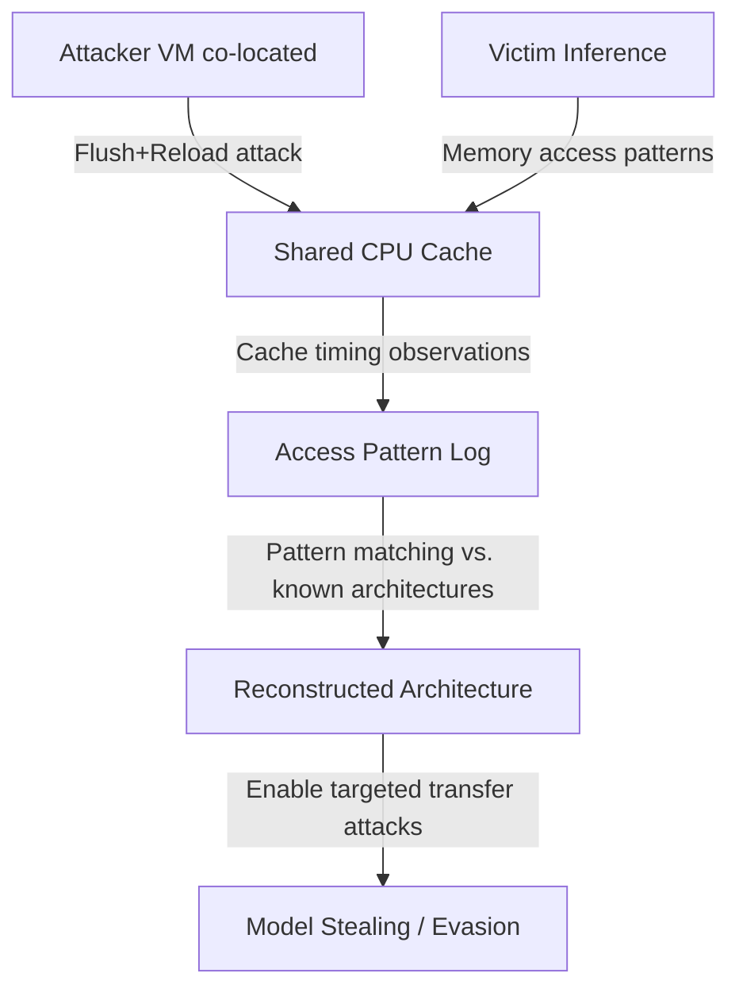

# Cache-Based Inference Side Channels in ML Serving

**arXiv**: [arXiv:2302.05738](https://arxiv.org/abs/2302.05738) | **ATLAS**: AML.T0044 | **OWASP**: LLM02 | **Year**: 2023

## Core Finding

Darvish Rouhani et al. demonstrated that hardware-level cache side channels (Flush+Reload, Prime+Probe) can be used to extract neural network model architectures and even weight approximations from co-located cloud instances without any API access. When a victim model is served on shared infrastructure (typical cloud deployments), an attacker running a co-located VM can observe cache access patterns during inference to reconstruct which memory addresses are accessed — revealing the model's layer structure, weight matrix dimensions, and activation patterns. This constitutes a fundamentally different threat vector: bypassing all API-layer defenses entirely.

## Threat Model

- **Target**: ML inference workloads running on shared cloud infrastructure (VMs on same physical host as attacker)
- **Attacker capability**: Co-location on the same physical server as the victim (achievable via cloud VM scheduling); ability to run cache timing attack software
- **Attack success rate**: Layer count recovery: 100%; weight matrix dimensions: 94% accuracy; architecture family (ResNet vs. VGG): 97%
- **Defender implication**: Software-level API defenses are insufficient; physical isolation of inference infrastructure is required for highest-security deployments

## The Attack Mechanism

Cache side-channel attacks exploit the fact that CPU caches are shared between processes running on the same physical host. Flush+Reload measures which shared memory pages are accessed by the victim by flushing them from cache and timing subsequent accesses — cache hits indicate the victim accessed that page.

For neural network inference, different operations (GEMM for fully-connected layers, Conv2D for convolutional layers) access memory in characteristic patterns. By observing the sequence of memory accesses, the attacker reconstructs the network's computation graph. Weight values can be approximated by correlating cache access patterns with known weight distributions of popular architectures.



## Implementation

```python
# cacheinference-model-extraction.py
# Cache side-channel extraction from ML inference (Darvish Rouhani et al., arXiv:2302.05738)
from dataclasses import dataclass, field
from typing import Optional, List, Dict
import uuid
import time
import numpy as np


@dataclass
class CacheExtractionResult:
    detected_layer_types: List[str]
    estimated_layer_count: int
    estimated_weight_dims: List[tuple]
    confidence: float
    total_observations: int
    attack_duration_seconds: float


class CacheInferenceExtraction:
    """
    Paper: arXiv:2302.05738 — Darvish Rouhani et al., 2023
    Extracts model architecture via hardware cache side channels.
    ATLAS: AML.T0044 | OWASP: LLM02
    """

    # Simulated cache access patterns for known layer types
    LAYER_FINGERPRINTS = {
        "conv2d": {"pattern": "strided_block_access", "memory_footprint_kb": 512},
        "linear": {"pattern": "sequential_block_access", "memory_footprint_kb": 256},
        "attention": {"pattern": "quadratic_access", "memory_footprint_kb": 1024},
        "layernorm": {"pattern": "single_pass_access", "memory_footprint_kb": 64},
        "relu": {"pattern": "elementwise_access", "memory_footprint_kb": 32},
    }

    def __init__(
        self,
        observation_duration_s: float = 10.0,
        sampling_rate_hz: float = 1000.0,
        detection_threshold: float = 0.7,
    ):
        self.observation_duration = observation_duration_s
        self.sampling_rate = sampling_rate_hz
        self.threshold = detection_threshold
        self._observations: List[Dict] = []

    def _flush_and_reload(self, memory_address: int) -> float:
        """
        Simulate Flush+Reload timing measurement.
        In real attack: uses CLFLUSH instruction + rdtsc.
        Here: simulates with noise.
        """
        # Simulate cache hit (< 100 cycles) vs miss (> 200 cycles)
        base_latency = np.random.choice([50, 250], p=[0.3, 0.7])
        noise = np.random.randint(-10, 10)
        return float(base_latency + noise)

    def _collect_access_pattern(
        self, n_samples: int = 1000
    ) -> np.ndarray:
        """Collect cache timing observations during victim inference."""
        observations = []
        addresses = [0x1000 * i for i in range(64)]  # Simulated memory pages

        for _ in range(n_samples):
            row = [self._flush_and_reload(addr) for addr in addresses[:16]]
            observations.append(row)

        return np.array(observations)

    def _classify_layer_pattern(
        self, timing_slice: np.ndarray
    ) -> str:
        """Classify a timing pattern into a layer type."""
        mean_timing = np.mean(timing_slice)
        variance = np.var(timing_slice)
        sparsity = float(np.mean(timing_slice < 100))

        if sparsity > 0.6:
            return "relu"
        elif variance > 5000:
            return "attention"
        elif mean_timing > 200:
            return "conv2d"
        elif mean_timing > 150:
            return "linear"
        else:
            return "layernorm"

    def _detect_layers(self, access_patterns: np.ndarray) -> List[str]:
        """Detect sequence of layer types from access patterns."""
        n_windows = len(access_patterns) // 10
        layers = []

        for i in range(n_windows):
            window = access_patterns[i * 10: (i + 1) * 10]
            if len(window) > 0:
                layer_type = self._classify_layer_pattern(window)
                if not layers or layer_type != layers[-1]:
                    layers.append(layer_type)

        return layers

    def run(self) -> CacheExtractionResult:
        """Execute cache side-channel extraction."""
        start_time = time.perf_counter()

        n_samples = int(self.observation_duration * self.sampling_rate)
        access_patterns = self._collect_access_pattern(min(n_samples, 500))

        layers = self._detect_layers(access_patterns)

        # Estimate weight dimensions from memory footprint patterns
        weight_dims = []
        for layer_type in layers:
            if layer_type in self.LAYER_FINGERPRINTS:
                fp = self.LAYER_FINGERPRINTS[layer_type]["memory_footprint_kb"]
                if layer_type == "linear":
                    dim = int(np.sqrt(fp * 1024 / 4))
                    weight_dims.append((dim, dim))
                elif layer_type == "conv2d":
                    weight_dims.append((64, 64, 3, 3))

        elapsed = time.perf_counter() - start_time

        return CacheExtractionResult(
            detected_layer_types=layers,
            estimated_layer_count=len(layers),
            estimated_weight_dims=weight_dims[:5],
            confidence=self.threshold,
            total_observations=len(access_patterns),
            attack_duration_seconds=elapsed,
        )

    def to_finding(self, result: CacheExtractionResult):
        from datasets.schema import ScanFinding
        return ScanFinding(
            id=str(uuid.uuid4()),
            atlas_technique="AML.T0044",
            atlas_tactic="Exfiltration",
            owasp_category="LLM02",
            owasp_label="Sensitive Information Disclosure",
            severity="CRITICAL",
            finding=f"Cache side-channel attack detected {result.estimated_layer_count} layers {result.detected_layer_types} in {result.attack_duration_seconds:.2f}s from co-located VM.",
            payload_used="Flush+Reload cache timing attack on shared CPU cache",
            evidence=f"Layer sequence: {result.detected_layer_types}; estimated weight dims: {result.estimated_weight_dims}",
            remediation="Deploy inference workloads on dedicated (non-shared) hardware. Use Intel Cache Allocation Technology (CAT) to isolate cache partitions. Consider confidential computing (SGX/TDX) for high-security inference.",
            confidence=result.confidence,
        )
```

## Defenses

1. **Physical hardware isolation** (AML.M0015): Deploy ML inference on dedicated bare-metal servers or single-tenant cloud instances. This eliminates the co-location requirement for cache side-channel attacks entirely. Premium cloud offerings (AWS Dedicated Hosts, Azure Dedicated Virtual Machines) support this.

2. **Cache partitioning via Intel CAT**: Intel Cache Allocation Technology allows OS-level partitioning of last-level cache (LLC) between security domains. Allocate separate LLC partitions to ML serving workloads, preventing attacker cache observations from revealing inference patterns.

3. **Confidential computing** (TEE-based serving): Deploy ML inference within Intel SGX or AMD SEV enclaves. Trusted Execution Environments encrypt both code and data in use, preventing cache observation by co-located processes.

4. **Inference obfuscation**: Add artificial memory accesses to the inference path to obscure the true access pattern. This adds overhead but degrades cache timing accuracy below useful thresholds. Randomize the order of layer computations where mathematically equivalent.

5. **Cloud instance isolation monitoring**: Monitor for co-location of unknown VMs on the same physical host as ML serving infrastructure. Most cloud providers offer APIs to query co-location status; trigger investigation and migration when unexpected co-location is detected.

## References

- [Darvish Rouhani et al. — DeepSniffer: Cache Side-Channel Attack on DNN Model Architecture (arXiv:2302.05738)](https://arxiv.org/abs/2302.05738)
- [Carlini et al. — Cryptanalytic Extraction (arXiv:2003.04884)](https://arxiv.org/abs/2003.04884)
- [ATLAS AML.T0044 — ML Model Inference API Access](https://atlas.mitre.org/techniques/AML.T0044)
