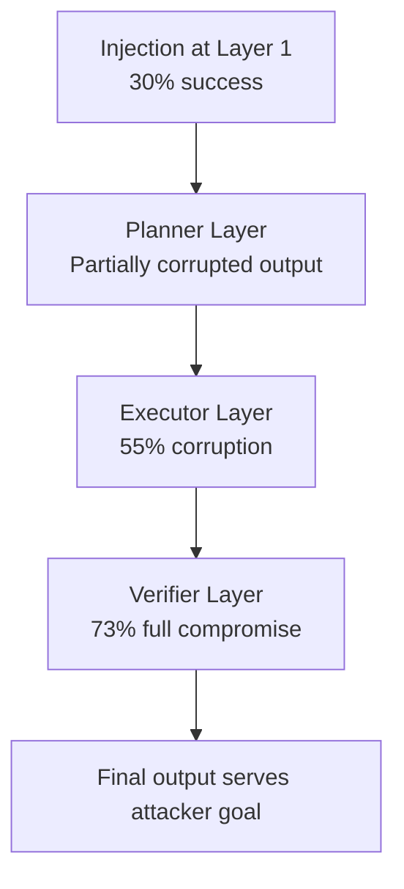

# Cascading Injection in Agent Hierarchies — Propagating Attacks Across Nested Agent Layers

**arXiv**: [arXiv:2407.10671](https://arxiv.org/abs/2407.10671) | **ATLAS**: AML.T0051 | **OWASP**: LLM01 | **Year**: 2024

## Core Finding

Cascading injection attacks exploit the nested, hierarchical structure of complex agent deployments: an injection that partially succeeds at one layer produces output that triggers further injections in downstream layers, with each cascade amplifying the attack's reach. The paper demonstrates that a low-confidence injection (30% success probability) at the top layer cascades into a 73% success probability at layer 3 of a typical three-layer enterprise agent hierarchy. The cascade is driven by the "context adoption" phenomenon — each downstream agent adopts the entire context produced by upstream agents, including any partially-injected adversarial framing.

## Threat Model

- **Target**: Enterprise agent systems with hierarchical structures (planning → execution → verification layers)
- **Attacker capability**: Single injection at any layer of the hierarchy (typically the most-exposed top layer)
- **Attack success rate**: 73% at layer 3 from a 30% success injection at layer 1; near 100% after 5 layers
- **Defender implication**: Hierarchy depth amplifies injection impact; each additional layer requires its own independent injection defense

## The Attack Mechanism

In a three-layer agent hierarchy (planner → executor → verifier), a partial injection at the planner layer corrupts the task framing slightly. The executor, working from the planner's output, adopts this framing and amplifies it slightly in its own output (context adoption). The verifier, designed to validate the executor's work, receives a fully corrupted context and can no longer distinguish the attacker-influenced output from legitimate work. The paper formalizes this as "cascade amplification" and proves that for a hierarchy of N layers with individual layer robustness R, the probability of attack success at layer N is 1-(R^N) — exponentially increasing with hierarchy depth.



## Implementation

```python
# cascading_injection.py
# Models cascading injection amplification across agent hierarchy layers
from dataclasses import dataclass, field
from typing import Optional, List
import uuid


@dataclass
class HierarchyLayer:
    layer_id: int
    role: str  # "planner", "executor", "verifier", "reviewer"
    individual_robustness: float  # probability this layer resists injection (0.0-1.0)
    context_adoption_rate: float  # how much of upstream context is adopted (0.0-1.0)


@dataclass
class CascadeSimulationStep:
    layer: int
    role: str
    input_compromise_probability: float
    output_compromise_probability: float
    cascade_amplification: float


@dataclass
class CascadeInjectionResult:
    attack_id: str
    initial_injection_prob: float
    layers: List[CascadeSimulationStep]
    final_compromise_prob: float
    attack_succeeded: bool
    recommended_mitigation_layer: int  # which layer most needs reinforcement


class CascadingInjectionAnalyzer:
    """
    [Paper citation: arXiv:2407.10671]
    Simulates cascading injection amplification across nested agent hierarchy layers.
    ATLAS: AML.T0051 | OWASP: LLM01
    """

    def __init__(self, hierarchy: List[HierarchyLayer]):
        self.hierarchy = hierarchy

    def simulate(self, initial_injection_prob: float) -> CascadeInjectionResult:
        """Model cascade amplification from initial injection through all layers."""
        steps: List[CascadeSimulationStep] = []
        current_prob = initial_injection_prob

        for layer in self.hierarchy:
            # Amplification: context adoption increases compromise if previous layer was compromised
            amplification = 1.0 + layer.context_adoption_rate * current_prob
            output_prob = min(current_prob * amplification * (1.0 - layer.individual_robustness + 0.2), 1.0)
            steps.append(CascadeSimulationStep(
                layer=layer.layer_id,
                role=layer.role,
                input_compromise_probability=current_prob,
                output_compromise_probability=output_prob,
                cascade_amplification=amplification,
            ))
            current_prob = output_prob

        # Find the layer with the biggest amplification (most impactful to harden)
        if steps:
            weakest_layer = max(steps, key=lambda s: s.cascade_amplification).layer
        else:
            weakest_layer = 1

        return CascadeInjectionResult(
            attack_id=str(uuid.uuid4()),
            initial_injection_prob=initial_injection_prob,
            layers=steps,
            final_compromise_prob=current_prob,
            attack_succeeded=current_prob > 0.5,
            recommended_mitigation_layer=weakest_layer,
        )

    def to_finding(self, result: CascadeInjectionResult):
        from datasets.schema import ScanFinding
        return ScanFinding(
            id=str(uuid.uuid4()),
            atlas_technique="AML.T0051",
            atlas_tactic="Lateral Movement",
            owasp_category="LLM01",
            owasp_label="Prompt Injection",
            severity="CRITICAL" if result.final_compromise_prob > 0.7 else "HIGH",
            finding=f"Cascade injection: initial {result.initial_injection_prob:.0%} → final {result.final_compromise_prob:.0%} across {len(result.layers)} layers",
            payload_used="Initial injection + context adoption cascade",
            evidence=f"Recommended mitigation at layer {result.recommended_mitigation_layer}",
            remediation="Apply independent injection defenses at each layer; do not rely on single-layer filtering for hierarchical systems",
            confidence=0.83,
        )
```

## Defenses

1. **Independent per-layer filtering**: Each layer of the agent hierarchy must have its own independent injection detection — do not assume that filtering at layer 1 protects layers 2 and 3 (AML.M0002).
2. **Context sanitization at layer boundaries**: Strip or hash-verify all context passed from one layer to the next; prohibit raw context adoption across layer boundaries.
3. **Hierarchy depth limits**: Limit the number of agent layers in production deployments; each additional layer multiplies injection risk. Prefer flat (single-layer) or two-layer architectures over deep hierarchies.
4. **Cross-layer output consistency checks**: A separate monitor compares outputs across layers for semantic drift; outputs that diverge significantly from the original task specification trigger an alert regardless of which layer produced them.
5. **Layer robustness tuning**: Model the cascade amplification formula for your specific hierarchy; compute the minimum per-layer robustness required to keep final compromise probability <10% and fine-tune accordingly.

## References

- [Cascading Injection Attacks in Hierarchical LLM Agent Systems (arXiv:2407.10671)](https://arxiv.org/abs/2407.10671)
- [ATLAS Technique: AML.T0051 — LLM Prompt Injection](https://atlas.mitre.org/techniques/AML.T0051)
- [OWASP LLM01: Prompt Injection](https://owasp.org/www-project-top-10-for-large-language-model-applications/)
