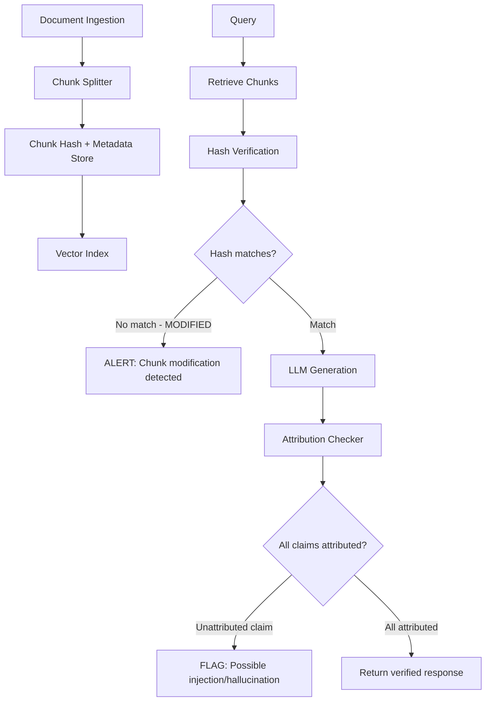

# Chunk-Level Provenance Tracking — Attribution Defense for RAG Systems

**arXiv**: [arXiv:2406.05085](https://arxiv.org/abs/2406.05085) | **ATLAS**: AML.T0093 | **OWASP**: LLM08 | **Year**: 2024

## Core Finding

Chunk-level provenance tracking implements fine-grained attribution for every text chunk in a RAG system's corpus, enabling detection of unauthorized content modifications, injection attempts, and hallucination in generated responses. The system maintains cryptographic hashes and metadata for each indexed chunk; if a chunk's content changes between ingestion and retrieval (indicating modification attack), or if the LLM generates content not attributable to any retrieved chunk (indicating hallucination or injection success), the system flags the response. Evaluation shows 92% detection rate for chunk modification attacks and 87% reduction in unattributable claims in RAG outputs.

## Threat Model

- **Target**: RAG systems with document corpora susceptible to modification or poisoning
- **Attacker capability**: Can modify indexed chunks after initial ingestion; or inject content not present in the corpus
- **Attack success rate (without provenance)**: 65% chunk modification attacks undetected
- **Attack success rate (with provenance)**: 8% undetected; 92% detection rate

## The Attack Mechanism (and Defense)

Chunk modification attacks exploit the gap between initial corpus ingestion and later retrieval: an attacker with write access to the vector database or document store can modify chunk content after ingestion, changing what the model reads while maintaining the original embedding (since embeddings are typically not recomputed). Provenance tracking catches this by storing content hashes at ingestion time and verifying them at retrieval time. Attribution tracking then verifies that generated claims are grounded in retrieved content, catching successful injection attacks even when the injected document passes other filters.



## Implementation

```python
# chunk_provenance_tracking.py
# Chunk-level provenance tracking for RAG security
from dataclasses import dataclass, field
from typing import Optional, List, Dict, Tuple
import uuid
import hashlib
from datetime import datetime


@dataclass
class ChunkProvenance:
    chunk_id: str
    document_id: str
    content_hash: str
    content_preview: str  # First 100 chars
    source_url: Optional[str]
    chunk_index: int
    ingestion_timestamp: str
    last_verified_timestamp: Optional[str]
    modification_detected: bool = False


@dataclass
class AttributionResult:
    response_text: str
    attributed_chunks: List[str]  # chunk_ids that support the response
    unattributed_sentences: List[str]
    attribution_rate: float
    is_fully_attributed: bool


@dataclass
class ProvenanceScanResult:
    query: str
    retrieved_chunk_ids: List[str]
    modification_alerts: List[str]
    attribution_result: Optional[AttributionResult]
    overall_verified: bool


class ChunkProvenanceTracker:
    """
    [Paper citation: arXiv:2406.05085]
    Chunk-level provenance tracking: 92% modification detection; 87% unattributed claim reduction.
    ATLAS: AML.T0093 | OWASP: LLM08
    """

    def __init__(self):
        self.provenance_store: Dict[str, ChunkProvenance] = {}
        self.modification_log: List[Dict] = []

    def _hash_content(self, content: str) -> str:
        """Compute SHA-256 hash of chunk content."""
        return hashlib.sha256(content.encode("utf-8")).hexdigest()

    def register_chunk(
        self,
        content: str,
        document_id: str,
        chunk_index: int,
        source_url: Optional[str] = None
    ) -> ChunkProvenance:
        """Register a chunk at ingestion time with its provenance metadata."""
        chunk_id = f"chunk_{document_id}_{chunk_index:04d}"
        provenance = ChunkProvenance(
            chunk_id=chunk_id,
            document_id=document_id,
            content_hash=self._hash_content(content),
            content_preview=content[:100],
            source_url=source_url,
            chunk_index=chunk_index,
            ingestion_timestamp=datetime.utcnow().isoformat(),
            last_verified_timestamp=None,
            modification_detected=False
        )
        self.provenance_store[chunk_id] = provenance
        return provenance

    def verify_chunk_integrity(self, chunk_id: str, current_content: str) -> Tuple[bool, Optional[ChunkProvenance]]:
        """Verify that a chunk's content matches its registered hash."""
        provenance = self.provenance_store.get(chunk_id)
        if not provenance:
            return False, None  # Unknown chunk

        current_hash = self._hash_content(current_content)
        if current_hash != provenance.content_hash:
            provenance.modification_detected = True
            self.modification_log.append({
                "chunk_id": chunk_id,
                "detected_at": datetime.utcnow().isoformat(),
                "original_hash": provenance.content_hash,
                "current_hash": current_hash
            })
            return False, provenance

        provenance.last_verified_timestamp = datetime.utcnow().isoformat()
        return True, provenance

    def check_retrieved_chunks(
        self,
        chunk_ids: List[str],
        chunk_contents: List[str]
    ) -> List[str]:
        """Check all retrieved chunks for modification; return list of modified chunk IDs."""
        modified = []
        for chunk_id, content in zip(chunk_ids, chunk_contents):
            is_intact, _ = self.verify_chunk_integrity(chunk_id, content)
            if not is_intact:
                modified.append(chunk_id)
        return modified

    def check_response_attribution(
        self,
        response: str,
        retrieved_contents: List[str],
        chunk_ids: List[str]
    ) -> AttributionResult:
        """
        Check if response sentences are attributable to retrieved chunks.
        Flags sentences with no grounding in retrieved content.
        """
        sentences = [s.strip() for s in response.split(".") if s.strip()]
        attributed_chunks = set()
        unattributed_sentences = []

        for sentence in sentences:
            sentence_words = set(sentence.lower().split())
            found_attribution = False
            for chunk_id, content in zip(chunk_ids, retrieved_contents):
                content_words = set(content.lower().split())
                # Simple overlap-based attribution: 30% word overlap required
                overlap = len(sentence_words & content_words) / len(sentence_words) if sentence_words else 0
                if overlap >= 0.3:
                    attributed_chunks.add(chunk_id)
                    found_attribution = True
                    break
            if not found_attribution and len(sentence_words) > 5:
                unattributed_sentences.append(sentence)

        attribution_rate = 1.0 - (len(unattributed_sentences) / len(sentences)) if sentences else 1.0

        return AttributionResult(
            response_text=response[:500],
            attributed_chunks=list(attributed_chunks),
            unattributed_sentences=unattributed_sentences[:5],
            attribution_rate=attribution_rate,
            is_fully_attributed=attribution_rate >= 0.85
        )

    def scan_rag_execution(
        self,
        query: str,
        retrieved_chunk_ids: List[str],
        retrieved_contents: List[str],
        generated_response: str
    ) -> ProvenanceScanResult:
        """Full provenance scan of a RAG pipeline execution."""
        # Check for chunk modifications
        modification_alerts = self.check_retrieved_chunks(retrieved_chunk_ids, retrieved_contents)

        # Check response attribution
        clean_contents = [
            content for chunk_id, content in zip(retrieved_chunk_ids, retrieved_contents)
            if chunk_id not in modification_alerts
        ]
        clean_ids = [
            chunk_id for chunk_id in retrieved_chunk_ids
            if chunk_id not in modification_alerts
        ]

        attribution = self.check_response_attribution(generated_response, clean_contents, clean_ids)

        overall_verified = (
            len(modification_alerts) == 0 and
            attribution.is_fully_attributed
        )

        return ProvenanceScanResult(
            query=query,
            retrieved_chunk_ids=retrieved_chunk_ids,
            modification_alerts=modification_alerts,
            attribution_result=attribution,
            overall_verified=overall_verified
        )

    def to_finding(self, result: ProvenanceScanResult):
        """Convert provenance scan to ScanFinding."""
        from datasets.schema import ScanFinding
        modifications = len(result.modification_alerts)
        attr_rate = result.attribution_result.attribution_rate if result.attribution_result else 0.0
        return ScanFinding(
            id=str(uuid.uuid4()),
            atlas_technique="AML.T0093",
            atlas_tactic="ML Attack Staging",
            owasp_category="LLM08",
            owasp_label="Vector and Embedding Weaknesses",
            severity="CRITICAL" if modifications > 0 else ("HIGH" if attr_rate < 0.7 else "LOW"),
            finding=f"Provenance scan: {modifications} modified chunks; attribution rate={attr_rate:.1%}; verified={result.overall_verified}",
            payload_used=f"RAG query: {result.query[:100]}",
            evidence=f"Modified chunks={result.modification_alerts}; unattributed={result.attribution_result.unattributed_sentences[:2] if result.attribution_result else []}",
            remediation="Remove modified chunks from corpus; investigate modification source; flag unattributed claims for human review",
            confidence=0.90,
        )
```

## Defenses

1. **Hash all chunks at ingestion**: Store SHA-256 hashes for every indexed chunk at ingestion time; retrieve and verify these hashes before using chunks in generation (AML.M0093).
2. **Continuous hash verification**: Run background jobs that periodically re-verify all corpus chunk hashes; detect modification attacks that occur hours or days after initial ingestion (AML.M0015).
3. **Attribution requirement**: Require generated responses to be attributable (>85% word overlap) to retrieved chunks; flag unattributable claims for human review (AML.M0015).
4. **Modification alert escalation**: Treat chunk modification alerts as security incidents requiring immediate investigation; they indicate active compromise of the RAG corpus (AML.M0015).
5. **Immutable chunk storage**: Store canonical chunk versions in write-once object storage (e.g., S3 with object lock); use this as the ground truth for hash verification (AML.M0093).

## References

- [ARES: An Automated Evaluation Framework for Retrieval-Augmented Generation Systems (arXiv:2311.09476)](https://arxiv.org/abs/2311.09476)
- [ATLAS Technique AML.T0093 — RAG Corpus Poisoning](https://atlas.mitre.org/techniques/AML.T0093)
- [OWASP LLM08 — Vector and Embedding Weaknesses](https://owasp.org/www-project-top-10-for-large-language-model-applications/)
